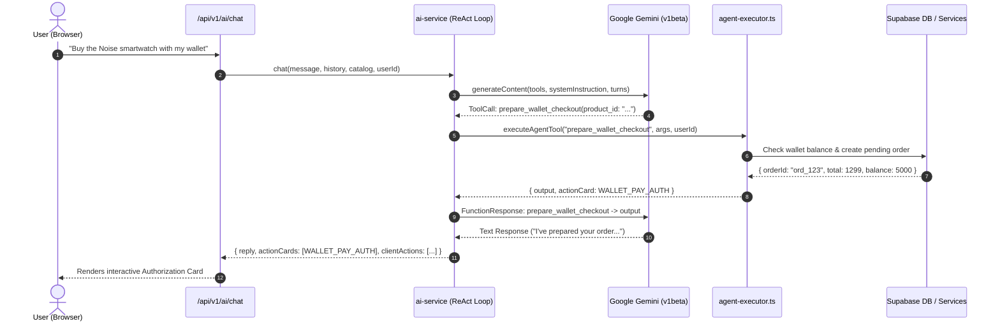
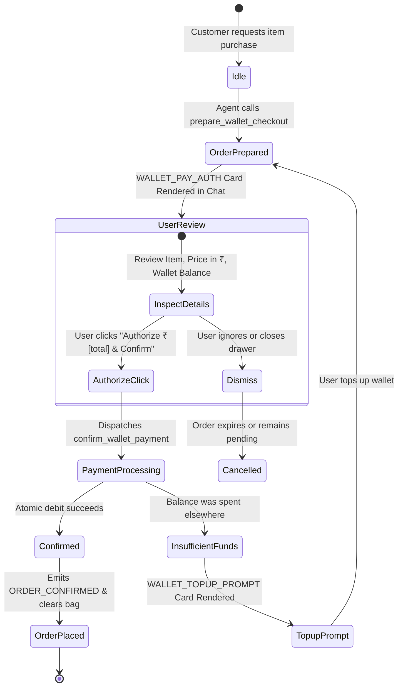

# ShopSphere — Customer Super Agent Architecture Specification

> **Document Version:** 1.0.0  
> **Status:** Production Engineering Specification  
> **Target Subsystem:** Customer Super Agent, Autonomous ReAct Engine & In-App Financial Subsystem  
> **Primary References:** [`src/services/ai-service.ts`](file:///home/batman/Pictures/shopsphere/src/services/ai-service.ts), [`src/services/agent-executor.ts`](file:///home/batman/Pictures/shopsphere/src/services/agent-executor.ts), [`src/services/agent-tools.ts`](file:///home/batman/Pictures/shopsphere/src/services/agent-tools.ts), [`src/services/wallet-service.ts`](file:///home/batman/Pictures/shopsphere/src/services/wallet-service.ts)

---

## 1. Executive Summary & Core Philosophy

The **ShopSphere Customer Super Agent** transforms the traditional conversational AI assistant into an **autonomous shopping agent**. Rather than merely generating conversational text or canned recommendations, the agent has full agency to perform real transactional marketplace actions on behalf of the customer:

1. **Autonomous Catalog Search & Spec Analysis** (filtering by category, price in ₹, rating, attributes, and stock).
2. **Direct Cart Management** (add items, update quantities, remove items, clear cart).
3. **Wishlist & Favorites Control** (instant favoriting with real-time UI synchronization).
4. **Social Gifting** (finding connected friends, configuring surprise gift wraps, custom notes, and scheduled reveal dates).
5. **Verified Customer Reviews** (fetching previously purchased items and submitting star ratings and text feedback).
6. **In-App Wallet Payments** (checking balance, top-ups, and 1-tap checkout via a 2-phase Human-In-The-Loop safety protocol).
7. **Agent Purchase Labeling & Relaxed Leniency Policy** (every purchase made by the agent is flagged with `🤖 Agent Purchase` and enjoys a less strict cancellation policy through `packed` status with instant 100% wallet refunds).

---

## 2. End-to-End System Architecture

```mermaid
flowchart TD
    subgraph ClientUI [Browser Client UI]
        ChatDrawer["Personal AI Assistant Drawer\n(PersonalAiAssistant.tsx)"]
        ProductCard["Product Card\n(ProductCard.tsx)"]
        CartBadge["Navbar Cart Badge\n(CustomerNavbar.tsx)"]
        CheckoutView["Checkout Page\n(checkout/page.tsx)"]
        OrdersView["Orders History\n(orders/page.tsx)"]
        EventBus["Browser CustomEvent Bus\n(shopsphere:*-update)"]
    end

    subgraph APILayer [Next.js API Gateway (Edge & Node)]
        ChatAPI["POST /api/v1/ai/chat\n(Session, User Context, Turn History)"]
        WalletAPI["GET/POST /api/v1/wallet\nPOST /api/v1/wallet/pay"]
        FavAPI["GET/POST/DELETE /api/v1/favorites"]
        OrdersAPI["POST/PATCH /api/v1/orders"]
    end

    subgraph AgentCore [Agent Reasoning & Execution Engine]
        ReActLoop["Multi-Turn ReAct Loop\n(ai-service.ts)"]
        GeminiModel["Google Gemini\n(gemini-flash-lite-latest)\nFree-Tier & Non-Deprecated"]
        ToolRegistry["13 Gemini Function Declarations\n(agent-tools.ts)"]
        ToolExecutor["Agent Tool Dispatcher\n(agent-executor.ts)"]
    end

    subgraph Services [Domain Services Layer]
        WalletService["WalletService\n(wallet-service.ts)"]
        OrderService["OrderService\n(order-service.ts)"]
        FavoritesService["FavoritesService\n(favorites-service.ts)"]
        CatalogDB["Product Catalog\n(products table)"]
        SocialDB["Friends & Gifting\n(friend_relationships, gifts)"]
        ReviewsDB["Product Reviews\n(product_reviews)"]
    end

    subgraph Storage [Supabase Storage & Persistence]
        DBTables[("Dedicated DB Tables\nuser_wallets, wallet_transactions,\nuser_favorites, orders")]
        ResilientFallback[("Dual-Layer Fallback\nai_user_profiles.feed_weights\nJSON Schema Storage")]
    end

    %% Interactions
    ChatDrawer -->|Sends message & persona| ChatAPI
    ChatAPI --> ReActLoop
    ReActLoop <-->|Function Calls & Thought Signatures| GeminiModel
    ReActLoop -->|Dispatches Tool Name & Args| ToolExecutor
    ToolExecutor --> ToolRegistry
    ToolExecutor --> WalletService
    ToolExecutor --> OrderService
    ToolExecutor --> FavoritesService
    ToolExecutor --> CatalogDB
    ToolExecutor --> SocialDB
    ToolExecutor --> ReviewsDB

    WalletService --> DBTables
    WalletService -.->|Fallback if table missing| ResilientFallback
    FavoritesService --> DBTables
    FavoritesService -.->|Fallback if table missing| ResilientFallback
    OrderService --> DBTables

    ToolExecutor -->|Generates ClientActions & ActionCards| ChatAPI
    ChatAPI -->|Returns reply, actionCards, clientActions| ChatDrawer

    ChatDrawer -->|Dispatches events| EventBus
    EventBus -->|Update items| CartBadge
    EventBus -->|Toggle heart| ProductCard
    EventBus -->|Sync balance| CheckoutView
    EventBus -->|Sync balance| ChatDrawer

    OrdersView -->|Views '🤖 Agent Purchase' & Relaxed Cancel| OrdersAPI
```

---

## 3. The 13-Tool Function Registry

The agent operates with native Gemini function calling (`tools: [{ functionDeclarations: [...] }]`):

| # | Tool Name | Scope & Parameters | Functional Action & Platform Side-Effects |
| :-: | :--- | :--- | :--- |
| **1** | `search_catalog` | `query`, `category`, `min_price`, `max_price`, `in_stock_only` | Performs semantic & keyword search across approved products, returns structured catalog entries and generates an interactive `PRODUCT_CAROUSEL` action card. |
| **2** | `get_product_specs` | `product_id` | Retrieves comprehensive product specifications, dynamic attributes, seller storefront info, and recent buyer reviews. |
| **3** | `manage_cart` | `action` (`add` \| `remove` \| `update` \| `view` \| `clear`), `product_id`, `quantity` | Mutates the customer's cart, generates reactive `CART_SYNC` / `CART_CLEAR` client actions that immediately update the navigation badge. |
| **4** | `manage_favorites` | `action` (`add` \| `remove` \| `list`), `product_id` | Adds or removes products from customer favorites, emits `FAVORITES_SYNC` events to toggle card heart icons in real time. |
| **5** | `get_friends_list` | *(none)* | Queries `friend_relationships` for accepted friendships to facilitate social commerce and surprise gift delivery. |
| **6** | `send_as_gift` | `friend_email_or_name`, `product_id`, `gift_message`, `reveal_date` | Prepares a surprise gift package with customized greeting and scheduled reveal, rendering a `GIFT_CARD` preview. |
| **7** | `get_reviewable_products` | *(none)* | Inspects user's verified past orders and lists delivered items awaiting customer ratings. |
| **8** | `submit_product_review` | `product_id`, `rating` (1–5), `title`, `comment` | Submits a verified customer review directly to `product_reviews` and updates the product's average rating. |
| **9** | `get_wallet_status` | *(none)* | Inspects the customer's in-app wallet balance in ₹ and lists recent ledger transactions. |
| **10** | `topup_wallet` | `amount` (INR) | Deposits demo/prepaid funds into the customer's in-app wallet and issues a `WALLET_SYNC` action. |
| **11** | `prepare_wallet_checkout` | `product_id`, `quantity` | **Phase 1 of HITL:** Verifies wallet balance against item total, reserves stock, creates a pending order, and renders a `WALLET_PAY_AUTH` authorization card. |
| **12** | `confirm_wallet_payment` | `order_id` | **Phase 2 of HITL:** Executes atomic debit from wallet, transitions order to `confirmed`, clears the cart, and issues an `ORDER_CONFIRMED` card. |
| **13** | `cancel_or_replace_order` | `order_id`, `action` (`cancel` \| `replace`), `reason` | **Leniency Engine:** Checks relaxed cancellation window (permitted through `packed` status) and executes an instant 100% refund into the wallet. |

---

## 4. Multi-Turn ReAct Reasoning Engine

The agent uses a ReAct (Reasoning + Acting) execution pattern implemented in [`src/services/ai-service.ts`](file:///home/batman/Pictures/shopsphere/src/services/ai-service.ts):



### Thought Signatures & Gemini Protocol Compliance
When calling Gemini with function declarations in multi-turn mode:
1. Model turns that return `functionCall` parts often include an internal `thoughtSignature`.
2. The ReAct loop preserves all original parts from the model response verbatim.
3. The function execution result is injected as a subsequent `user` turn containing `{ functionResponse: { name, response: { output } } }`.
4. The loop iterates up to a maximum safety limit of 5 turns before finalizing the response.

---

## 5. Human-In-The-Loop (HITL) Financial Safety Protocol

To prevent accidental, hallucinated, or unauthorized financial debits, the Super Agent implements a **Two-Phase Commit Protocol**:



### Safety Guarantees
* **Zero Autonomous Debit:** The agent **never** debits the customer's wallet in a single turn without showing the interactive authorization card.
* **Double Balance Verification:** Balance is checked during `prepare_wallet_checkout` and re-verified atomically under row-level database locking during `confirm_wallet_payment`.

---

## 6. Real-Time Client-Side Reactive State Bridge

Because shopping actions happen inside the conversational AI drawer, the rest of the web application must reflect changes instantly without requiring a page reload. This is achieved via an **in-browser event bridge**:

```
[Agent Action Completed]
         │
         ├──> CART_SYNC ──────────> CustomEvent('shopsphere:cart-update') ───> CartContext (Navbar Badge)
         ├──> CART_CLEAR ─────────> CustomEvent('shopsphere:cart-clear')  ───> CartContext (Empty State)
         ├──> FAVORITES_SYNC ─────> CustomEvent('shopsphere:favorites-update') > ProductCard (Heart Toggle)
         └──> WALLET_SYNC ────────> CustomEvent('shopsphere:wallet-update') ───> Checkout & Wallet Panels
```

1. **`shopsphere:cart-update`**: Listened to by [`CartContext.tsx`](file:///home/batman/Pictures/shopsphere/src/context/CartContext.tsx). Automatically adds, removes, or updates items in the customer's bag and triggers storage persistence.
2. **`shopsphere:favorites-update`**: Listened to by [`ProductCard.tsx`](file:///home/batman/Pictures/shopsphere/src/components/ProductCard.tsx). Smoothly animates the heart icon between active/inactive states across all rendered grids.
3. **`shopsphere:wallet-update`**: Listened to by [`checkout/page.tsx`](file:///home/batman/Pictures/shopsphere/src/app/(customer)/checkout/page.tsx) and wallet views, updating real-time balances.

---

## 7. Agent Purchase Labeling & Relaxed Leniency Policy

Customer orders initiated through the Super Agent receive special customer-protection policies:

### 1. `🤖 Agent Purchase` Visual Labeling
* Stored on the order record via `orders.placed_by = 'agent'`.
* Fallback storage in `orders.shipping_address._metadata.placed_by = 'agent'`.
* Displayed on the [Order History Page](file:///home/batman/Pictures/shopsphere/src/app/(customer)/orders/page.tsx) with a distinctive gradient badge and tooltip.

### 2. Relaxed Cancellation & Return Policy
To give users complete peace of mind when allowing an AI agent to execute purchases, cancellation restrictions are substantially relaxed:

| Policy Parameter | Standard Customer Purchase | 🤖 AI Super Agent Purchase |
| :--- | :--- | :--- |
| **Cancellable Statuses** | `pending`, `confirmed` only | `pending`, `confirmed`, `processing`, **and `packed`** |
| **Non-Cancellable Cutoff**| Once merchant starts packing | Only after physical dispatch to courier (`shipped`, `out_for_delivery`, `delivered`) |
| **Refund Mechanism** | Manual review / payment gateway cycle (3–5 days) | **Instant 100% automated credit** to In-App Wallet |
| **Replacement Support** | Return ticket required | Instant 1-command replacement via `cancel_or_replace_order` |

---

## 8. Dual-Layer Resilient Storage Architecture

To guarantee 100% zero-crash operation across all development and remote environments (even when remote database migrations have not yet been manually pushed via Supabase SQL Editor), the subsystem uses a **self-healing dual-layer storage pattern**:

```
Layer 1: Dedicated Supabase Tables
  ├── user_wallets (id, user_id, balance, currency, is_frozen)
  ├── wallet_transactions (id, wallet_id, amount, type, reference_id)
  └── user_favorites (id, user_id, product_id)
        │
        ▼ (Catches PGRST205: "Table not found" error)
Layer 2: Resilient User Profile JSON Store
  └── ai_user_profiles.feed_weights
        ├── wallet_state: { balance, currency, transactions }
        └── favorites_list: [ product_ids... ]
```

* If dedicated tables exist: Fast relational queries and PostgreSQL row-level locks are used.
* If dedicated tables are absent: Automatically stores wallet and favorites state in the user's `ai_user_profiles.feed_weights` record with an initial ₹5,000 credit. No exceptions are ever thrown to the user.

---

## 9. Verification & Quality Benchmarks

* **Model Compatibility**: Tested with `gemini-flash-lite-latest` and `gemini-3.1-flash-lite` on the Google Gemini v1beta API.
* **Compilation**: `npm run typecheck` passes with **0 errors**.
* **Next.js Production Build**: `npm run build` generates all **57 application routes** without errors.
