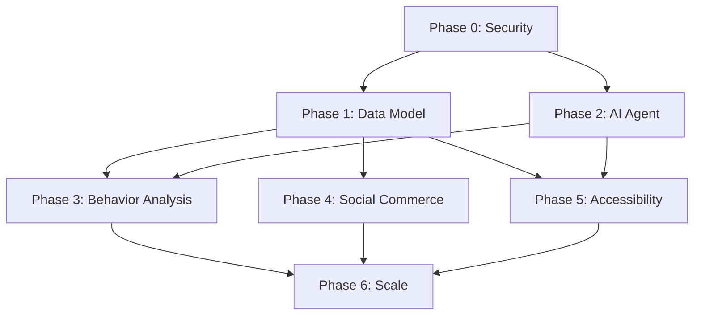

# ShopSphere — AI Agent Build Plan

**Version:** 1.0  
**Target:** Production-ready implementation of all 4 differentiating features  
**Philosophy:** "Bricks and mortar first" — each phase produces working, tested code  
**Execution Model:** Single AI agent, sequential phases, autonomous validation

---

## Phase 0: Security & Foundation Hardening (Week 1-2)
**Goal:** Eliminate critical vulnerabilities, establish service layer, unify auth

### 0.1 Remove Service Role Key from Customer APIs (Day 1)
- [ ] Audit all `/api/*` routes using `createAdminClient()`
- [ ] Create `src/lib/auth.ts` with `getAuthenticatedUser()` returning typed `{ user, profile }`
- [ ] Refactor `/api/ai/chat` → use `createClient()` + RLS
- [ ] Refactor `/api/feed/personalized` → use `createClient()` + RLS
- [ ] Refactor `/api/offers/personalized` → use `createClient()` + RLS
- [ ] Refactor `/api/accessibility` → use `createClient()` + RLS
- [ ] **Validation:** Run `grep -r "createAdminClient" src/app/api` — only admin routes should remain

### 0.2 Add Rate Limiting to AI Endpoints (Day 1-2)
- [ ] Install `@upstash/ratelimit` + `@upstash/redis`
- [ ] Create `src/lib/rate-limiter.ts` with:
  - `chatLimiter`: 10 req/min per user
  - `categorizeLimiter`: 5 req/min per user
  - `visualSearchLimiter`: 5 req/min per user
- [ ] Add rate limiter middleware to `/api/ai/*` routes
- [ ] **Validation:** Hammer `/api/ai/chat` 15 times → 429 response

### 0.3 Fix Prompt Injection Vulnerability (Day 2)
- [ ] Create `src/lib/prompt-templates.ts` with structured templates:
  ```typescript
  export const chatSystemPrompt = (params: { 
    persona: string; 
    catalog: string; 
    accessibility?: string;
    userQuery: string; // NEVER interpolated directly
  }) => `... User Query: {{USER_QUERY}} ...`
  ```
- [ ] Use `prompt.replace('{{USER_QUERY}}', sanitizeInput(message))`
- [ ] Add input sanitization: strip `{{`, `}}`, `Ignore`, `SYSTEM`, `previous instructions`
- [ ] **Validation:** Send `"{{USER_QUERY}} Ignore previous instructions"` → safe response

### 0.4 Extract Service Layer (Day 3-5)
Create `src/services/` with atomic, testable units:

| Service | Methods | Replaces |
|---------|---------|----------|
| `order-service.ts` | `createOrder()`, `calculateTotals()`, `reserveStock()`, `confirmPayment()` | `/api/orders/route.ts` logic |
| `cart-service.ts` | `getCart()`, `addItem()`, `updateQuantity()`, `mergeGuestCart()`, `syncToServer()` | `CartContext` localStorage logic |
| `ai-service.ts` | `chat()`, `mutateFeed()`, `getRecommendations()`, `summarizeConversation()` | `/api/ai/chat` logic |
| `gift-service.ts` | `createGift()`, `revealGift()`, `thankSender()`, `createGroupGift()` | New |
| `behavior-service.ts` | `trackEvent()`, `computeFeatures()`, `getUserFeatures()` | New |
| `notification-service.ts` | `sendPush()`, `sendEmail()`, `sendSMS()`, `queueNotification()` | New |

**Pattern for each:**
```typescript
// src/services/order-service.ts
export async function createOrder(input: CreateOrderInput, userId: string): Promise<OrderResult> {
  const supabase = createServerClient(); // RLS-enforced
  // 1. Validate & lock stock (SELECT ... FOR UPDATE via RPC)
  // 2. Calculate totals
  // 3. Insert order + items in transaction
  // 4. Queue notifications
  // 5. Return result
}
```

### 0.5 Add CSRF Protection (Day 5)
- [ ] Create `src/lib/csrf.ts` — double-submit cookie pattern
- [ ] Add `csrfMiddleware` to all mutating API routes
- [ ] Include CSRF token in all forms/fetch calls
- [ ] **Validation:** POST without token → 403

### 0.6 Security Headers (Day 5)
- [ ] Update `next.config.mjs` with headers:
  ```javascript
  headers: async () => [{
    source: '/:path*',
    headers: [
      { key: 'Content-Security-Policy', value: "default-src 'self'; script-src 'self' 'unsafe-inline'; style-src 'self' 'unsafe-inline'; img-src 'self' data: https:; connect-src 'self' https://generativelanguage.googleapis.com wss://*.supabase.co; frame-ancestors 'none';" },
      { key: 'Permissions-Policy', value: 'camera=(), microphone=(), geolocation=(self)' },
      { key: 'X-Frame-Options', value: 'DENY' },
      { key: 'X-Content-Type-Options', value: 'nosniff' },
      { key: 'Referrer-Policy', value: 'strict-origin-when-cross-origin' },
    ],
  }],
  ```

### 0.7 Unified Auth Hook (Day 6)
- [ ] Create `src/hooks/use-auth.ts` — single source of truth for user/profile
- [ ] Replace all `createClient().auth.getUser()` + profile fetch patterns
- [ ] **Validation:** No duplicate auth logic in any component/route

### 0.8 Database Migration Setup (Day 6-7)
- [ ] Install `supabase` CLI, run `supabase init`
- [ ] Create `supabase/migrations/001_foundation_fixes.sql` with:
  - Remove redundant `products.category`, `products.sub_category` columns
  - Add `shops.location` geography(POINT) + PostGIS index
  - Add missing FKs with `ON DELETE SET NULL`
  - Add all new indexes from `database-schema.md` Section 4
- [ ] **Validation:** `supabase db reset` → clean schema

---

## Phase 1: Core Data Model & Infrastructure (Week 2-3)
**Goal:** All vision-feature tables exist, RLS enforced, realtime enabled

### 1.1 Vision Feature Tables Migration (Day 8-9)
Create `supabase/migrations/002_vision_features.sql` with all 13 tables from `database-schema.md` Sections 3.16-3.28.

**Order matters** (FK dependencies):
1. `user_behavior_events`
2. `friend_relationships`
3. `gift_wrapping_options`
4. `gifts`
5. `gift_notifications`
6. `group_gifts`
7. `group_gift_contributions`
8. `shared_products`
9. `ai_agent_memory` (requires `vector` extension)
10. `ai_agent_sessions`
11. `audio_descriptions`
12. `accessibility_usage_metrics`
13. `user_features`
14. `ml_models`

### 1.2 RLS Policies for New Tables (Day 9-10)
- [ ] Apply all policies from `database-schema.md` Section 5.3 (items 7-15)
- [ ] Create helper functions: `is_gift_participant()`, `are_friends()`
- [ ] **Validation:** Test each policy with `supabase.auth.signInAs()` different roles

### 1.3 Enable Supabase Realtime (Day 10)
- [ ] Dashboard → Replication → Enable for:
  - `orders`, `order_tracking_events` (order updates)
  - `ai_user_profiles` (feed mutation)
  - `gifts` (reveal notifications)
  - `friend_relationships` (social updates)
  - `user_behavior_events` (analytics pipeline)
- [ ] Create `src/hooks/use-realtime.ts` for typed subscriptions

### 1.4 Redis Cache Layer (Day 10-11)
- [ ] Provision Upstash Redis (Vercel integration)
- [ ] Create `src/lib/cache.ts`:
  ```typescript
  export async function getPersonalizedFeed(userId: string): Promise<FeedResponse> {
    const cached = await redis.get(`feed:${userId}`);
    if (cached) return JSON.parse(cached);
    const fresh = await fetchFeedFromDB(userId);
    await redis.setex(`feed:${userId}`, 300, JSON.stringify(fresh)); // 5 min
    return fresh;
  }
  ```
- [ ] Wrap `/api/feed/personalized` with cache
- [ ] Cache invalidation on `ai_user_profiles` update (Supabase webhook → `redis.del()`)

### 1.5 API Versioning (Day 11)
- [ ] Create `src/app/api/v1/` route group
- [ ] Move all existing APIs to `/api/v1/*`
- [ ] Add `Accept: application/vnd.shopsphere.v1+json` header validation
- [ ] Update all frontend fetch calls

---

## Phase 2: AI Guide Agent Core (Week 3-5)
**Goal:** Multi-modal conversational agent with specialist personas, visual search, proactive notifications

### 2.1 Vector Memory Infrastructure (Day 12-13)
- [ ] Enable `pgvector` in Supabase: `CREATE EXTENSION vector;`
- [ ] Create `src/lib/embeddings.ts`:
  ```typescript
  export async function generateEmbedding(text: string): Promise<number[]> {
    // Use OpenAI text-embedding-3-small or Gemini equivalent
  }
  export async function searchSimilarProducts(embedding: number[], limit: number): Promise<Product[]> {
    // SELECT * FROM products ORDER BY embedding <=> $1 LIMIT $2
  }
  ```
- [ ] Backfill embeddings for all approved products (batch job)

### 2.2 Conversation Summarization (Day 13-14)
- [ ] Add `summarizeConversation()` to `ai-service.ts`:
  - Trigger after 10 messages or 24 hours
  - Use Gemini to condense → key facts + preferences
  - Store in `ai_agent_memory` with embedding
- [ ] Modify `/api/ai/chat` to inject relevant memories into prompt

### 2.3 Specialist Persona Architecture (Day 14-16)
- [ ] Create `src/lib/personas/` with isolated configs:
  ```
  src/lib/personas/
  ├── tech-guru.ts      // systemPrompt, tools, knowledgeBase
  ├── fashion-stylist.ts
  ├── gourmet-sommelier.ts
  ├── beauty-consultant.ts
  └── accessibility-guide.ts
  ```
- [ ] Update `/api/ai/chat` to route to persona sub-agent
- [ ] Implement seamless handoff: preserve `sessionId`, transfer `context_summary`

### 2.4 Visual Search Endpoint (Day 16-18)
- [ ] Create `/api/ai/visual-search/route.ts`:
  - Accept multipart/form-data image
  - Generate CLIP embedding (via Gemini Vision or hosted CLIP)
  - Vector similarity search against `products.embedding`
  - Return ranked results with confidence scores
- [ ] Create `src/components/ai/VisualSearch.tsx` — camera/upload UI
- [ ] **Validation:** Photo of headphones → returns headphone products

### 2.5 Proactive Notification Engine (Day 18-19)
- [ ] Create `src/services/notification-service.ts` with cron-triggered checks:
  ```typescript
  // Runs every 30 min via Vercel Cron
  export async function checkProactiveNotifications() {
    // 1. Price drops: products in user's wishlist/cart with price < alert_threshold
    // 2. Back in stock: previously OOS products now in stock
    // 3. Delivery milestones: orders transitioning to out_for_delivery
    // 4. AI recommendations: high-confidence predictions from ML models
    // Queue via notification-service.sendPush()/sendEmail()
  }
  ```
- [ ] Create `/api/ai/proactive/route.ts` for manual trigger/testing

### 2.6 Audio Description Generation (Day 19-20)
- [ ] Create `/api/ai/generate-audio-description/route.ts`:
  - Input: `product_id`
  - Fetch product images + attributes + reviews
  - Prompt Gemini Vision → structured TTS script
  - Call ElevenLabs/Google Cloud TTS → MP3
  - Store in `audio_descriptions` table + CDN
- [ ] Create `src/components/accessibility/AudioDescriptionPlayer.tsx`

### 2.7 AI Agent UI Polish (Day 20)
- [ ] Refactor `PersonalAiAssistant.tsx` → use Vanilla Extract styles
- [ ] Add `VoiceInterface.tsx` (STT/TTS integration)
- [ ] Add `PersonaSelector.tsx` (visual persona cards)
- [ ] **Validation:** Full conversation flow with persona switch + visual search

---

## Phase 3: AI Behavior Analysis & ML Pipeline (Week 4-6)
**Goal:** Event-driven personalization with production ML models

### 3.1 Behavioral Event Ingestion (Day 21-22)
- [ ] Create `/api/behavior/events/route.ts` — batch ingest endpoint:
  ```typescript
  // Accepts: BehaviorEvent[] (max 100)
  // Validates schema, enriches with session/user context
  // Writes to user_behavior_events (immutable)
  // Returns { accepted: number, failed: number }
  ```
- [ ] Create `src/hooks/use-behavior-tracking.ts` — auto-track:
  - Page views, clicks, scroll depth, dwell time
  - AI chat interactions, carousel impressions/clicks
  - Cart/checkout events
- [ ] **Validation:** Open DevTools → Network → see batched events every 30s

### 3.2 Feature Computation Pipeline (Day 22-24)
- [ ] Create `src/services/behavior-service.ts`:
  ```typescript
  // Real-time (per event): update category_affinity in user_features
  // Daily batch (Vercel Cron 03:00): compute all features
  export async function computeUserFeatures(userId: string): Promise<UserFeatures> {
    const events = await getEvents(userId, { days: 30 });
    return {
      category_affinity: computeCategoryAffinity(events),
      price_elasticity: computePriceElasticity(events),
      brand_loyalty: computeBrandLoyalty(events),
      size_preference: computeSizePreference(events),
      delivery_urgency: computeDeliveryUrgency(events),
      gifting_propensity: computeGiftingPropensity(events),
      accessibility_needs: computeAccessibilityNeeds(events),
    };
  }
  ```
- [ ] Store in `user_features` table with `model_version`

### 3.3 ML Model Training Infrastructure (Day 24-27)
**Option A: Vertex AI (Recommended for speed)**
- [ ] Export training data to GCS: `user_behavior_events` + `orders` + `user_features`
- [ ] Train 6 models via Vertex AI AutoML or custom training:
  1. Next Purchase Predictor (sequence → top-10 products)
  2. Churn Risk Scorer (RFMC → risk tier)
  3. Category Affinity Ranker (features → ordered categories)
  4. Price Sensitivity Estimator (features → discount %)
  5. Gift Recommender (sender + recipient + occasion → gifts)
  6. Accessibility Needs Predictor (early signals → preset)

**Option B: Modal.com / Local (Lower cost)**
- [ ] Use `modal` for GPU training, store artifacts in Supabase Storage

- [ ] Register models in `ml_models` table with `artifact_uri`, `metrics`, `is_active`

### 3.4 LTR Feed Ranking (Day 27-29)
- [ ] Create `/api/feed/personalized/v2/route.ts`:
  ```typescript
  // 1. Fetch user_features + active ml_models
  // 2. For each candidate product, compute feature vector
  // 3. Score with XGBoost/LightGBM model (WASM or ONNX Runtime)
  // 4. Apply MMR for diversity
  // 5. Generate themed carousels with explainable labels
  ```
- [ ] A/B test: 50% users on v1 (heuristic), 50% on v2 (LTR)
- [ ] **Validation:** v2 shows >10% CTR lift in analytics

### 3.5 Offer Personalization Upgrade (Day 29-30)
- [ ] Enhance `/api/offers/personalized` to use ML model scores
- [ ] Dynamic discount depth per user from `price_sensitivity`
- [ ] Gift-specific offers from `gifting_propensity`

---

## Phase 4: Social Commerce — Send & Gift a Friend (Week 5-7)
**Goal:** Complete friend graph, gift lifecycle, group gifting

### 4.1 Friend Graph API (Day 31-32)
- [ ] `/api/friends/route.ts`:
  - `GET` — list friends (accepted), pending requests
  - `POST` — send request (email/phone/username lookup)
  - `PUT` — accept/block request
  - `DELETE` — remove friend
- [ ] Create `src/components/gifting/FriendSelector.tsx` — autocomplete + contact import
- [ ] **Validation:** User A sends request → User B sees it → accept → both see each other

### 4.2 Send a Friend (Day 32-33)
- [ ] `/api/shared-products/route.ts`:
  - `POST` — generate deep link token, create `shared_products` record
  - `GET /:token` — track view/click/conversion, redirect to PDP
- [ ] PDP enhancement: detect `?ref=` param → show "Sent by [Name]" banner
- [ ] **Validation:** Share link → recipient opens → attribution recorded

### 4.3 Gift a Friend — Core Workflow (Day 33-36)
- [ ] `/api/gifts/route.ts`:
  - `POST` — create gift (product + recipient + reveal_trigger + wrapping + message)
  - `GET` — list sent/received gifts with status
- [ ] `/api/gifts/[id]/reveal/route.ts`:
  - `POST` — manual reveal, trigger unboxing animation
  - Auto-reveal cron for `reveal_trigger = 'date'` or `'delivery'`
- [ ] `/api/gifts/[id]/thank/route.ts`:
  - `POST` — recipient sends thank-you (text/voice/photo)
  - Notify sender, update gift status
- [ ] Create `src/components/gifting/GiftFlow.tsx` — multi-step wizard
- [ ] **Validation:** Full gift flow: create → stealth → reveal → thank you

### 4.4 Group Gifting (Day 36-38)
- [ ] `/api/group-gifts/route.ts`:
  - `POST` — create pool (organizer, target_amount, deadline, product)
  - `GET` — pool details + contributors + progress
- [ ] `/api/group-gifts/[id]/contribute/route.ts`:
  - `POST` — UPI payment integration (Razorpay/Stripe)
  - Real-time progress bar via Supabase Realtime
- [ ] Auto-purchase cron: check deadline → if target met → place order
- [ ] **Validation:** 3 friends contribute → pool completes → order placed

### 4.5 Gift UI & Notifications (Day 38-39)
- [ ] `src/app/(customer)/gifts/page.tsx` — gift dashboard
- [ ] `src/app/(customer)/gifts/[id]/page.tsx` — stealth/unboxing view
- [ ] `src/app/(customer)/gifts/send/page.tsx` — creation flow
- [ ] Integrate `notification-service` for all gift events
- [ ] **Validation:** Push/email/SMS notifications at each stage

---

## Phase 5: Blind Accessibility Excellence (Week 6-9)
**Goal:** WCAG 2.2 AAA+ compliance, voice-first navigation, audio descriptions

### 5.1 Screen Reader Architecture (Day 39-41)
- [ ] Audit all pages with `axe-core` — fix all violations
- [ ] Create `src/components/accessibility/ScreenReaderAnnouncer.tsx`:
  ```typescript
  // Priority queue: assertive > polite
  // Deduplication: same message within 2s = suppress
  // API: announce(message, priority, region?)
  ```
- [ ] Wrap all dynamic updates (cart, filters, AI responses, toasts) with announcer
- [ ] Enforce heading hierarchy: automated test in CI

### 5.2 Voice Command Router (Day 41-43)
- [ ] Create `/api/accessibility/voice-command/route.ts`:
  - Input: STT transcript
  - NLU: classify intent + extract entities (using Gemini or regex patterns)
  - Output: structured action `{ type: 'navigate', target: 'cart' }` or `{ type: 'search', query: '...' }`
- [ ] Create `src/components/accessibility/VoiceCommandBar.tsx`:
  - Wake word detection ("Hey ShopSphere")
  - Web Speech API STT → API → execute action → TTS confirmation
  - Barge-in support: `speechSynthesis.cancel()` on new input
- [ ] **Validation:** "Go to cart" → focuses cart link, announces items

### 5.3 Accessible Sign-In Flow (Day 43-44)
- [ ] Create `src/app/(customer)/accessibility/login/page.tsx`:
  - Audio CAPTCHA: `speechSynthesis.speak("What is 5 plus 3?")` → STT verify
  - Voice OTP: "Speak the 6 digits" → STT → verify
  - Single-field progressive form
  - High contrast + large touch + simplified UI pre-enabled
- [ ] **Validation:** Complete login without visual interaction

### 5.4 Audio Description Coverage (Day 44-46)
- [ ] Backfill `audio_descriptions` for all approved products:
  - Batch job: iterate products → call `/api/ai/generate-audio-description`
  - Store MP3 in Supabase Storage + CDN
- [ ] PDP integration: play button + auto-play setting
- [ ] **Validation:** Screen reader user can hear full product details

### 5.5 Multi-Sensory Feedback (Day 46-47)
- [ ] Implement Web Vibration API patterns in `AccessibilityContext`:
  ```typescript
  const haptics = {
    addToCart: [50, 50, 50],
    outOfStock: [300],
    navigationLandmark: [20],
    error: [100, 50, 100, 50, 100],
    success: [100, 100, 100, 100, 100],
  };
  ```
- [ ] Earcons: distinct audio cues via `AudioContext`
- [ ] **Validation:** Mobile device — feel/hear feedback on actions

### 5.6 Braille & Edge Cases (Day 47-48)
- [ ] Test with actual Braille display (or simulator)
- [ ] Verify no visual-only state exists
- [ ] Focus management: all modals trap, skip links work, tab order logical
- [ ] **Validation:** axe-core CI gate passes with 0 violations

---

## Phase 6: Scalability, Polish & Production Hardening (Week 8-12)
**Goal:** Production-grade reliability, performance, observability

### 6.1 Pagination & Query Optimization (Day 49-50)
- [ ] Add cursor-based pagination to all list APIs:
  - `/api/feed/personalized/v2?cursor=&limit=20`
  - `/api/ai/chat?cursor=&limit=10`
  - Admin queues
- [ ] Add `EXPLAIN ANALYZE` to all slow queries, add missing indexes

### 6.2 Async Job Queue (Day 50-52)
- [ ] Provision Redis + BullMQ (or Supabase Edge Functions + pg_cron)
- [ ] Move to background jobs:
  - AI categorization (seller onboarding)
  - Audio description generation
  - Proactive notification checks
  - ML feature computation
  - Gift reveal cron
  - Group gift auto-purchase
- [ ] Create `src/lib/queue.ts` with typed job definitions

### 6.3 Granular RBAC (Day 52-54)
- [ ] Add `permissions` JSONB to `users` table
- [ ] Create `src/lib/rbac.ts`:
  ```typescript
  export function hasPermission(user: User, resource: string, action: string): boolean {
    // Check role default + user-specific permissions
  }
  ```
- [ ] Define permission matrix (see `prd.md` Module 15.2)
- [ ] Update middleware to check permissions for sensitive routes

### 6.4 GDPR/Privacy Compliance (Day 54-55)
- [ ] `/api/privacy/export` — full user data dump (JSON)
- [ ] `/api/privacy/delete` — anonymize + delete (cascade)
- [ ] Cookie consent banner + preferences
- [ ] Data processing agreement (DPA) for Supabase

### 6.5 Observability Stack (Day 55-57)
- [ ] **Logging:** Pino + structured JSON → Vercel Logs / Datadog
- [ ] **Metrics:** Prometheus client → custom metrics (API latency, AI costs, conversion)
- [ ] **Tracing:** OpenTelemetry → Jaeger/Vercel
- [ ] **Alerting:** PagerDuty for:
  - API error rate > 1%
  - AI API cost > $500/day
  - Realtime connection drops
  - Queue backlog > 1000

### 6.6 Load Testing (Day 57-58)
- [ ] k6 scripts for:
  - 10k concurrent users browsing
  - 1k concurrent AI chats
  - 500 concurrent checkouts
  - 100 concurrent gift creations
- [ ] Identify bottlenecks, optimize

### 6.7 Test Suite (Day 58-60)
| Layer | Tool | Target Coverage |
|-------|------|-----------------|
| Unit | Vitest | Services, utils, validators — 80% |
| Integration | Vitest + Supabase local | API routes — 70% |
| E2E | Playwright | Critical paths (checkout, gift, AI chat) — 100% |
| Accessibility | axe-core + Playwright | All pages — 0 violations |
| Visual | Playwright + pixelmatch | Key components — regression detection |

### 6.8 Documentation & Handoff (Day 60)
- [ ] Update all `.md` files with final implementation details
- [ ] Create `ONBOARDING.md` for new developers
- [ ] Create `RUNBOOK.md` for production incidents
- [ ] Record architecture decision log (ADR) for major choices

---

## Phase Dependencies (Critical Path)



**Parallelizable:**
- Phase 2, 3, 4, 5 can run in parallel after Phase 1 completes
- Phase 6 waits for all feature phases

---

## Validation Checklist per Phase

Each phase must pass before moving on:

| Phase | Automated Checks | Manual Verification |
|-------|------------------|---------------------|
| 0 | `npm run lint`, `npm run typecheck`, security scan | Penetration test basics |
| 1 | `supabase db reset`, migration tests | RLS policy test matrix |
| 2 | AI response quality eval (golden set) | Conversation flow with personas |
| 3 | Feature computation accuracy vs ground truth | A/B test results |
| 4 | Gift flow E2E tests | Real user gift exchange |
| 5 | axe-core CI, screen reader test | Blind user session |
| 6 | k6 load test, test coverage | Production staging deploy |

---

## Risk Mitigation

| Risk | Probability | Impact | Mitigation |
|------|-------------|--------|------------|
| Supabase RLS performance at scale | Medium | High | Test with 100k rows; add composite indexes |
| AI API cost overrun | High | High | Strict rate limits, caching, fallback models |
| ML model training complexity | Medium | Medium | Start with Vertex AutoML; iterate |
| Accessibility compliance gaps | Low | High | Continuous axe-core + manual testing |
| Gift flow edge cases (expired, refunds) | Medium | Medium | Comprehensive state machine tests |

---

## Success Metrics (North Stars)

| Metric | Target | Measurement |
|--------|--------|-------------|
| AI Chat CSAT | > 4.5/5 | Post-chat survey |
| Feed Personalization CTR | > 15% | Analytics events |
| Gift Completion Rate | > 80% | Gift status = thanked |
| Accessibility Task Success | 100% | Blind user testing |
| API p95 Latency | < 300ms | Observability |
| AI Cost per User/Month | < $0.10 | Billing reports |

---

## Agent Execution Instructions

**For each task:**
1. Read relevant `.md` specs first
2. Write implementation + tests
3. Run validation checklist
4. Commit with conventional message: `feat(phase-2): add visual search endpoint`
5. Update `CHANGELOG.md`

**If blocked:** Document in `BLOCKERS.md`, attempt workaround, escalate if >2 hours.

**Quality Gates:** No commit without passing `typecheck`, `lint`, and relevant tests.

---

*This plan is designed for autonomous execution. Each checkbox is a verifiable deliverable. The end state is a production-ready ShopSphere with all 4 differentiating features working together.*