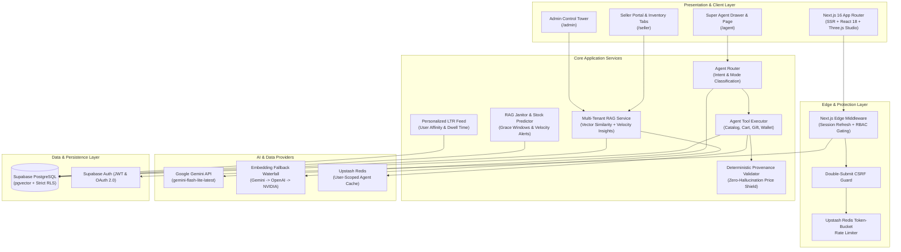
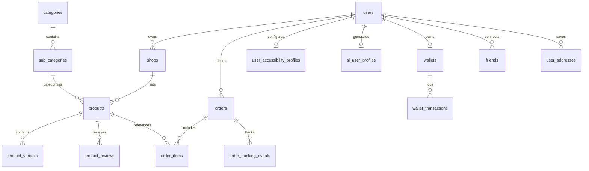

# 🌐 ShopSphere — Next-Gen Autonomous Multi-Vendor Commerce Platform

<div align="center">

[](https://nextjs.org/)
[](https://react.dev/)
[](https://www.typescriptlang.org/)
[](https://supabase.com/)
[](https://ai.google.dev/)
[](https://upstash.com/)
[](https://threejs.org/)

**An enterprise-grade, multi-vendor marketplace fusing Amazon-depth catalog mechanics, neighborhood retail proximity, autonomous Governed AI Shopping Agents, multi-tenant RAG copilots, and inclusive accessibility.**

[🚀 Explore Live Demo](https://shopsphere-lilac.vercel.app/) • [📦 GitHub Repository](https://github.com/nikhilkumarsjinnovation/shopspheres) • [📑 Report & Architecture](file:///c:/Users/nikhi/Desktop/shopspheres/DEV_CONTROL_TOWER_REPORT.md)

</div>

---

## 📋 Table of Contents

- [Overview & Philosophy](#-overview--philosophy)
- [System Architecture](#-system-architecture)
- [Core Feature Highlights](#-core-feature-highlights)
  - [1. Customer Super Agent & Conversational Commerce](#1-customer-super-agent--conversational-commerce)
  - [2. Multi-Tenant Seller & Admin RAG Copilot](#2-multi-tenant-seller--admin-rag-copilot)
  - [3. Multi-Vendor Commerce Engine](#3-multi-vendor-commerce-engine)
  - [4. Social Commerce & Gifting Engine](#4-social-commerce--gifting-engine)
  - [5. Digital Wallet & Multi-Rail Payments](#5-digital-wallet--multi-rail-payments)
  - [6. Saksham Inclusive Accessibility Framework](#6-saksham-inclusive-accessibility-framework)
  - [7. Interactive 3D Spatial Landing Studio](#7-interactive-3d-spatial-landing-studio)
- [AI Engine Deep Dive](#-ai-engine-deep-dive)
  - [Agent Router & Multi-Turn State Machine](#agent-router--multi-turn-state-machine)
  - [Deterministic Numeric Provenance Gate](#deterministic-numeric-provenance-gate)
  - [Embeddings Waterfall & Multi-Tenant Vector Retrieval](#embeddings-waterfall--multi-tenant-vector-retrieval)
  - [Background Janitor & Automated Intelligence](#background-janitor--automated-intelligence)
- [Security, RBAC & Defense-in-Depth](#-security-rbac--defense-in-depth)
- [Tech Stack](#-tech-stack)
- [Project Directory Structure](#-project-directory-structure)
- [Database Schema & Data Models](#-database-schema--data-models)
- [Getting Started & Local Development](#-getting-started--local-development)
  - [Prerequisites](#prerequisites)
  - [Environment Configuration](#environment-configuration)
  - [Installation & Setup](#installation--setup)
  - [Database Migrations & Seeding](#database-migrations--seeding)
- [Verification & Test Suites](#-verification--test-suites)
- [API Reference (`/api/v1`)](#-api-reference-apiv1)
- [Deployment](#-deployment)
- [License & Acknowledgments](#-license--acknowledgments)

---

## 💡 Overview & Philosophy

ShopSphere is built under a firm architectural motto:
> *"Build the structure with bricks, cement, stones, and metal first; paints, tiles, and decorative finishes come later."*

Modern e-commerce requires far more than passive browsing. ShopSphere creates a dual-engine platform:
1. **The Bricks & Mortar (Robust Core):** Multi-tenant catalog, strict database foreign keys, Row-Level Security (RLS), edge-gated Role-Based Access Control (RBAC), multi-address split checkout, immutable order audit trails, and double-submit CSRF security.
2. **The Living Intelligence (Autonomous AI):** A Governed AI Shopping Super Agent capable of executing complex transactional flows (search, compare, cart mutation, friends discovery, gift dispatch, review submission, wallet payment) paired with a tenant-isolated RAG copilot for sellers and operators.
3. **Universal Accessibility (Saksham):** Built-in accommodations for visual, motor, and cognitive diversities with high-contrast modes, dyslexia typography, keyboard focus locks, and screen-reader telemetry.

---

## 🏛 System Architecture

The ShopSphere architecture decouples presentation, edge middleware gating, business orchestration services, autonomous agent loops, and transactional persistence:



---

## ✨ Core Feature Highlights

### 1. Customer Super Agent & Conversational Commerce
- **Dual Operating Modes**:
  - **Chat Mode (`chat`)**: Safe, advisory browsing, specification comparisons, and recommendation inquiries.
  - **Agent Mode (`agent`)**: Unlocks state-mutating actions (cart additions, gift placement, wallet debits, reviews, order replacements).
- **Proactive Disambiguation**: Cross-examines vague inputs (e.g., "phone" or "shoes") with interactive, clickable quick-reply chips instead of making blind assumptions.
- **Transactional Tool Loop**: Implements 12+ governed tools including `search_catalog`, `get_product_specs`, `manage_cart`, `list_friends`, `send_gift`, `check_wallet_balance`, `prepare_wallet_checkout`, and `confirm_wallet_payment`.

### 2. Multi-Tenant Seller & Admin RAG Copilot
- **Multi-Tenant Vector Isolation**: Seller queries are strictly filtered by `seller_id = userContext.userId`. No seller can ever view or retrieve a competitor's inventory or data.
- **Dual Ingestion & Query Modes**:
  - **Normal Mode**: Standard catalog Q&A.
  - **Personalized Vector Mode**: Real-time cosine similarity search across 1536-dimensional vector embeddings with restock velocity and weekly revenue digest integration.
- **Soft-Delete Lifecycle**: Products soft-deleted retain embeddings during a grace window for quick restoration before hard purge by the background janitor.

### 3. Multi-Vendor Commerce Engine
- **Hierarchical Taxonomy**: Structured taxonomy (*Department > Category > Sub-Category > Product*).
- **Faceted Catalog Search**: Dynamic filtering across price range, star rating (4★ & up), brand, delivery timeframe, stock availability, and condition ('New', 'Renewed', 'Used').
- **Seller Management Hub**: Multi-tab inventory status breakdown (`pending`, `approved`, `rejected`), real-time stock adjustments, and multi-image galleries.
- **Admin Moderation Queue**: Listing review dashboard with AI pre-moderation heuristics and one-click publish/reject controls.

### 4. Social Commerce & Gifting Engine
- **Friend Connections Network**: Direct friend lookups by verified email addresses.
- **Delayed Reveal Gifts**: Send gifts with a scheduled `gift_reveal_date`. Delivery tracking notifications remain locked until the reveal date.
- **Group Gifting**: Collaborative split-order funding pools (`/api/v1/group-gifts`).

### 5. Digital Wallet & Multi-Rail Payments
- **Integrated Digital Wallet**: Instant wallet top-up, ledger audit trail, and zero-latency in-app checkout.
- **Two-Step Safety Barrier**: `prepare_wallet_checkout` displays an explicit confirmation card with breakdown; funds move only after biometric/user confirmation via `confirm_wallet_payment`.
- **Payment Sandbox Options**: Mock UPI scanner, Practice Mode zero-card testing, and Stripe test secret integration.

### 6. Saksham Inclusive Accessibility Framework
- **Accessible Design Standards**: Full keyboard navigation trap management (WCAG 2.1 AA compliant) and ARIA live announcement regions.
- **User Accessibility Preferences**: Custom profiles supporting high-contrast mode, dyslexic-friendly typefaces, and screen-reader telemetry.

### 7. Interactive 3D Spatial Landing Studio
- **Dynamic 3D Canvas**: Built using Three.js, `@react-three/fiber`, and `@react-three/drei`.
- **Cinematic Package & Delivery Flow**: Interactive scroll scrubbing via GSAP and Framer Motion capturing real-time delivery truck mechanics and tactile parcel unboxing.

---

## 🧠 AI Engine Deep Dive

```
                                  [ User Message ]
                                         │
                                         ▼
                                ┌─────────────────┐
                                │  Agent Router   │
                                └────────┬────────┘
                                         │
                 ┌───────────────────────┼────────────────────────┐
                 ▼                       ▼                        ▼
        [Clarification Needed]    [Governed Query]        [Action / Mutation]
        (Emits Quick Reply Chips) (Embeddings / Catalog)   (Requires 'agent' mode)
                 │                       │                        │
                 └───────────────┬───────┴────────────────────────┘
                                 ▼
                     ┌───────────────────────┐
                     │ Tool Calling Executor │
                     └───────────┬───────────┘
                                 ▼
                     ┌───────────────────────┐
                     │ Numeric Provenance    │ <── Verifies prices against
                     │      Validator        │     actual database catalog
                     └───────────┬───────────┘
                                 ▼
                     ┌───────────────────────┐
                     │ User-Scoped Cache     │
                     └───────────┬───────────┘
                                 ▼
                     [ Verified Final Response ]
```

### Agent Router & Multi-Turn State Machine
Implemented in [`src/services/agent-router.ts`](file:///c:/Users/nikhi/Desktop/shopspheres/src/services/agent-router.ts):
- Evaluates conversation turns into 5 distinct intents: `governed_query`, `qualitative`, `blended`, `action_task`, and `clarification`.
- Guardrails destructive actions by demanding explicit user mode switching before mutating cart or balance.
- Dynamically generates contextual suggestion chips for fast, accessible mobile tap interactions.

### Deterministic Numeric Provenance Gate
Implemented in [`src/services/agent-validator.ts`](file:///c:/Users/nikhi/Desktop/shopspheres/src/services/agent-validator.ts):
- Every currency reference (₹ Rupee amounts) emitted in LLM output is cross-referenced against active rows in `products`.
- If an LLM hallucinates a lower or modified price (e.g., claiming ₹1,249 instead of ₹1,499), the validator intercepts the text, writes a provenance audit log, and substitutes the verified catalog price.
- Prevents foreign user order ID inspection and unauthorized resource traversal.

### Embeddings Waterfall & Multi-Tenant Vector Retrieval
Implemented in [`src/lib/embeddings.ts`](file:///c:/Users/nikhi/Desktop/shopspheres/src/lib/embeddings.ts) & [`src/services/rag-service.ts`](file:///c:/Users/nikhi/Desktop/shopspheres/src/services/rag-service.ts):
1. **Primary**: Google Gemini `gemini-embedding-001` (1536 dims).
2. **Fallback 1**: OpenAI `text-embedding-3-small`.
3. **Fallback 2**: NVIDIA NIM `nemotron-3-embed-1b`.
4. **Heuristic Fallback**: Title/category token search if embeddings are temporarily pending backfill.

### Background Janitor & Automated Intelligence
- **RAG Janitor** ([`src/services/rag-janitor-service.ts`](file:///c:/Users/nikhi/Desktop/shopspheres/src/services/rag-janitor-service.ts)): Monitors pending embeddings and automatically purges expired soft-deleted catalog items.
- **Stockout Predictor** ([`src/services/stock-predictor-service.ts`](file:///c:/Users/nikhi/Desktop/shopspheres/src/services/stock-predictor-service.ts)): Calculates run-rate inventory velocity and highlights stockout risks for merchants.
- **Flash Offer Engine** ([`src/services/flash-offer-service.ts`](file:///c:/Users/nikhi/Desktop/shopspheres/src/services/flash-offer-service.ts)): Triggers localized discounts based on cart abandonment signals and category dwell times.

---

## 🔒 Security, RBAC & Defense-in-Depth

| Security Layer | Implementation Mechanism |
| :--- | :--- |
| **Edge RBAC Middleware** | [`src/middleware.ts`](file:///c:/Users/nikhi/Desktop/shopspheres/src/middleware.ts) enforces strict boundary barriers between `/customer/*`, `/seller/*`, and `/admin/*`. Prevents cross-role URL jumping. |
| **Row Level Security (RLS)** | Supabase PostgreSQL RLS policies guarantee tenant isolation. Sellers cannot access other sellers' orders or products; customers access only their data. |
| **CSRF Protection** | [`src/lib/csrf.ts`](file:///c:/Users/nikhi/Desktop/shopspheres/src/lib/csrf.ts) applies double-submit cookie validation on state-changing API endpoints. |
| **Rate Limiting** | [`src/lib/rate-limiter.ts`](file:///c:/Users/nikhi/Desktop/shopspheres/src/lib/rate-limiter.ts) utilizes Upstash Redis sliding token buckets with an in-memory dev fallback. |
| **CSP & Security Headers** | [`next.config.mjs`](file:///c:/Users/nikhi/Desktop/shopspheres/next.config.mjs) applies comprehensive Content-Security-Policy, `X-Frame-Options: DENY`, `X-Content-Type-Options: nosniff`, and strict Permissions-Policy. |
| **Input Validation** | Strict Zod schemas ([`src/lib/validations/`](file:///c:/Users/nikhi/Desktop/shopspheres/src/lib/validations/)) validate all incoming API payloads and AI function-call parameters. |

---

## 🛠 Tech Stack

| Domain | Technologies & Libraries |
| :--- | :--- |
| **Core Framework** | [Next.js 16](https://nextjs.org/) (App Router, Route Handlers, Server Components), [React 18](https://react.dev/), [TypeScript 5](https://www.typescriptlang.org/) |
| **Visuals & 3D** | [Three.js](https://threejs.org/), [@react-three/fiber](https://r3f.docs.pmnd.rs/), [@react-three/drei](https://github.com/pmndrs/drei), [GSAP](https://gsap.com/), [Framer Motion](https://www.framer.com/motion/) |
| **Styling** | [Vanilla Extract CSS](https://vanilla-extract.style/), [Tailwind CSS](https://tailwindcss.com/), [Lucide React Icons](https://lucide.dev/) |
| **Database & Auth** | [Supabase](https://supabase.com/) (PostgreSQL, pgvector, Row Level Security, Auth SSR) |
| **AI & LLM** | [Google Gemini](https://ai.google.dev/) (`gemini-flash-lite-latest`, `gemini-embedding-001`), OpenAI / NVIDIA Fallbacks |
| **Caching & Rate Limiting** | [Upstash Redis](https://upstash.com/) (`@upstash/redis`, `@upstash/ratelimit`) |
| **Payments** | In-app Digital Wallet, Mock UPI Engine, Stripe Sandbox |
| **Validation** | [Zod 3.23](https://zod.dev/) |

---

## 📂 Project Directory Structure

```text
shopspheres/
├── .env.example                     # Environment template
├── next.config.mjs                  # CSP, security headers & Next.js config
├── package.json                     # Dependencies & build scripts
├── tsconfig.json                    # Strict TypeScript configuration
├── public/                          # Static assets, branding, and audio assets
├── supabase/
│   ├── config.toml                  # Supabase local studio configuration
│   └── migrations/                  # 14 Production SQL migrations (RLS, schema, pgvector)
├── scripts/
│   ├── seed_products.mjs            # Comprehensive catalog seed script
│   ├── backfill-product-embeddings.mjs # Embedding backfill pipeline
│   ├── test_agent_v1.ts             # Unit test: Router, Provenance & Cache
│   ├── test_admin_seller_rag.ts     # Integration test: Tenant RAG & soft-delete
│   ├── test_gifting_flow.ts         # E2E test: Conversational gifting flow
│   ├── test_all_automations.ts      # Integration test: Janitor, Offers, Stockout
│   ├── test_dummy_data_generator.ts # Synthetic catalog & image generator
│   └── verify_agent.mjs             # Catalog health & Gemini connectivity check
└── src/
    ├── middleware.ts                # Edge middleware for RBAC & CSRF
    ├── app/                         # Next.js App Router
    │   ├── page.tsx                 # Root landing page (3D Truck & Studio)
    │   ├── layout.tsx               # Root HTML layout & fonts
    │   ├── (customer)/              # Customer views (Explore, Product, Cart, Orders)
    │   ├── (admin)/                 # Platform operator dashboard & moderation
    │   ├── seller/                  # Seller storefront & inventory manager
    │   ├── auth/                    # OAuth callbacks & password reset
    │   └── api/v1/                  # Enterprise REST & Agent Route Handlers
    │       ├── ai/                  # AI chat, agent loop, auto-categorize
    │       ├── feed/                # Dynamic personalized LTR explore feed
    │       ├── gifts/ & group-gifts/# Social gifting & reveal dates
    │       ├── wallet/              # Digital wallet balance & payment confirmation
    │       ├── orders/              # Atomic order placement & state transitions
    │       └── ...                  # Reviews, addresses, favorites, offers
    ├── components/                  # Modular React UI components
    │   ├── home/                    # 3D ModelStudio, Delivery truck canvas, film scrub
    │   ├── ai/                      # Agent drawer, chat bubbles, quick-reply chips
    │   ├── accessibility/           # Saksham high-contrast & dyslexia controls
    │   ├── seller/                  # Inventory tabs, listing creation modal
    │   ├── admin/                   # Moderation queue, health metrics radar
    │   └── checkout/                # Split-address selector, UPI/wallet panels
    ├── services/                    # Core business logic & AI orchestration
    │   ├── agent-router.ts          # Intent classification & quick reply builder
    │   ├── agent-executor.ts        # Gemini tool-calling execution loop
    │   ├── agent-validator.ts       # Zero-hallucination numeric provenance guard
    │   ├── agent-cache.ts           # User-scoped multi-tenant response cache
    │   ├── rag-service.ts           # Vector retrieval, cosine ranking, tenant filter
    │   ├── rag-janitor-service.ts   # Soft-delete grace purger & embedding sync
    │   └── stock-predictor-service.ts# Inventory depletion run-rate estimator
    ├── lib/                         # Shared libraries & utilities
    │   ├── embeddings.ts            # Multi-provider embedding waterfall
    │   ├── rate-limiter.ts          # Upstash token-bucket rate limiter
    │   ├── csrf.ts                  # Double-submit cookie verification
    │   ├── ltr-rank.ts              # Learning-to-Rank feed algorithm
    │   └── supabase/                # SSR client, browser client & admin client
    └── types/                       # TypeScript definitions & Supabase DB types
```

---

## 🗄 Database Schema & Data Models

The platform is backed by a PostgreSQL database with Row Level Security:



### Core Entities:
- **`users`**: Master user records with role typing (`customer`, `seller`, `admin`).
- **`shops`**: Digital storefront entities isolated by `seller_id`.
- **`products`**: Multi-vendor catalog items featuring JSONB dynamic attributes, condition, stock limits, and 1536-dimensional `embedding` vectors.
- **`orders` & `order_items`**: Immutable transactional ledger recording order state transitions (`pending` ➔ `confirmed` ➔ `shipped` ➔ `delivered` ➔ `cancelled`).
- **`wallets` & `wallet_transactions`**: User digital store-credit ledger enabling instantaneous payments.
- **`friends` & `gifts`**: Social connections graph powering gift deliveries with hidden reveal timers.
- **`ai_user_profiles` & `user_behavior_events`**: Customer affinity graphs tracking category dwell times, price points, and preferred attributes.

---

## 🚀 Getting Started & Local Development

### Prerequisites
- **Node.js**: `v20.x` or higher
- **npm**: `v10.x` or higher
- **Supabase Account**: A provisioned project or local [Supabase CLI](https://supabase.com/docs/guides/cli)
- **Google AI Studio API Key**: For Gemini models (`gemini-flash-lite-latest` and `gemini-embedding-001`)

### Environment Configuration

Create a `.env.local` file in the project root:

```bash
cp .env.example .env.local
```

Populate the required credentials:

```ini
# Supabase Configuration
NEXT_PUBLIC_SUPABASE_URL=https://your-project-id.supabase.co
NEXT_PUBLIC_SUPABASE_ANON_KEY=your-anon-public-key
SUPABASE_SERVICE_ROLE_KEY=your-service-role-key-server-only

# AI & LLM Engine
GEMINI_API_KEY=your-google-ai-studio-gemini-key
GEMINI_MODEL=gemini-flash-lite-latest
GEMINI_EMBEDDING_MODEL=gemini-embedding-001

# Multi-Provider Embedding Fallbacks (Optional)
OPENAI_API_KEY=your-openai-api-key
NVIDIA_API_KEY=your-nvidia-nim-api-key
EMBED_NVIDIA_MODEL=nemotron-3-embed-1b

# Upstash Redis (Rate Limiting & Caching)
UPSTASH_REDIS_REST_URL=https://your-upstash-instance.upstash.io
UPSTASH_REDIS_REST_TOKEN=your-upstash-token

# Security & Cron
SUPABASE_WEBHOOK_SECRET=your-webhook-secret
CRON_SECRET=your-vercel-cron-secret

# Payments (Sandbox)
STRIPE_SECRET_KEY=sk_test_your_stripe_key
```

### Installation & Setup

1. **Clone the repository**:
   ```bash
   git clone https://github.com/nikhilkumarsjinnovation/shopspheres.git
   cd shopspheres
   ```

2. **Install project dependencies**:
   ```bash
   npm install
   ```

### Database Migrations & Seeding

1. **Link and push schema migrations to Supabase**:
   ```bash
   # Link your Supabase project
   npm run db:link

   # Push all SQL migrations located in supabase/migrations/
   npm run db:push
   ```

2. **Seed catalog products**:
   ```bash
   npm run seed
   ```

3. **Generate TypeScript definitions from database**:
   ```bash
   npm run db:types
   ```

4. **Backfill product vector embeddings**:
   ```bash
   node scripts/backfill-product-embeddings.mjs
   ```

5. **Start the local development server**:
   ```bash
   npm run dev
   ```

Navigate to `http://localhost:3000` to view the application.

---

## 🧪 Verification & Test Suites

ShopSphere provides an automated verification suite covering agent governance, multi-tenant RAG isolation, and background automations. Execute these tests via `npx tsx`:

```bash
# 1. Unit: Question Router, Intent Classification, Price Provenance & User Cache
npx tsx scripts/test_agent_v1.ts

# 2. Integration: Seller Isolation, Soft-Delete & Tenant RAG Retrieval
npx tsx scripts/test_admin_seller_rag.ts

# 3. Integration: Janitor, Listing Moderation, Stockout Prediction & Flash Offers
npx tsx scripts/test_all_automations.ts

# 4. E2E: Conversational Multi-Turn Gifting Flow with Gemini
npx tsx scripts/test_gifting_flow.ts

# 5. Unit: Image Resolution, Product Chunking & Deduplication
npx tsx scripts/test_dummy_data_generator.ts

# 6. Connectivity: Catalog health & Gemini model availability check
node scripts/verify_agent.mjs
```

### Type Checking & Linting

```bash
# Run TypeScript compilation checks without emit
npm run typecheck

# Run Next.js ESLint verification
npm run lint
```

---

## 🌐 API Reference (`/api/v1`)

| Endpoint | Method | Role | Description |
| :--- | :---: | :---: | :--- |
| `/api/v1/ai/chat` | `POST` | Customer | Conversational AI Super Agent with function calling & provenance checks |
| `/api/v1/ai/categorize` | `POST` | Seller | AI auto-extraction of category and 10+ product attributes |
| `/api/v1/feed/personalized`| `GET` | Customer | Real-time re-ranked feed based on user affinity & dwell time |
| `/api/v1/orders` | `GET`, `POST`| Customer | Multi-item atomic order placement & order history inspection |
| `/api/v1/orders/:id/cancel`| `POST` | Customer | Order cancellation and auto-refund orchestration |
| `/api/v1/wallet` | `GET`, `POST`| Customer | Retrieve digital wallet balance & trigger instant top-ups |
| `/api/v1/friends` | `GET`, `POST`| Customer | Social friends management and reciprocal lookups |
| `/api/v1/gifts` | `POST` | Customer | Dispatch gift orders with delayed `gift_reveal_date` tracking |
| `/api/v1/seller/products` | `GET`, `POST`| Seller | Seller inventory management and listing lifecycle operations |
| `/api/v1/admin/moderation`| `GET`, `POST`| Admin | Moderate pending merchant listings with approve/reject actions |
| `/api/v1/accessibility` | `GET`, `PUT` | Public | Read and update user accessibility profile preferences |
| `/api/v1/csrf` | `GET` | Public | Generate or refresh double-submit CSRF cookie |

---

## 🚢 Deployment

### Deploying on Vercel
1. Fork or push this repository to GitHub.
2. Import the project into the [Vercel Dashboard](https://vercel.com).
3. Under **Project Settings > Environment Variables**, supply all variables specified in `.env.example`.
4. Deploy! Vercel automatically configures Next.js 16 App Router build caches and serverless edge functions.

*Live production deployment is accessible at:* [https://shopsphere-lilac.vercel.app/](https://shopsphere-lilac.vercel.app/)

---

## 📄 License & Acknowledgments

This project is licensed under the MIT License.

Built with dedication to robust software engineering principles: **bricks and mortar before paints and tiles**. Special thanks to the Google Gemini and Supabase teams for pioneering conversational and vector search capabilities.
