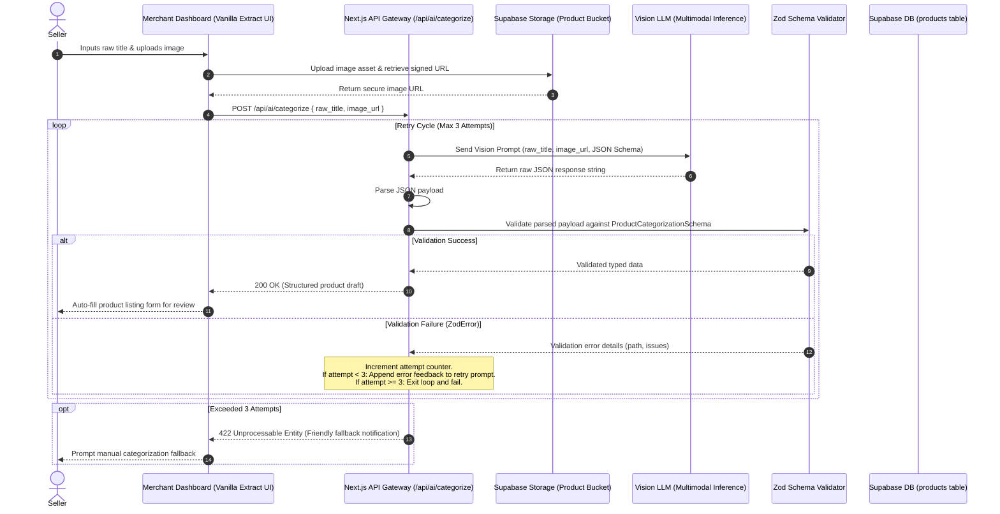

# ShopSphere Phase 1 — Seller AI Auto-Categorization Architecture

**Role:** AI Integration Engineer  
**Subsystem:** Merchant Catalog Intelligence (Auto-Categorization & Enrichment)  
**Status:** Architecture Specification & Integration Blueprint  

---

## 1. System Overview & Objective

The Seller Auto-Categorization subsystem empowers merchants to onboard merchandise rapidly by transforming minimal inputs—a raw product title and an image—into a fully structured, enriched, and classified catalog listing.

### Core Objectives
1. **Multimodal Understanding:** Ingest both unstructured textual titles and product imagery to deduce accurate product taxonomy, descriptions, and metadata.
2. **Strict Determinism:** Eliminate non-deterministic LLM text drift by requiring strict JSON output conforming directly to the Supabase database schema.
3. **Automated Error Recovery:** Intercept schema violations via runtime Zod validation and execute an automatic self-healing retry loop (up to 3 attempts) before surfacing errors to the merchant.

---

## 2. End-to-End Processing Pipeline



---

## 3. Input & Multimodal Prompt Specifications

### 3.1 Input Payload to Integration Service
The integration endpoint accepts a lightweight JSON payload:
* `raw_title`: Unprocessed product name provided by seller (e.g., `"sony wh-1000xm5 black"` or `"nike air zoom 10.5"`).
* `image_url`: Public or time-bound pre-signed URL to the uploaded product image hosted in Supabase Storage.

### 3.2 Model Ingestion Constraints
* **Output Format:** Strict JSON mode enabled (`response_format: { type: "json_object" }` or equivalent schema-guided decoding).
* **Sampling Parameters:** Deterministic temperature (`temperature: 0.1` to `0.2`) to suppress creative hallucinations while retaining taxonomic accuracy.
* **System Prompt Guardrails:**
  * System instruction explicitly mandates outputting *only* valid JSON.
  * System instruction defines allowed top-level platform categories (e.g., *Electronics, Apparel & Accessories, Home & Kitchen, Health & Beauty, Sports & Outdoors, Digital Goods*).
  * Explicit prohibition of Markdown fences (no ````json ... ```` wrapper), preamble, or postscript.

---

## 4. Supabase Database Alignment & Zod Schema Requirements

The output produced by the AI model must directly map to the Phase 1 `public.products` relational table without data loss or intermediate type casting.

### 4.1 Database Column Target Mapping
| AI Generated Field | Database Target (`public.products`) | Data Type & Constraint |
| :--- | :--- | :--- |
| `title` | `products.title` | `TEXT NOT NULL` (Cleaned, professional product headline) |
| `description` | `products.description` | `TEXT NOT NULL` (Structured specifications & marketing copy) |
| `category` | `products.category` | `TEXT NOT NULL` (Standardized top-level platform taxonomy) |
| `sub_category` | `products.sub_category` | `TEXT` (Fine-grained classification) |
| `tags` | `products.tags` | `TEXT[] NOT NULL` (Array of 3 to 7 searchable metadata tags) |
| `confidence_score` | *Telemetry / Metadata* | Float between `0.00` and `1.00` representing model certainty |
| `suggested_price_range` | *Advisory / Metadata* | Object with `min` and `max` numeric values for seller guidance |

### 4.2 Zod Schema Architecture Specification
The validation layer applies strict structural, type, and boundary rules:

* **Title Rules:**
  * Non-empty string, trimmed, between 5 and 150 characters.
* **Description Rules:**
  * Informative string between 20 and 2,000 characters.
* **Category Rules:**
  * Restricted enum of verified platform categories to prevent taxonomic fragmentation.
* **Sub-Category Rules:**
  * Non-empty string, maximum 50 characters.
* **Tags Rules:**
  * Array of strings with a minimum of 3 and a maximum of 7 tags.
  * Each tag must be lowercase, alphanumeric with hyphens, and between 2 and 30 characters.
* **Confidence Score Rules:**
  * Floating-point number between `0.0` and `1.0`.
* **Suggested Price Range Rules:**
  * Optional numeric object with `min >= 0` and `max >= min`.

---

## 5. Self-Healing Retry Loop & Error Handling Architecture

When integrating with large language models, structural drift, malformed JSON, or field omission can occur. The application handles this through a 3-tier validation and recovery cycle.

### 5.1 The 3-Attempt Retry Protocol

```
[Initial Request] Attempt 1
        │
        ├──> AI Ingestion & Response
        ├──> JSON Parsing & Zod Schema Validation
        │
        ├──[Valid] ───────────────> Return Enriched Listing (Success)
        │
        └──[ZodError / Parse Error]
                │
                ├── Log Error Details & Issues
                ├── Format Diagnostic Feedback Payload
                │
                ▼
        [Retry Attempt 2]
                │
                ├── Include: Original Inputs + Failed Output + Exact Schema Errors
                ├── Model Corrects Formatting Errors
                │
                ├──[Valid] ───────────────> Return Enriched Listing (Success)
                │
                └──[ZodError / Parse Error]
                        │
                        ▼
                [Retry Attempt 3] (Final Remediation)
                        │
                        ├── Highest Strictness System Prompt
                        │
                        ├──[Valid] ───────────────> Return Enriched Listing (Success)
                        │
                        └──[Failed]
                                │
                                ▼
                        [Trigger User-Facing Fallback & Log Incident]
```

### 5.2 Dynamic Diagnostic Feedback Generation
On validation failure, the retry prompt is augmented with the exact Zod failure trace:
1. **Identified Path:** The exact JSON key that failed validation (e.g., `tags[4]`, `category`).
2. **Failure Reason:** The specific schema constraint violated (e.g., `Expected array with <= 7 elements, received 11`, `Invalid category enum`).
3. **Corrective Command:** Explicit instruction for the model to rectify the identified paths without modifying valid fields.

### 5.3 Failure Containment & Graceful Degradation
If all 3 attempts fail:
* **Circuit Breaker / Abort:** The system halts automated attempts to prevent runaway API billing and latency degradation.
* **Admin Health Telemetry:** A metric increment is recorded to Supabase or observability logs tracking `ai_categorization_failure` with error metadata (used by the Centralized Admin Dashboard).
* **User-Facing Response:** The API returns an HTTP `422 Unprocessable Entity` containing:
  * A clear, non-technical explanation: *"We couldn't automatically categorize this product. Please select a category manually."*
  * The seller's raw title is preserved in the form so that manual entry requires minimal extra effort.

---

## 6. Security, Rate Limiting & Latency Controls

1. **Authentication Guard:** Only authenticated users with the `seller` role verified through Supabase session middleware can invoke the categorization endpoint.
2. **Rate Limiting:** Per-seller rate throttling (e.g., 20 categorization requests per 10-minute rolling window) to prevent abuse and API exhaustion.
3. **Timeout Safeguards:** Individual AI invocation timeout set to 8 seconds; total timeout for the entire 3-step retry loop capped at 25 seconds.
4. **Image Sanitization:** Image URLs are checked against trusted Supabase Storage origins and verified for MIME types (`image/jpeg`, `image/png`, `image/webp`) before transmission to the vision model.
