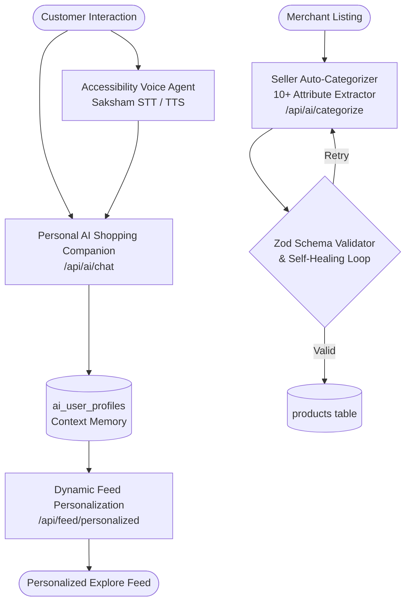
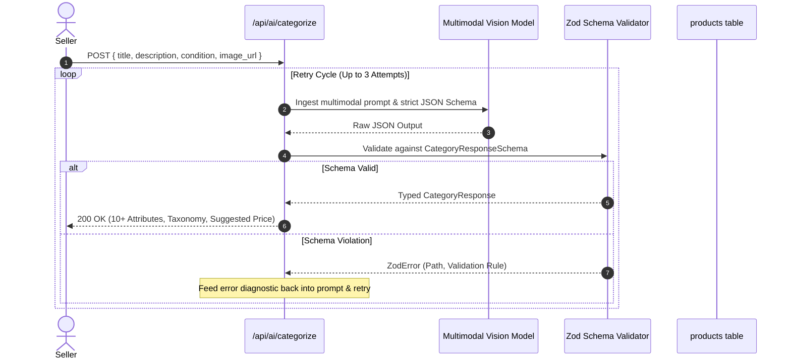

# ShopSphere — Comprehensive AI Subsystem Architecture & Agents Specification

**Document Version:** 2.0.0  
**Subsystem:** Intelligent Platform Intelligence & Autonomous Agent Network  
**Philosophy:** *"Build the foundation with bricks, cement, stones, and metal first; paints and tiles come later."*  
**Status:** Approved Engineering Blueprint

---

## 1. Architectural Overview & The AI Agent Ecosystem

ShopSphere incorporates a multi-agent AI architecture spanning both customer and merchant operations:



---

## 2. Agent 1: The Personal AI Shopping Companion (Living Concierge)

### 2.1 Mission & Core Capabilities
The Personal AI Companion is a continuous-learning conversational guide that understands each user's unique context, provides objective purchasing recommendations, answers complex compatibility questions, and **autonomously mutates the customer's home explore feed in real time**.

### 2.2 Living Memory & User Context Extraction
* **Context Vector Stored in `ai_user_profiles`:**
  * **Explicit Profile:** Budget limits, dietary restrictions (vegan, keto, gluten-free), clothing/shoe sizes, brand preferences.
  * **Implicit Affinity Graph:** Top categories browsed, dwell time on listings, search keywords, price points, conversion history.
  * **Conversational Intent Log:** Extracted entities from recent chat interactions.

### 2.3 Tool-Calling Architecture (`/api/ai/chat`)
The assistant interacts with platform data via structured tool definitions:
1. `search_catalog(query, category?, max_price?, in_stock?, condition?)`: Queries the approved products database.
2. `compare_products(product_ids)`: Generates side-by-side spec comparison highlighting differences and trade-offs.
3. `check_local_availability(product_id, pincode)`: Checks whether an item is within 30 km for immediate hub/store pickup.
4. `update_user_preference(category, weight_delta, intent_tag)`: Mutates `ai_user_profiles.feed_weights` to immediately personalize the customer's home feed.

---

## 3. Dynamic Feed Personalization Engine ("Change His Feed Accordingly")

### 3.1 Overview & Architecture
The customer explore feed (`/customer/explore`) is not a static list. It is driven by the dynamic feed calculation endpoint (`/api/feed/personalized`), which merges general popularity with the user's active AI memory profile.

### 3.2 Feed Weight Scoring Algorithm
Every approved product $P$ receives a real-time relevance score $S(P, U)$ for user $U$:

$$S(P, U) = W_{\text{base}} \cdot \text{Rating}(P) + W_{\text{cat}} \cdot C(P, U) + W_{\text{intent}} \cdot I(P, U) + W_{\text{price}} \cdot D_{\text{price}}(P, U)$$

Where:
* $C(P, U)$ is the user's affinity score for the product's category from `ai_user_profiles.feed_weights`.
* $I(P, U)$ is the match score between the product's tags/attributes and recent AI chat intents.
* $D_{\text{price}}(P, U)$ rewards products that fall within the user's typical purchasing price band.

### 3.3 Dynamic Carousel Generation
The feed API dynamically synthesizes customized carousels based on the user's latest interaction signals:
* **Signal (User chats about hiking gear):**
  * Carousel generated: *"Curated for Your Outdoor Trail Adventure"*
  * Category boost: *Sports & Outdoors*, *Waterproof Footwear*, *Backpacks*.
* **Signal (User searches for kitchen gadgets under ₹2,000):**
  * Carousel generated: *"Top Rated Kitchen Essentials in Your Budget"*

---

## 4. Agent 2: Accessibility Voice & Navigation Agent (Saksham Framework)

### 4.1 Speech-to-Text (STT) Voice Command Engine
* Ingests microphone audio stream, transcribes queries, and classifies navigation or purchasing intents.
* Supported commands:
  * *"Search for stainless steel water bottles under five hundred rupees"*
  * *"Add the second product to my cart"*
  * *"Read the specifications of this item"*
  * *"Proceed to checkout with my default home address"*
  * *"Where is my order?"*

### 4.2 Text-to-Speech (TTS) Audible Guidance
* Generates clear, concise natural language audio descriptions.
* Strips marketing clutter and announces crucial parameters:
  * *"Drift ANC Headphones. Priced at ₹3,499. Rated 4.8 stars by 142 buyers. In stock at Sound & Co. Delivery in 42 minutes."*

---

## 5. Agent 3: Category Specialist Personas (PRO Feature)

When enabled, the assistant adopts specialized domain expertise:

| Persona | Domain | Reasoning Focus | Example Query Resolution |
| :--- | :--- | :--- | :--- |
| **Tech & Electronics Guru** | Audio, Computing, Smart Home | Specs, compatibility, benchmarks, battery life | *"Will these headphones support low-latency gaming on a PS5 without a dongle?"* |
| **Fashion Stylist** | Apparel, Footwear, Accessories | Color harmony, occasion dressing, sizing fits | *"Recommend shoes that pair with an emerald linen blazer for a summer evening."* |
| **Gourmet Sommelier** | Groceries, Coffee, Pantry | Origin, dietary allergies, shelf life, pairings | *"Suggest medium-roast beans roasted within 10 days that work well with French press."* |
| **Beauty Consultant** | Skincare, Cosmetics | Active ingredients, skin tolerance, clean formula | *"Find a daytime moisturizer with niacinamide for sensitive combination skin."* |

---

## 6. Agent 4: Seller Auto-Categorization & 10+ Attribute Extractor

### 6.1 Pipeline Architecture
The endpoint `/api/ai/categorize` transforms minimal seller inputs into an enterprise listing draft.



### 6.2 Strict Zod Schema Contract
```typescript
import { z } from "zod";

export const CategoryResponseSchema = z.object({
  category: z.string().min(1, "Primary category is required"),
  sub_category: z.string().min(1, "Sub-category is required"),
  tags: z.array(z.string()).min(3).max(10),
  confidence: z.number().min(0).max(1),
  attributes: z.record(z.string()).refine(
    (attrs) => Object.keys(attrs).length >= 5,
    "At least 5 detailed specification attributes are required"
  ),
  suggested_price: z.number().min(0, "Price must be positive")
});

export type CategoryResponse = z.infer<typeof CategoryResponseSchema>;
```

---

## 7. Agent 5: Customer Review Summarizer & Comparison Engine

### 7.1 Verified Review Distillation
* Ingests verified buyer reviews from `product_reviews`.
* Outputs concise structural overview:
  * **Top Highlights:** Key praised features (e.g. *"Long battery life (35+ hrs)", "Soft ear cushions"*).
  * **Watch Outs:** Common critical notes (e.g. *"Microphone is average in noisy outdoor environments"*).
  * **Buyer Verdict:** One-sentence summary for rapid decision-making.

### 7.2 Multi-Product Comparison Matrix
* Evaluates 2 (Free) or up to 5 (PRO) products side-by-side.
* Generates clear comparison grid comparing Price, Rating, Battery, Dimensions, Warranty, and Value Score.

---

## 8. Latency Budgets, Fallbacks & Error Recovery

| Operation | Target Latency | Fallback Strategy on Failure |
| :--- | :--- | :--- |
| **Personal AI Chat (`/api/ai/chat`)** | < 1,500 ms | Standard semantic search fallback with rule-based recommendations. |
| **Feed Personalization (`/api/feed/personalized`)** | < 250 ms | Falls back to global top-rated popularity ordering if profile is cold or query times out. |
| **Voice Command Parsing (STT)** | < 800 ms | Standard text search query fallback with error confirmation. |
| **Seller Auto-Categorization (`/api/ai/categorize`)** | < 2,500 ms | 3-attempt self-healing retry loop; falls back to manual merchant form on failure. |
