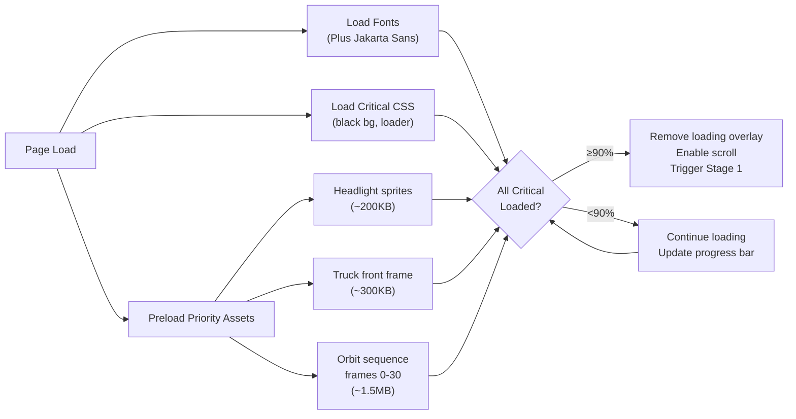

# 🚚 ShopSphere: Delivery Truck Scroll Experience — Full Blueprint

> **Concept:** A cinematic, scroll-driven narrative where a delivery truck comes to life on a pitch-black screen, packages escape in a comedic sequence, and the user scrolls through features alongside tumbling boxes — culminating in a miniature truck recapturing the packages and diving the user into the app.

> **Tech Stack:** Next.js 16 · Framer Motion · GSAP ScrollTrigger · Lottie · Three.js (optional for 3D) · CSS Scroll-Driven Animations

---

## Table of Contents

1. [Concept Overview & Scroll Map](#1-concept-overview--scroll-map)
2. [Detailed Scene Breakdown (17 Stages)](#2-detailed-scene-breakdown-17-stages)
3. [Loading & Performance Strategy](#3-loading--performance-strategy)
4. [Technical Architecture](#4-technical-architecture)
5. [Complete Asset Manifest](#5-complete-asset-manifest)
6. [AI Generation Prompts for Every Asset](#6-ai-generation-prompts-for-every-asset)
7. [Animation Implementation Guide](#7-animation-implementation-guide)
8. [Component Architecture (Next.js)](#8-component-architecture-nextjs)
9. [Responsive & Fallback Strategy](#9-responsive--fallback-strategy)
10. [Development Phases & Timeline](#10-development-phases--timeline)

---

## 1. Concept Overview & Scroll Map

### The Narrative Arc

```
USER SCROLLS ↓
╔══════════════════════════════════════════════════════════════════════════╗
║  [BLACK VOID] → Loading screen with progress bar                      ║
║       ↓ scroll unlocked at 90% load                                   ║
╠══════════════════════════════════════════════════════════════════════════╣
║  ACT I: THE AWAKENING (0vh – 400vh)                                   ║
║  ├─ [1] Two headlights flicker ON in pure darkness                    ║
║  ├─ [2] Brightness swells — truck front revealed                      ║
║  ├─ [3] Camera orbits: front → left side → rear of truck              ║
║  ├─ [4] Humanoid spotted at rear, waving hand                         ║
║  ├─ [5] Humanoid opens one rear door — truck overloaded               ║
║  ├─ [6] Packages tumble from the stack                                ║
║  ├─ [7] Humanoid struggles, slams door shut (comedic)                 ║
║  └─ [8] 3–4 rogue packages escape before door closes                  ║
╠══════════════════════════════════════════════════════════════════════════╣
║  ACT II: THE FEATURE JOURNEY (400vh – 1400vh)                         ║
║  ├─ [9]  Cut-scene: packages tumble & roll to left column             ║
║  ├─ [10] Split layout: packages scroll LEFT, features RIGHT           ║
║  │       ├─ Feature 1: AI Shopping Companion                          ║
║  │       ├─ Feature 2: Visual Search & Lens                           ║
║  │       ├─ Feature 3: Multi-Vendor Marketplace                       ║
║  │       ├─ Feature 4: Smart Checkout & UPI                           ║
║  │       ├─ Feature 5: Accessibility (Saksham)                        ║
║  │       └─ Feature 6: Seller Dashboard & Analytics                   ║
║  └─ [11] Features complete, approaching footer zone                   ║
╠══════════════════════════════════════════════════════════════════════════╣
║  ACT III: THE RECAPTURE & DIVE (1400vh – 2000vh)                      ║
║  ├─ [12] Small truck appears at bottom, doors wide open               ║
║  ├─ [13] Packages roll/fall into the open truck                       ║
║  ├─ [14] Doors slam shut, truck shown complete                        ║
║  ├─ [15] Truck rotates 180° — front now faces upward                  ║
║  ├─ [16] Truck drives UP with scroll, white "zip" blanket unfurls     ║
║  └─ [17] Final: Signup (if guest) or Explore (if logged in) — dive!   ║
╚══════════════════════════════════════════════════════════════════════════╝
```

### Total Scroll Height Estimate

| Act | Scroll Range | Duration (vh) | Key Motion Type |
|-----|-------------|---------------|-----------------|
| Loading | Pre-scroll | N/A | Preloader overlay |
| Act I: Awakening | 0vh – 400vh | 400vh | Sprite sequence / Video scrub / 3D orbit |
| Act II: Features | 400vh – 1400vh | 1000vh | Parallax split-scroll with sticky elements |
| Act III: Recapture | 1400vh – 2000vh | 600vh | Video/sprite sequence + CSS morph |
| **Total** | — | **~2000vh** | Mixed |

---

## 2. Detailed Scene Breakdown (17 Stages)

### 🔒 Stage [*] — Loading Gate

**What happens:** Full-black screen with ShopSphere logo (subtle glow) and a radial progress ring. Scroll is `overflow: hidden` on `<body>`. Once 90%+ of critical frame assets, sprite sheets, and fonts are loaded, the progress ring completes, a soft pulse animation plays, and scroll is unlocked.

**Visual:**
```
┌──────────────────────────────┐
│                              │
│          ◉ (logo)            │
│       ━━━━━━━━━▓░░ 87%      │
│                              │
│    "Warming up the engine…"  │
│                              │
└──────────────────────────────┘
```

**Technical:**
- Track asset loading via `Promise.all()` on image/video preloads.
- CSS: `body.loading { overflow: hidden; height: 100vh; }`
- Once loaded: remove class, enable scroll, trigger Stage 1 entrance.

---

### 💡 Stage [1] — Headlights Ignition (0vh – 50vh)

**What happens:** Two circular headlight glows fade in from zero opacity to full brightness on a pure `#000000` screen. They start as tiny dots and expand with a warm amber-white radial gradient.

**Visual:**
```
┌──────────────────────────────┐
│                              │
│                              │
│        ◎            ◎        │
│    (left light)  (right)     │
│                              │
│                              │
└──────────────────────────────┘
```

**Animation Details:**
- **Scroll 0% → 30%:** Lights appear as 2px dots, `opacity: 0 → 1`
- **Scroll 30% → 100%:** Dots expand to ~120px diameter with radial gradient:
  - Core: `#FFFFFF` (pure white)
  - Mid: `#FFF7E6` (warm amber)
  - Outer: `#FFD700` → transparent (golden halo)
- Subtle lens flare streaks emanate outward

**Implementation Option A — CSS/Canvas (Lightweight):**
```css
.headlight {
  width: 4px; height: 4px;
  border-radius: 50%;
  background: radial-gradient(circle, #fff 0%, #FFD700 40%, transparent 70%);
  box-shadow: 0 0 60px 30px rgba(255, 215, 0, 0.3);
  transform: scale(var(--light-scale)); /* driven by scroll */
  opacity: var(--light-opacity);
}
```

**Implementation Option B — Sprite Sequence (Premium):**
- 30-frame PNG sequence of headlights igniting with realistic bloom
- Scrubbed via `scrollYProgress`

---

### 🔆 Stage [2] — Truck Reveal (50vh – 120vh)

**What happens:** The ambient brightness slowly increases around the headlights. The silhouette of a delivery truck (front view) emerges from the darkness. First the grille, then the bumper, then the full cab shape.

**Visual Layers:**
1. Background: `#000000` → very subtle dark gradient (`#0a0a0a` → `#111`)
2. Truck front silhouette fades in (dark grey → full color/texture)
3. Headlights remain glowing, now contextually placed on the truck body

**Animation:**
- **Scroll 0% → 40%:** Background lightens from `#000` to `#0d0d0d`
- **Scroll 20% → 70%:** Truck outline fades in as a grey silhouette
- **Scroll 60% → 100%:** Full truck detail visible — ShopSphere branding on the front

**Asset Needed:** Front-view illustration/render of delivery truck (see Asset Manifest)

---

### 🎬 Stage [3] — Camera Orbit (120vh – 250vh)

**What happens:** The "camera" rotates from the front of the truck, sweeping left along the truck's side, all the way to the rear — revealing the cargo doors.

**Implementation Approaches:**

| Approach | Pros | Cons | Recommended For |
|----------|------|------|-----------------|
| **A. Frame Sequence (Sprite Sheet)** | Silky smooth, full artistic control | Large asset size (2–5MB for 60–120 frames) | ✅ Best balance |
| **B. Video Scrub** | Easiest to produce, ultra-smooth | Larger file, codec issues on Safari | Good fallback |
| **C. Three.js 3D Model** | Fully interactive, small asset | Complex dev, performance risk on mobile | Premium option |
| **D. CSS 3D Transform on 2D Layers** | Lightweight, no extra assets | Looks flat, limited realism | Budget fallback |

**Recommended: Approach A — Frame Sequence**
- **120 frames** at 1920×1080 each
- Render truck rotating from 0° (front) → 180° (rear) in 3D software (Blender/Spline)
- Export as individual PNGs, pack into a sprite sheet or lazy-load in sequence
- Scrub frame index based on `scrollYProgress`

**Camera Path:**
```
Frame 0:   Front dead-center (0°)
Frame 30:  Front-left quarter (45°)
Frame 60:  Direct left side profile (90°)
Frame 90:  Rear-left quarter (135°)
Frame 120: Direct rear view (180°) — cargo doors visible
```

---

### 👋 Stage [4] — Humanoid Appears (250vh – 300vh)

**What happens:** A small, cute humanoid character is standing beside the truck's rear door. It waves its hand at the user. The humanoid should feel mascot-like — friendly, slightly cartoonish, with ShopSphere branding (e.g., a cap or vest).

**Character Design:**
- **Style:** Low-poly / clay-render / Pixar-junior aesthetic
- **Size:** ~30% of truck height
- **Outfit:** ShopSphere branded cap + delivery vest
- **Personality:** Eager, slightly clumsy, endearing

**Animation:** Lottie animation or sprite sequence
- Idle pose with wave cycle (8–12 frames looped)
- Triggered when scroll reaches this section

---

### 📦 Stage [5] — Door Opens (300vh – 340vh)

**What happens:** The humanoid reaches for one of the two rear doors and pulls it open. Inside, the truck is HEAVILY loaded — boxes stacked floor to ceiling, some leaning precariously.

**Animation Sequence:**
1. Humanoid arm reaches for door handle (Lottie: 15 frames)
2. Door swings open ~90° on its hinge (transform: `rotateY(0deg → -90deg)`)
3. Interior revealed: wall of colorful ShopSphere-branded packages
4. Some boxes visibly shift/lean — foreshadowing the tumble

---

### 🎲 Stage [6] — Packages Tumble (340vh – 370vh)

**What happens:** The top 5–8 packages from the stack lose balance and tumble out of the truck in a cascade. Physics-like motion with rotation and bounce.

**Animation Details:**
- Each package has a randomized:
  - Fall delay (staggered: 0ms, 100ms, 200ms...)
  - Rotation angle (15°–45° per tumble)
  - Bounce height (2–3 bounces, decreasing)
  - Final resting position (scattered on "ground")

**Package Designs (variety):**
- Small brown kraft box with ShopSphere sticker
- Medium white box with green ribbon
- Small padded envelope (amber/terracotta)
- Tall slim box (could be electronics)

---

### 😤 Stage [7] — Humanoid Struggles (370vh – 400vh)

**What happens:** The humanoid frantically pushes against the door. Boxes keep pushing back. Comedic back-and-forth 2–3 times. Finally, with a big effort (exaggerated push pose), the door slams shut.

**Animation Beats:**
1. Push → door closes 70% → boxes push back → door opens 30%
2. Push harder → door closes 85% → a box arm pokes out → pushed in
3. Final SLAM — door fully closes with a satisfying "thud" effect
4. Humanoid wipes forehead (relief pose)

**Sound Design Note (optional):** Slam SFX, grunt SFX, comedic spring boing

---

### 🏃 Stage [8] — Escaped Packages (visible at ~400vh)

**What happens:** While the humanoid was busy — 3–4 packages that fell in Stage [6] have "escaped" and are now sitting on the ground beside the truck. These are the hero packages that will accompany the user through the features section.

**The 4 Escaped Packages (named for reference):**

| Package ID | Visual | Represents |
|-----------|--------|-----------|
| `pkg-alpha` | Brown kraft cube (S) | AI Shopping Companion |
| `pkg-beta` | White box, green ribbon (M) | Marketplace & Vendors |
| `pkg-gamma` | Amber padded envelope (S) | Smart Checkout |
| `pkg-delta` | Tall slim box, blue accent (L) | Accessibility & Saksham |

---

### 🎬 Stage [9] — Cut-Scene Transition (400vh – 450vh)

**What happens:** A cinematic cut. The truck scene fades/wipes away. The 4 escaped packages roll/tumble from their scattered positions toward the LEFT side of the viewport. They stack loosely in a vertical column — ready to accompany the user.

**Transition Effect Options:**
- **Option A:** Quick smash-cut to black, then packages roll in from right
- **Option B:** Truck scene slides up/away, packages physically tumble leftward
- **Option C (Recommended):** Parallax depth wipe — the "ground" tilts and packages slide left by gravity

**End State:** The viewport is now split:
```
┌─────────────────────────────────────────────┐
│  LEFT (30–35%)     │  RIGHT (65–70%)        │
│                    │                         │
│   📦 pkg-alpha     │  ┌─────────────────┐   │
│   📦 pkg-beta      │  │  FEATURE CARD   │   │
│   📦 pkg-gamma     │  │  AI Companion   │   │
│   📦 pkg-delta     │  │                 │   │
│                    │  └─────────────────┘   │
│  (following user   │                         │
│   as they scroll)  │  (features appear &     │
│                    │   disappear on scroll)  │
└─────────────────────────────────────────────┘
```

---

### 📜 Stage [10] — Feature Showcase (450vh – 1200vh)

**What happens:** The core landing page content. Left column has the 4 packages floating/following the user (sticky + parallax). Right column cycles through feature sections as the user scrolls.

**Left Column (Sticky Packages):**
- Position: `sticky`, `top: 20vh`
- Packages float with subtle bounce animation (Framer spring)
- As each feature section enters the right viewport, the corresponding package glows/pulses to show a connection
- Packages gently rotate and bob (idle loop)

**Right Column (6 Feature Sections):**

Each feature section is **~125vh** of scroll height and contains:

#### Feature 1: AI Shopping Companion (450vh – 575vh)
- **Headline:** *"An AI that listens, remembers, and shops for you."*
- **Visual:** Animated chat bubble mockup showing a real conversation
- **Key Points:**
  - Living user context model
  - Real-time feed mutation
  - Domain specialist personas
- **Connected Package:** `pkg-alpha` glows green

#### Feature 2: Visual Search & Lens (575vh – 700vh)
- **Headline:** *"See it. Snap it. Shop it."*
- **Visual:** Phone camera frame scanning a product with AI detection overlays
- **Key Points:**
  - Camera/image upload search
  - AI texture and style matching
  - Moodboard-to-cart pipeline
- **Connected Package:** `pkg-alpha` rotation

#### Feature 3: Multi-Vendor Marketplace (700vh – 825vh)
- **Headline:** *"300+ verified merchants. One curated experience."*
- **Visual:** Grid of artisan storefront cards
- **Key Points:**
  - Hierarchical department taxonomy
  - Buy Box & multi-seller sourcing
  - Hyperlocal 0–30km discovery
- **Connected Package:** `pkg-beta` glows amber

#### Feature 4: Smart Checkout & Payments (825vh – 950vh)
- **Headline:** *"From cart to doorstep in 3 taps."*
- **Visual:** Checkout flow animation (cart → address → UPI → confirm)
- **Key Points:**
  - Instant UPI (PhonePe, GPay, Paytm)
  - Dynamic flash coupons
  - 7-day safety net recovery
- **Connected Package:** `pkg-gamma` glows terracotta

#### Feature 5: Accessibility — Saksham (950vh – 1075vh)
- **Headline:** *"Commerce with dignity. For everyone."*
- **Visual:** Accessibility toggle panel mockup
- **Key Points:**
  - Screen reader optimized
  - High contrast & large targets
  - Simplified UI mode
  - Voice navigation
- **Connected Package:** `pkg-delta` glows iris purple

#### Feature 6: Seller Dashboard & AI Tools (1075vh – 1200vh)
- **Headline:** *"Your boutique. Powered by intelligence."*
- **Visual:** Dashboard mockup with analytics charts
- **Key Points:**
  - AI-assisted catalog onboarding
  - Autonomous content moderation
  - Demand prediction & restock alerts
  - Zero data leakage guarantee
- **Connected Package:** all 4 packages pulse together

---

### 🏁 Stage [11] — Features Complete (1200vh – 1300vh)

**What happens:** A transitional beat. The feature cards fade out. The packages on the left start to look "restless" — bouncing more, jittering, as if they know something is coming. Text appears:

> *"But wait... these packages still need to be delivered."*

The left-side packages begin drifting downward, pulled by "gravity" toward the bottom of the viewport.

---

### 🚛 Stage [12] — Mini Truck Appears (1300vh – 1400vh)

**What happens:** At the bottom of the viewport, a small ShopSphere delivery truck rolls in from the right side. It stops at center-bottom. Its rear doors swing wide open, revealing an empty cargo bay ready to receive the escaped packages.

**Animation:**
1. Truck enters from right (translate-x: `100vw → center`)
2. Brakes with a slight bounce (spring easing)
3. Both rear doors swing open simultaneously (`rotateY: 0 → ±90deg`)
4. Cargo bay interior visible (warm amber interior light glow)

**Truck Style:** Same design as the big truck from Act I, but miniaturized (~200–250px wide)

---

### 📥 Stage [13] — Packages Recaptured (1400vh – 1500vh)

**What happens:** The 4 escaped packages tumble/slide/roll downward into the open truck. Each enters with a satisfying plop and stacks neatly inside.

**Animation per package (staggered 200ms apart):**
1. Package lifts from its floating position
2. Arcs downward in a parabolic path
3. Enters the truck bay
4. Lands with a small bounce and settles
5. A subtle ✓ checkmark flashes on landing

**Order:** `pkg-alpha` → `pkg-beta` → `pkg-gamma` → `pkg-delta`

---

### 🚪 Stage [14] — Doors Close (1500vh – 1550vh)

**What happens:** Both rear doors swing closed with a satisfying slam. The complete miniature truck is now shown — loaded and ready.

**Animation:**
1. Left door swings: `rotateY(-90deg → 0deg)` with spring
2. Right door swings: `rotateY(90deg → 0deg)` with spring (100ms delayed)
3. Door latch click animation (small metal latch rotates into place)
4. Full truck hero shot — clean, complete, branded

---

### 🔄 Stage [15] — 180° Truck Rotation (1550vh – 1650vh)

**What happens:** The truck rotates 180° so that its front now faces UPWARD (toward the top of the page). This symbolizes "going back / delivering to you."

**Animation:**
- Truck rotates on its Y-axis: `rotateY(0deg → 180deg)` — OR
- Top-down 2D rotation: `rotate(0deg → 180deg)` so the front points up
- Smooth spring easing, ~100 frames of scroll

**Important:** After rotation, the truck's headlights face upward (toward top of page)

---

### 🏔️ Stage [16] — The Ascent & White Zip Reveal (1650vh – 1850vh)

**What happens:** The truck now drives UPWARD as the user continues scrolling down. Behind the truck, a white "zip-open" effect unfurls — like a zipper opening a black canvas to reveal white/light underneath. This creates the transition from the dark cinematic world to the bright app interface.

**The "Zip" Effect:**
```
BEFORE (black):                 AFTER (white revealed):
┌──────────────────┐            ┌──────────────────┐
│ ████████████████ │            │                  │
│ ████████████████ │            │   (white/app)    │
│ ████████████████ │            │                  │
│ ████ 🚛 ████████ │   →→→     │       🚛          │
│ ██/    \████████ │            │      / \         │
│ █/ white \██████ │            │     (white)      │
│ /  below  \█████ │            │                  │
└──────────────────┘            └──────────────────┘
```

**Implementation:**
- Two diagonal black overlays (like a V-shaped zip) that part as the truck moves up
- `clip-path: polygon(...)` animated with scroll progress
- Behind the "zip": white background with subtle warm gradient
- The unzipped area grows from bottom to top as the truck ascends

**CSS Concept:**
```css
.zip-left {
  clip-path: polygon(
    0 0,
    50% calc(var(--zip-progress) * 100%),
    0 calc(var(--zip-progress) * 100%)
  );
  background: #000;
}
.zip-right {
  clip-path: polygon(
    50% calc(var(--zip-progress) * 100%),
    100% 0,
    100% calc(var(--zip-progress) * 100%)
  );
  background: #000;
}
```

---

### 🎯 Stage [17] — The Dive (1850vh – 2000vh)

**What happens:** The truck reaches the "top" of the revealed white zone and parks. The white area has fully opened. Now:

- **If user is NOT logged in:** A beautiful signup/login card materializes in the white space. The truck's headlights illuminate it. CTA: *"Ready to receive your first delivery?"*
- **If user IS logged in:** The white space morphs into a portal showing their explore/dashboard page. The truck drives "into" it, creating a zoom/dive effect that navigates the user into the app.

**The "Dive" Effect:**
1. White zone fully open
2. Content card/portal scales from `0.8 → 1.0` with a blur-to-sharp transition
3. Background zooms in (`scale: 1 → 1.5`) creating a "falling into" sensation
4. Route transition: `router.push('/login')` or `router.push('/customer/explore')`

**Signup Card Design:**
```
┌─────────────────────────────────┐
│  🚛                             │
│                                 │
│   Ready to receive your         │
│   first delivery?               │
│                                 │
│  ┌─────────────────────────┐    │
│  │  🛍️  Start Shopping     │    │
│  └─────────────────────────┘    │
│                                 │
│  ┌─────────────────────────┐    │
│  │  🏪  Open Your Store    │    │
│  └─────────────────────────┘    │
│                                 │
│  Already have an account?       │
│  Sign in →                      │
└─────────────────────────────────┘
```

---

## 3. Loading & Performance Strategy

### Critical Path Loading



### Lazy Loading Strategy

| Priority | Assets | Load When |
|----------|--------|-----------|
| **P0 (Critical)** | Headlight sprites, truck front, fonts | Before scroll unlock |
| **P1 (High)** | Orbit frames 0–60, humanoid idle | After scroll unlock, immediately |
| **P2 (Medium)** | Orbit frames 60–120, package sprites, door animations | When scroll > 80vh |
| **P3 (Low)** | Feature section images, mini truck, zip textures | When scroll > 300vh |
| **P4 (Deferred)** | Signup card assets, portal effect | When scroll > 1400vh |

### Performance Targets

| Metric | Target |
|--------|--------|
| First Contentful Paint | < 1.2s (black screen + loader) |
| Loader to Interactive | < 4s on 4G, < 2s on broadband |
| Frame Rate during scroll | 60fps locked (use `will-change`, GPU layers) |
| Total Asset Weight | < 8MB (compressed), lazy-loaded in chunks |
| Largest Contentful Paint | < 2.5s |

---

## 4. Technical Architecture

### Approach Decision Matrix

For the truck sequence (Stages 1–8 and 12–16), we need to choose between:

| Approach | Description | Bundle Size | Dev Effort | Visual Quality | Recommendation |
|----------|-------------|-------------|------------|----------------|----------------|
| **Frame Sequence** | Pre-rendered PNG/WebP frames scrubbed by scroll | 3–6MB | Medium | ⭐⭐⭐⭐⭐ | ✅ **Primary** |
| **Lottie Animations** | Vector animations for humanoid & packages | 200–500KB each | Medium | ⭐⭐⭐⭐ | ✅ **For character** |
| **Video Scrub** | MP4/WebM video with `currentTime` bound to scroll | 4–8MB | Low | ⭐⭐⭐⭐⭐ | 🔄 Fallback option |
| **Three.js/R3F** | Real-time 3D rendered truck model | 1–2MB (model) | High | ⭐⭐⭐⭐⭐ | 🔮 Premium future |
| **CSS-only 2D** | CSS transforms on layered 2D illustrations | ~100KB | High (manual) | ⭐⭐⭐ | ❌ Too flat |

### Recommended Hybrid Approach

```
┌───────────────────────────────────────────────────┐
│              RECOMMENDED TECH STACK                │
├───────────────────────────────────────────────────┤
│                                                   │
│  Stages 1–3, 12–16:  FRAME SEQUENCE (WebP)        │
│  ├─ 120 frames for orbit, 60 for mini truck       │
│  ├─ Scrubbed via GSAP ScrollTrigger               │
│  └─ Compressed WebP, ~40KB per frame avg.         │
│                                                   │
│  Stages 4–8:  LOTTIE + CSS                        │
│  ├─ Humanoid character: Lottie animation           │
│  ├─ Package physics: Framer Motion springs         │
│  └─ Door swing: CSS 3D transforms                  │
│                                                   │
│  Stages 9–11:  FRAMER MOTION + CSS                 │
│  ├─ Package floating: useScroll + useTransform     │
│  ├─ Feature cards: scroll-triggered fade/slide     │
│  └─ Sticky column: position: sticky               │
│                                                   │
│  Stage 16:  CSS clip-path ANIMATION                │
│  ├─ Zip effect via animated polygon clip-path      │
│  └─ Driven by scroll progress variable             │
│                                                   │
│  Stage 17:  NEXT.JS ROUTER + FRAMER MOTION         │
│  ├─ Conditional render (auth check)                │
│  └─ Scale/blur transition on route push            │
│                                                   │
└───────────────────────────────────────────────────┘
```

### Libraries Needed

```json
{
  "existing": ["framer-motion", "next", "react"],
  "to-install": {
    "gsap": "^3.12 — ScrollTrigger for frame scrubbing",
    "@lottiefiles/react-lottie-player": "^3.5 — Lottie playback",
    "lottie-web": "^5.12 — Core Lottie renderer"
  },
  "optional-premium": {
    "@react-three/fiber": "^8.15 — If 3D truck model route chosen",
    "@react-three/drei": "^9.88 — 3D helpers and controls"
  }
}
```

---

## 5. Complete Asset Manifest

### 🎬 A. Frame Sequences

| Asset ID | Description | Frames | Resolution | Format | Est. Size | Source |
|----------|-------------|--------|------------|--------|-----------|--------|
| `truck-orbit-seq` | Truck rotating 0°→180° (front to rear) | 120 | 1920×1080 | WebP | ~4.8MB | Blender render / Spline export |
| `headlight-ignition` | Two headlights fading in with bloom | 30 | 1920×1080 | WebP | ~900KB | After Effects / Blender |
| `truck-front-reveal` | Truck front emerging from darkness | 40 | 1920×1080 | WebP | ~1.6MB | Blender render |
| `mini-truck-rotation` | Small truck rotating 180° | 60 | 800×600 | WebP | ~1.2MB | Same Blender model, smaller |

### 🎭 B. Lottie Animations

| Asset ID | Description | Duration | Format | Est. Size |
|----------|-------------|----------|--------|-----------|
| `humanoid-idle-wave` | Mascot standing, waving hand | 2s loop | Lottie JSON | ~80KB |
| `humanoid-open-door` | Mascot reaching and pulling door handle | 1.5s | Lottie JSON | ~60KB |
| `humanoid-struggle-push` | Mascot pushing against door, comedic | 3s | Lottie JSON | ~120KB |
| `humanoid-relief` | Mascot wiping forehead, relieved | 1.5s | Lottie JSON | ~50KB |
| `package-tumble-physics` | 5–8 packages cascading out | 2s | Lottie JSON | ~100KB |
| `door-slam-effect` | Impact lines / dust puff on door slam | 0.5s | Lottie JSON | ~30KB |

### 📦 C. Package Sprites (Static + Animated)

| Asset ID | Description | Resolution | Format | Notes |
|----------|-------------|------------|--------|-------|
| `pkg-alpha-kraft` | Brown kraft cube, ShopSphere sticker | 200×200 | PNG (transparent) | Multiple rotation angles |
| `pkg-beta-white` | White box with green ribbon | 250×200 | PNG (transparent) | Ribbon detail important |
| `pkg-gamma-envelope` | Amber padded envelope | 220×150 | PNG (transparent) | Soft, puffy look |
| `pkg-delta-tall` | Tall slim box, blue accent stripe | 150×300 | PNG (transparent) | Electronics-style |
| `pkg-tumble-sheet` | Sprite sheet: each package in 8 rotation angles | 1600×800 | PNG | 4 packages × 8 angles |

### 🚛 D. Truck Assets (If Not Using Frame Sequence)

| Asset ID | Description | Resolution | Format |
|----------|-------------|------------|--------|
| `truck-front-full` | Front view, headlights on | 1200×800 | PNG (transparent) |
| `truck-side-full` | Left side profile view | 1600×600 | PNG (transparent) |
| `truck-rear-open` | Rear view, doors open, loaded interior | 1200×800 | PNG (transparent) |
| `truck-rear-closed` | Rear view, doors closed | 1200×800 | PNG (transparent) |
| `truck-mini-side` | Small truck for footer section | 400×200 | PNG (transparent) |
| `truck-door-left` | Single left door (for CSS 3D transform) | 200×600 | PNG (transparent) |
| `truck-door-right` | Single right door (for CSS 3D transform) | 200×600 | PNG (transparent) |

### 🧑 E. Humanoid Character (If Not Lottie)

| Asset ID | Description | Resolution | Format |
|----------|-------------|------------|--------|
| `humanoid-idle` | Standing pose, front/side view | 400×600 | PNG (transparent) |
| `humanoid-wave-sheet` | 8-frame wave cycle sprite sheet | 3200×600 | PNG (transparent) |
| `humanoid-push-sheet` | 12-frame push struggle sprite sheet | 4800×600 | PNG (transparent) |

### 🌟 F. Effects & UI

| Asset ID | Description | Format |
|----------|-------------|--------|
| `lens-flare-streak` | Horizontal lens flare for headlights | PNG (transparent) |
| `dust-particles` | Subtle dust motes for dark scene ambiance | Lottie / CSS |
| `zip-texture` | Black fabric/canvas texture for the zip edges | SVG / PNG tileable |
| `loading-logo-glow` | ShopSphere logo with subtle pulse glow | SVG + CSS animation |
| `checkmark-pop` | Small ✓ that pops when package lands in truck | Lottie |

---

## 6. AI Generation Prompts for Every Asset

### 🎨 Image Generation Prompts (Midjourney / DALL-E / Ideogram / Stable Diffusion)

---

#### Prompt 1: Delivery Truck (Front View)

> **Prompt:** *A front view of a modern, friendly delivery truck on a pure black background. The truck is a medium-sized box truck with rounded edges, painted in matte white with subtle sage green (#3B6B55) accent stripes. The grille has a clean, minimal design. Both headlights are glowing warm amber-white with realistic lens bloom. A small "ShopSphere" logo is on the front above the grille in a clean sans-serif font. The style is 3D rendered, clean, slightly stylized like a Pixar vehicle — not hyper-realistic but polished and appealing. Studio lighting from front, dramatic against black void. Transparent background. --ar 16:9 --v 6.1*

---

#### Prompt 2: Delivery Truck (Side Profile)

> **Prompt:** *A left side profile view of a modern delivery box truck on a pure black background. Matte white body with sage green (#3B6B55) stripe along the bottom. The cargo box has "ShopSphere" written in clean, elegant typography. The truck has chunky, friendly proportions — slightly cartoonish like a Pixar render. Warm studio lighting from the left. The rear cargo doors are visible and closed. Clean shadows, isolated on black. Transparent background. --ar 3:1 --v 6.1*

---

#### Prompt 3: Delivery Truck (Rear View, Doors Open, Loaded)

> **Prompt:** *A rear view of a delivery truck with both cargo doors swung wide open, revealing a heavily loaded interior packed floor-to-ceiling with colorful shipping packages and boxes. Some packages are brown kraft, some white with ribbons, some amber envelopes. Packages are stacked precariously, some leaning as if about to fall. The truck body is matte white with sage green accents. Warm amber interior light glows from inside. Pure black background. 3D rendered, Pixar-style, slightly stylized. Transparent background. --ar 16:9 --v 6.1*

---

#### Prompt 4: Humanoid Mascot Character

> **Prompt:** *A cute, friendly humanoid mascot character for a delivery company called ShopSphere. The character is small (about 3 feet tall), has a round head, simple dot eyes with a warm smile, and chunky proportions. They wear a sage green (#3B6B55) delivery vest over a white shirt, a matching green cap with a small "S" logo, and brown work boots. They are standing in a welcoming pose with one hand raised in a wave. Style: 3D clay render, Pixar-junior aesthetic, soft ambient occlusion lighting. Pure black background. Full body shot. Transparent background. --ar 2:3 --v 6.1*

---

#### Prompt 5: Humanoid Pushing Door (Struggle Pose)

> **Prompt:** *A cute 3D clay-rendered humanoid mascot character pushing hard against a large truck door. The character is leaning forward with both arms outstretched, feet planted, face showing comical effort (squinting eyes, puffed cheeks). They wear a sage green delivery vest and cap. The pose is exaggerated and cartoonish — like a Pixar character struggling with something heavy. Viewed from the side. Pure black background. Transparent background. --ar 3:2 --v 6.1*

---

#### Prompt 6: Individual Packages (Set of 4)

> **Prompt A (Kraft Box):** *A small brown kraft cardboard shipping box with a round "ShopSphere" sticker seal on top. The box is slightly worn with soft edges. Photorealistic product shot on transparent background. Warm studio lighting. --ar 1:1 --v 6.1*

> **Prompt B (White Gift Box):** *A medium white cardboard shipping box with a sage green (#3B6B55) ribbon tied in a simple bow on top. Clean, elegant, premium look. Photorealistic product shot on transparent background. Warm studio lighting. --ar 1:1 --v 6.1*

> **Prompt C (Amber Envelope):** *A small padded shipping envelope in warm amber/terracotta color. Slightly puffy, with a small barcode sticker. Photorealistic product shot on transparent background. Warm studio lighting. --ar 4:3 --v 6.1*

> **Prompt D (Tall Slim Box):** *A tall slim white shipping box with a blue accent stripe, like a box for electronics or a long item. Has a small ShopSphere shipping label. Photorealistic product shot on transparent background. Warm studio lighting. --ar 1:2 --v 6.1*

---

#### Prompt 7: Mini Truck (Footer Section)

> **Prompt:** *A miniature cute delivery truck seen from a slight top-down 3/4 angle. Matte white body with sage green stripe. Both rear doors are swung wide open, showing an empty interior with warm amber light. The truck looks toy-like and inviting, as if waiting to be loaded. Clean, minimal, 3D rendered Pixar-style. Pure white background. Transparent background. --ar 2:1 --v 6.1*

---

#### Prompt 8: Loading Screen Logo

> **Prompt:** *A minimal, elegant logo mark for "ShopSphere" — the letter "S" inside a soft rounded square with gentle rounded corners. The "S" is drawn with a single continuous line that subtly forms a delivery route/path. Colors: sage green (#3B6B55) on white, or white on black. Clean vector style, suitable for animation. Transparent background. --ar 1:1 --v 6.1*

---

### 🏆 THE ULTIMATE PIPELINE: Hunyuan3D → GLB → Real-Time 3D in Browser (MOST RECOMMENDED)

> **This is now the top recommended approach.** Generate 3D models using Hunyuan3D-2.1 (or similar AI), download as `.glb`, and load them directly into the browser with React Three Fiber. The camera orbit, door animations, and humanoid movements are all controlled in real-time by scroll position — **no frame sequences, no video extraction, no 500 static images.** Just a ~2-5MB model file and silky smooth scroll-driven 3D.

#### Why This Is Superior

| Aspect | Frame Sequence | Video → Frames | **GLB → R3F (This)** |
|--------|:---:|:---:|:---:|
| File size | 5–15MB (120+ images) | 5–10MB (extracted frames) | **1–3MB (single .glb)** |
| Smoothness | Good (depends on frame count) | Good (depends on extraction) | **Perfect (60fps real-time)** |
| Interactivity | None (fixed sequence) | None (fixed sequence) | **Full (hover, click, parallax)** |
| Resolution independence | Fixed resolution | Fixed resolution | **Adapts to any screen** |
| Loading speed | Slow (many files to preload) | Slow (many files to preload) | **Fast (1 file, progressive)** |
| Creative flexibility | Locked after render | Locked after render | **Change angles/lighting in code** |
| Mobile performance | Good | Good | **Needs optimization (see below)** |

#### The Pipeline

```
┌─────────────────┐     ┌─────────────────┐     ┌──────────────────┐     ┌─────────────────┐
│  STEP 1         │     │  STEP 2         │     │  STEP 3          │     │  STEP 4         │
│                 │     │                 │     │                  │     │                 │
│  Generate 3D    │────▶│  Download .glb  │────▶│  Optimize model  │────▶│  Load in R3F    │
│  model on HF    │     │  from Hugging   │     │  (compress,      │     │  Bind camera    │
│  (Hunyuan3D     │     │  Face Space     │     │   reduce polys,  │     │  orbit + scroll │
│   2.1)          │     │                 │     │   Draco/KTX2)    │     │                 │
└─────────────────┘     └─────────────────┘     └──────────────────┘     └─────────────────┘
```

---

#### STEP 1: Generate 3D Models on Hugging Face

##### Where to Generate

| Service | URL | Model | Format |
|---------|-----|-------|--------|
| **Hunyuan3D 2.1 Space** | `huggingface.co/spaces/tencent/Hunyuan3D-2` | Hunyuan3D-2.1 | `.glb` |
| **Hunyuan3D 2.1 Mini** | `huggingface.co/spaces/tencent/Hunyuan3D-2-Mini` | Lighter version | `.glb` |
| **TripoSR** | `huggingface.co/spaces/stabilityai/TripoSR` | Stability AI | `.glb` / `.obj` |
| **InstantMesh** | `huggingface.co/spaces/TencentARC/InstantMesh` | TencentARC | `.obj` / `.glb` |
| **Meshy.ai** | `meshy.ai` | Commercial (free tier) | `.glb` / `.fbx` |
| **Tripo3D** | `tripo3d.ai` | Commercial (free credits) | `.glb` |
| **Rodin Gen-2** | `hyperhuman.deemos.com` | Deemos | `.glb` |

##### Generation Prompts for Hunyuan3D-2.1

You can use **text-to-3D** or **image-to-3D** mode. Image-to-3D is recommended for more control.

> **Model 1: Delivery Truck (Text-to-3D)**
>
> *"A modern delivery box truck, medium size, matte white body with sage green stripe along the bottom panel. The truck has a rounded, friendly design with slightly cartoonish Pixar-like proportions. Clean cab with visible headlights. Rear has double cargo doors with handles. Simple clean design, low detail game-ready style."*

> **Model 1 ALT: Delivery Truck (Image-to-3D)**
>
> Upload the front-view or 3/4-view truck image generated from Prompt #1 or #2 (Section 6).
> Hunyuan3D will reconstruct the 3D geometry from the reference image.

> **Model 2: Humanoid Mascot (Text-to-3D)**
>
> *"A cute small humanoid mascot character, chibi proportions with a large round head, small body. Wearing a sage green delivery vest and matching cap. Simple dot eyes, warm smile. Brown work boots. Standing in a T-pose or A-pose for rigging. 3D cartoon clay render style, suitable for animation."*

> **Model 2 ALT: Humanoid Mascot (Image-to-3D)**
>
> Upload the mascot image generated from Prompt #4 (Section 6).

> **Model 3: Shipping Packages (Text-to-3D) — Generate Each Separately**
>
> *"A small brown kraft cardboard shipping box, cube shape, with a round sticker seal on top. Simple clean geometry."*
>
> *"A medium white cardboard box with a green ribbon tied in a bow on top."*
>
> *"A small padded shipping envelope, puffy shape, amber/terracotta color."*
>
> *"A tall slim white shipping box with a blue stripe, electronics packaging style."*

##### Tips for Best Hunyuan3D Results

1. **Use image-to-3D when possible** — It produces more consistent geometry than text prompts
2. **Generate the reference image first** (Midjourney/DALL-E), then feed it to Hunyuan3D
3. **Keep designs simple** — Low-detail, clean shapes work best for real-time WebGL
4. **Generate on high quality** — You can always decimate the mesh later
5. **Check the model in the 3D viewer** before downloading — rotate it, check all angles
6. **Download as `.glb`** (not `.gltf`) — GLB is a single binary file, easier to handle

---

#### STEP 2: Optimize the GLB for Web

Raw AI-generated models are often too heavy for web (50K–500K polygons). You need to optimize them to ~5K–20K polygons and compress textures.

##### Using gltf-transform (CLI — Recommended)

```bash
# Install gltf-transform globally
npm install -g @gltf-transform/cli

# Basic optimization pipeline:
# 1. Deduplicate redundant data
# 2. Compress mesh geometry with Draco
# 3. Compress textures with KTX2/Basis Universal
# 4. Optimize draw calls

gltf-transform optimize truck.glb truck-optimized.glb \
  --compress draco \
  --texture-compress webp

# For aggressive web optimization:
gltf-transform optimize truck.glb truck-web.glb \
  --compress draco \
  --texture-compress webp \
  --texture-size 1024 \
  --simplify \
  --simplify-ratio 0.5 \
  --simplify-error 0.001

# Check model stats:
gltf-transform inspect truck-web.glb
```

##### Using Blender (Manual Polish + Export)

If you want to manually fix/polish the model:

```
1. Import .glb into Blender (File → Import → glTF 2.0)
2. Polish:
   ├── Fix any mesh artifacts from AI generation
   ├── Add proper materials (Principled BSDF)
   │   ├── Body: white (#F5F5F5), roughness 0.4, metallic 0
   │   ├── Accents: sage green (#3B6B55), roughness 0.3
   │   ├── Headlights: Emission shader (warm white, strength 5)
   │   └── Windows: Glass BSDF, transmission 0.9
   ├── Separate the doors as individual objects (for animation)
   ├── Set correct pivot points for door hinges
   └── Decimate mesh if > 20K faces (Modifier → Decimate → ratio 0.5)
3. Export as .glb:
   ├── Format: glTF Binary (.glb)
   ├── Apply Modifiers: ✓
   ├── Compression: Draco ✓
   ├── Draco compression level: 6
   └── Texture format: WebP
```

##### Using gltfpack (Alternative CLI)

```bash
# Install via npm
npm install -g gltfpack

# Optimize with mesh simplification + Draco compression:
gltfpack -i truck.glb -o truck-optimized.glb \
  -si 0.5 \     # simplify to 50% of original faces
  -tc \          # compress textures with KTX2
  -cc           # compress geometry with meshopt
```

##### Target Specs After Optimization

| Asset | Max Polygons | Max Textures | Target .glb Size |
|-------|-------------|-------------|------------------|
| Truck (body) | 15K faces | 1 × 1024px diffuse, 1 × 1024px roughness/metallic | < 1.5MB |
| Truck doors (×2) | 2K faces each | Shared with truck body | Included above |
| Humanoid mascot | 8K faces | 1 × 1024px diffuse | < 800KB |
| Package (×4) | 500 faces each | 1 × 512px diffuse each | < 100KB each |
| **Total** | ~28K faces | — | **< 3MB** |

---

#### STEP 3: Load in React Three Fiber + Scroll-Driven Camera

##### Install Dependencies

```bash
npm install @react-three/fiber @react-three/drei three
npm install -D @types/three
```

##### The Scroll-Driven 3D Truck Scene

```tsx
// src/components/home/act-1/TruckScene3D.tsx
'use client';

import { useRef, Suspense } from 'react';
import { Canvas, useFrame, useThree } from '@react-three/fiber';
import {
  useGLTF,
  Environment,
  ContactShadows,
  useProgress,
} from '@react-three/drei';
import { useScroll, useTransform, useSpring, motion } from 'framer-motion';
import * as THREE from 'three';

// Preload the models
useGLTF.preload('/assets/landing/models/truck.glb');
useGLTF.preload('/assets/landing/models/humanoid.glb');

/* ─── The Truck Model ─── */
function TruckModel({ orbitProgress }: { orbitProgress: number }) {
  const { scene } = useGLTF('/assets/landing/models/truck.glb');
  const truckRef = useRef<THREE.Group>(null);

  useFrame(() => {
    if (!truckRef.current) return;
    // Rotate truck based on scroll: 0 = front view, PI = rear view
    truckRef.current.rotation.y = orbitProgress * Math.PI;
  });

  return (
    <group ref={truckRef}>
      <primitive object={scene.clone()} scale={1.5} />
    </group>
  );
}

/* ─── Headlights (Emission Meshes or Point Lights) ─── */
function Headlights({ intensity }: { intensity: number }) {
  return (
    <>
      <pointLight
        position={[-0.6, 0.8, 2.5]}
        intensity={intensity * 10}
        color="#FFE4B5"
        distance={8}
        decay={2}
      />
      <pointLight
        position={[0.6, 0.8, 2.5]}
        intensity={intensity * 10}
        color="#FFE4B5"
        distance={8}
        decay={2}
      />
    </>
  );
}

/* ─── Camera Controller (Bound to Scroll) ─── */
function ScrollCamera({
  orbitProgress,
  revealProgress,
}: {
  orbitProgress: number;
  revealProgress: number;
}) {
  const { camera } = useThree();

  useFrame(() => {
    // During reveal (Stage 1-2): Camera stays front, just zoom in
    // During orbit (Stage 3): Camera orbits around truck
    const angle = orbitProgress * Math.PI; // 0 to PI (front to rear)
    const radius = 6 - revealProgress * 1; // 6 → 5 (subtle zoom)

    camera.position.x = Math.sin(angle) * radius;
    camera.position.z = Math.cos(angle) * radius;
    camera.position.y = 1.5 + Math.sin(orbitProgress * 0.5) * 0.5;
    camera.lookAt(0, 0.8, 0);
  });

  return null;
}

/* ─── Loading Progress Reporter ─── */
function LoadingReporter({
  onProgress,
}: {
  onProgress: (p: number) => void;
}) {
  const { progress } = useProgress();
  onProgress(progress);
  return null;
}

/* ─── Main Scene Component ─── */
export function TruckScene3D() {
  const containerRef = useRef<HTMLDivElement>(null);

  const { scrollYProgress } = useScroll({
    target: containerRef,
    offset: ['start start', 'end end'],
  });

  // Stage 1-2: Headlight reveal (0% - 25% of scroll)
  const headlightIntensity = useTransform(
    scrollYProgress, [0, 0.1, 0.2], [0, 0.5, 1]
  );
  const revealProgress = useTransform(
    scrollYProgress, [0, 0.25], [0, 1]
  );
  // Stage 3: Camera orbit (25% - 65% of scroll)
  const orbitProgress = useTransform(
    scrollYProgress, [0.25, 0.65], [0, 1]
  );
  // Stage 4-8: Humanoid + packages (65% - 100%)
  const humanoidProgress = useTransform(
    scrollYProgress, [0.65, 1.0], [0, 1]
  );

  // Spring smoothing for buttery motion
  const smoothOrbit = useSpring(orbitProgress, {
    stiffness: 50,
    damping: 20,
    restDelta: 0.0001,
  });
  const smoothHeadlight = useSpring(headlightIntensity, {
    stiffness: 80,
    damping: 25,
  });

  return (
    <section
      ref={containerRef}
      style={{ height: '400vh', position: 'relative' }}
    >
      <div
        style={{
          position: 'sticky',
          top: 0,
          height: '100vh',
          width: '100%',
          background: '#000',
        }}
      >
        <Canvas
          camera={{ position: [0, 1.5, 6], fov: 45 }}
          gl={{
            antialias: true,
            alpha: true,
            powerPreference: 'high-performance',
          }}
          dpr={[1, 1.5]} // Limit DPR for performance
        >
          {/* Ambient darkness with subtle fill */}
          <ambientLight intensity={0.05} />

          <Suspense fallback={null}>
            <LoadingReporter onProgress={() => {}} />

            {/* Headlights driven by scroll */}
            <Headlights intensity={smoothHeadlight.get()} />

            {/* The Truck — orbit driven by scroll */}
            <TruckModel orbitProgress={smoothOrbit.get()} />

            {/* Camera path bound to scroll */}
            <ScrollCamera
              orbitProgress={smoothOrbit.get()}
              revealProgress={revealProgress.get()}
            />

            {/* Subtle ground shadow */}
            <ContactShadows
              position={[0, -0.5, 0]}
              opacity={0.3}
              scale={10}
              blur={2}
            />
          </Suspense>
        </Canvas>
      </div>
    </section>
  );
}
```

##### Animating Truck Doors (Scroll-Driven)

If you separated the doors as individual objects in Blender:

```tsx
function TruckWithDoors({ doorOpenProgress }: { doorOpenProgress: number }) {
  const { nodes, materials } = useGLTF('/assets/landing/models/truck.glb');

  const leftDoorRef = useRef<THREE.Mesh>(null);
  const rightDoorRef = useRef<THREE.Mesh>(null);

  useFrame(() => {
    // Open doors based on scroll progress (0 = closed, 1 = fully open)
    if (leftDoorRef.current) {
      leftDoorRef.current.rotation.y = -doorOpenProgress * (Math.PI / 2);
    }
    if (rightDoorRef.current) {
      rightDoorRef.current.rotation.y = doorOpenProgress * (Math.PI / 2);
    }
  });

  return (
    <group>
      {/* Truck body (static) */}
      <mesh geometry={nodes.TruckBody.geometry} material={materials.Body} />

      {/* Left door (pivots on left edge) */}
      <group position={[-1.2, 0.8, -2.5]}> {/* Hinge point */}
        <mesh
          ref={leftDoorRef}
          geometry={nodes.DoorLeft.geometry}
          material={materials.Body}
          position={[0.6, 0, 0]} // Offset from hinge
        />
      </group>

      {/* Right door (pivots on right edge) */}
      <group position={[1.2, 0.8, -2.5]}> {/* Hinge point */}
        <mesh
          ref={rightDoorRef}
          geometry={nodes.DoorRight.geometry}
          material={materials.Body}
          position={[-0.6, 0, 0]} // Offset from hinge
        />
      </group>
    </group>
  );
}
```

---

#### STEP 4: Mobile Fallback (GLB → Static Frames)

Real-time 3D can be heavy on low-end mobile devices. Use this hybrid strategy:

```tsx
// src/hooks/useDeviceCapability.ts
export function useDeviceCapability() {
  const [canHandle3D, setCanHandle3D] = useState(true);

  useEffect(() => {
    // Check for low-end devices
    const isLowEnd =
      navigator.hardwareConcurrency <= 4 ||
      /Android [4-7]/.test(navigator.userAgent) ||
      (navigator as any).deviceMemory < 4;

    // Check WebGL2 support
    const canvas = document.createElement('canvas');
    const gl = canvas.getContext('webgl2');
    const hasWebGL2 = !!gl;

    setCanHandle3D(hasWebGL2 && !isLowEnd);
  }, []);

  return canHandle3D;
}

// In your component:
export function TruckScene() {
  const canHandle3D = useDeviceCapability();

  if (canHandle3D) {
    return <TruckScene3D />;        // Real-time Three.js
  } else {
    return <TruckOrbitSequence />;   // Fallback: frame sequence
  }
}
```

To generate the fallback frames from your GLB (no need for Blender):

```bash
# Use gltf-to-image CLI or a Node.js headless Three.js renderer:
npx @nicolo-ribaudo/gltf-screenshot \
  --input truck.glb \
  --output frames/ \
  --width 1920 --height 1080 \
  --angles "0,15,30,45,60,75,90,105,120,135,150,165,180" \
  --format webp
```

Or use a quick Node script with `puppeteer` + `three.js`:

```js
// scripts/render-frames.mjs
// Renders .glb model at multiple angles using headless Three.js
import puppeteer from 'puppeteer';

const ANGLES = Array.from({ length: 120 }, (_, i) => (i / 119) * 180);

const browser = await puppeteer.launch({ headless: true });
const page = await browser.newPage();
await page.setViewport({ width: 1920, height: 1080 });

// Load a minimal HTML page with Three.js that renders the GLB
await page.goto(`file://${process.cwd()}/scripts/render-glb.html`);

for (let i = 0; i < ANGLES.length; i++) {
  await page.evaluate((angle) => {
    window.setAngle(angle); // Exposed function in render-glb.html
  }, ANGLES[i]);

  await page.screenshot({
    path: `public/assets/landing/frames/truck-orbit/frame_${String(i + 1).padStart(3, '0')}.webp`,
    type: 'webp',
    quality: 85,
  });
}

await browser.close();
console.log(`Rendered ${ANGLES.length} frames.`);
```

---

#### Complete Comparison: All 3 Pipelines

| Pipeline | Asset Size | Dev Complexity | Visual Quality | Interactivity | Mobile | Recommended? |
|----------|-----------|---------------|---------------|--------------|--------|:---:|
| **A. GLB → R3F (This)** | 1–3MB | Medium-High | ⭐⭐⭐⭐⭐ | Full (hover, orbit, click) | Needs fallback | 🏆 **#1** |
| **B. Image → Video → Frames** | 5–10MB | Low-Medium | ⭐⭐⭐⭐ | None | Great | **#2** |
| **C. Blender → Frame Renders** | 5–15MB | High (Blender skills) | ⭐⭐⭐⭐⭐ | None | Great | **#3** |

> **Best strategy:** Use **Pipeline A (GLB → R3F)** as the primary experience on capable devices, and **Pipeline B (Video → Frames)** as the automatic fallback for low-end mobile.

---

### 🎬 PIPELINE B: Image → Video AI → Frame Extraction → Scroll Scrub

> **This is the second recommended approach** and also serves as the mobile/low-end fallback for Pipeline A. Instead of rendering 120 individual frames in Blender, you generate 3–5 key reference images, feed them to a video generation AI to produce a smooth orbit video, then extract frames from that video using `ffmpeg`. Much faster, much cheaper, and the results are stunning.

#### The Pipeline At A Glance

```
┌─────────────┐     ┌──────────────────┐     ┌───────────────┐     ┌──────────────┐
│  STEP 1     │     │  STEP 2          │     │  STEP 3       │     │  STEP 4      │
│             │     │                  │     │               │     │              │
│ Generate 3  │────▶│ Feed to Video AI │────▶│ ffmpeg extract│────▶│ Scroll-scrub │
│ keyframe    │     │ (Veo / Runway /  │     │ PNG/WebP      │     │ via GSAP +   │
│ images      │     │  Kling / Pika)   │     │ frames        │     │ Canvas       │
│             │     │                  │     │               │     │              │
│ Front view  │     │ "Orbit camera    │     │ 60-120 frames │     │ Bind frame   │
│ Side view   │     │  from front to   │     │ at 1920×1080  │     │ index to     │
│ Rear view   │     │  rear smoothly"  │     │               │     │ scrollY      │
└─────────────┘     └──────────────────┘     └───────────────┘     └──────────────┘
```

---

#### STEP 1: Generate the 3 Keyframe Reference Images

Use the image prompts from Section 6 above (Prompts #1, #2, #3) to generate:

| Keyframe | Angle | Use Prompt # | Purpose |
|----------|-------|-------------|---------|
| **Keyframe A** | Front view (0°) | Prompt #1 | Starting frame of orbit |
| **Keyframe B** | Left side profile (90°) | Prompt #2 | Middle reference for smooth interpolation |
| **Keyframe C** | Rear view, doors visible (180°) | Prompt #3 | End frame of orbit |

> **CRITICAL:** All 3 keyframes MUST have:
> - **Same truck design** — same colors, proportions, branding
> - **Same black background** — pure `#000000`, no gradients
> - **Same lighting mood** — warm studio, dramatic against dark
> - **Same aspect ratio** — all 16:9 (1920×1080 or 1344×768)
> - **Consistent style** — if one is Pixar-ish, all must be Pixar-ish
>
> **Tip:** Generate all 3 in the SAME AI session if possible (Midjourney seed locking, or DALL-E conversation context) to maximize visual consistency.

---

#### STEP 2: Feed to Video Generation AI

Now take your keyframe images and ask a video model to smoothly orbit between them.

##### Option A: Google Veo 3 (Recommended — Best Quality)

**Veo 3 supports image-to-video.** Upload your front-view keyframe as the starting frame:

> **Veo 3 Prompt (Front → Side → Rear orbit):**
>
> *"A cinematic camera smoothly orbits around a stationary delivery truck on a pure black background. The camera starts from a direct front view showing the truck's glowing headlights, then slowly and continuously rotates counterclockwise around the truck — passing the left front quarter, the full left side profile revealing the 'ShopSphere' branding, continuing to the rear-left quarter, and finally settling on a direct rear view showing both closed cargo doors. The truck is matte white with sage green accent stripes, 3D rendered in a polished Pixar style. The camera movement is smooth, steady, and cinematic — like a product reveal turntable. Pure black void background throughout. No other objects. Dramatic studio lighting follows the truck."*

**Veo 3 Settings:**
- Duration: 8 seconds (gives ~60-80 extractable frames at smooth pace)
- Resolution: 1080p
- Style: "Cinematic" / "Product"
- Starting frame: Upload your front-view keyframe image
- Aspect ratio: 16:9

> **Veo 3 Prompt (Rear view → Door open + packages fall):**
>
> *"Camera holds steady on the rear of a matte white delivery truck with sage green accents, on a pure black background. A small cute humanoid mascot character wearing a green vest and cap walks into frame from the right side. The mascot waves at the camera, then reaches for the right cargo door handle and pulls it open. Inside, the truck is overloaded with colorful shipping packages stacked floor to ceiling. As the door swings open, several packages tumble and cascade out of the truck, bouncing on the ground. The mascot panics and frantically pushes the door closed, struggling against the weight. 3D rendered, Pixar animation style. Dramatic warm lighting against black void."*

##### Option B: Runway Gen-4 (Great Consistency)

Runway supports **first-frame-to-video** and **first+last-frame transitions**:

> **Runway Gen-4 Prompt:**
>
> *"Smooth cinematic camera orbit around a stationary white delivery truck with green accents on black background. Camera rotates from front view to left side to rear view. Dramatic product-shot lighting. 3D rendered style. No background change. Pure black void."*

**Runway Settings:**
- Mode: "Image to Video" (upload front-view as first frame)
- OR Mode: "First & Last Frame" (upload front-view AND rear-view)
- Duration: 10 seconds
- Camera motion: "Orbit" or "Arc"
- Resolution: 1080p

> **The First+Last Frame mode is PERFECT for this** because you can guarantee the video starts at the front and ends at the rear — the AI just has to smoothly interpolate between them.

##### Option C: Kling 2.1 (Good Motion, Affordable)

> **Kling 2.1 Prompt:**
>
> *"Product turntable video. Camera orbits smoothly around a matte white delivery box truck on a pure black background. Starting from front headlight view, rotating left to side profile, continuing to rear cargo door view. Sage green stripe accents on the truck. 3D rendered Pixar-style vehicle. Dramatic studio lighting. Smooth continuous camera motion."*

**Kling Settings:**
- Mode: Image-to-video (upload front keyframe)
- Duration: 5–10 seconds
- Motion: "Camera orbit"
- Resolution: 1080p

##### Option D: Pika 2.2 (Quick Iterations)

> **Pika 2.2 Prompt:**
>
> *"Orbit camera around white delivery truck, black background, front view to rear view, smooth rotation, 3D render style, cinematic lighting"*

**Pika Settings:**
- Upload front-view image
- Duration: 4 seconds
- Camera: "Orbit left"

---

#### Which Video Model to Choose?

| Model | Image-to-Video | First+Last Frame | Max Duration | Quality | Best For |
|-------|:---:|:---:|:---:|:---:|------|
| **Veo 3** | ✅ | ✅ | 8s | ⭐⭐⭐⭐⭐ | Best overall quality, smoothest motion |
| **Runway Gen-4** | ✅ | ✅ | 10s | ⭐⭐⭐⭐⭐ | Best consistency with first+last frame |
| **Kling 2.1** | ✅ | ✅ | 10s | ⭐⭐⭐⭐ | Great value, fast generation |
| **Pika 2.2** | ✅ | ❌ | 4s | ⭐⭐⭐ | Quick prototyping, cheap |
| **Minimax Hailuo** | ✅ | ❌ | 6s | ⭐⭐⭐⭐ | Good motion, free tier |
| **Luma Dream Machine** | ✅ | ✅ | 5s | ⭐⭐⭐⭐ | Good at camera control |

> **Recommendation:** Try **Veo 3 first** (best quality). If the consistency between front and rear isn't perfect, use **Runway Gen-4 with First+Last Frame mode** — it guarantees start and end match your keyframes.

---

#### STEP 3: Extract Frames with ffmpeg

Once you have the video file (MP4/WebM), extract individual frames:

##### Basic Frame Extraction (All Frames)

```bash
# Extract every frame as WebP (smallest file size, best quality)
mkdir -p public/assets/landing/frames/truck-orbit
ffmpeg -i truck_orbit_video.mp4 \
  -vf "scale=1920:1080" \
  -c:v libwebp \
  -quality 85 \
  -compression_level 6 \
  public/assets/landing/frames/truck-orbit/frame_%03d.webp

# Check how many frames you got
ls public/assets/landing/frames/truck-orbit/ | wc -l
```

##### Extract Specific Frame Count (Recommended: 120 frames)

```bash
# If your video is 8 seconds at 30fps = 240 frames
# But you only want 120 frames for scroll (every 2nd frame):
ffmpeg -i truck_orbit_video.mp4 \
  -vf "select='not(mod(n\,2))',scale=1920:1080,setpts=N/FRAME_RATE/TB" \
  -c:v libwebp \
  -quality 85 \
  public/assets/landing/frames/truck-orbit/frame_%03d.webp

# Or extract exactly 120 frames regardless of video length:
ffmpeg -i truck_orbit_video.mp4 \
  -vf "fps=120/$(ffprobe -v error -count_frames -select_streams v:0 \
       -show_entries stream=nb_read_frames -of csv=p=0 \
       truck_orbit_video.mp4 | head -1)*$(ffprobe -v error \
       -show_entries format=duration -of csv=p=0 \
       truck_orbit_video.mp4),scale=1920:1080" \
  -c:v libwebp \
  -quality 85 \
  public/assets/landing/frames/truck-orbit/frame_%03d.webp
```

##### Simple Approach — Fixed FPS Extraction

```bash
# Extract at exactly 15 fps (from an 8s video = 120 frames)
ffmpeg -i truck_orbit_video.mp4 \
  -vf "fps=15,scale=1920:1080" \
  -c:v libwebp \
  -quality 85 \
  public/assets/landing/frames/truck-orbit/frame_%03d.webp

# For a shorter/faster section (mini truck, 60 frames):
ffmpeg -i mini_truck_rotation.mp4 \
  -vf "fps=10,scale=800:600" \
  -c:v libwebp \
  -quality 80 \
  public/assets/landing/frames/mini-truck/frame_%03d.webp
```

##### Extract as PNG (If You Need Transparency)

```bash
# If the video has an alpha channel (rare, but Veo/Runway sometimes support it):
ffmpeg -i truck_orbit_video.webm \
  -vf "fps=15,scale=1920:1080" \
  -c:v png \
  public/assets/landing/frames/truck-orbit/frame_%03d.png
```

##### Optimize Extracted Frames Further

```bash
# Batch optimize WebP files for smaller size
for f in public/assets/landing/frames/truck-orbit/*.webp; do
  cwebp -q 80 -m 6 -resize 1920 1080 "$f" -o "$f"
done

# Or use squoosh-cli for aggressive optimization:
npx @aspect-build/squoosh-cli \
  --webp '{quality: 75}' \
  -d public/assets/landing/frames/truck-orbit/ \
  public/assets/landing/frames/truck-orbit/*.webp
```

---

#### STEP 4: Map to Scroll (Already Covered)

Use the `TruckOrbitSequence.tsx` component from Section 7 below — just update `TOTAL_FRAMES` to match however many frames you extracted.

---

#### Video Generation Plan for ALL Scroll Stages

You'll need **4 separate videos** total, not just the orbit:

| Video # | Stage | What It Shows | Duration | Keyframes Needed | Frames to Extract |
|---------|-------|---------------|----------|-----------------|-------------------|
| **Video 1** | Stage 1–2 | Black void → headlights ignite → truck front revealed | 4–5s | 1 (black + headlights glow) | 40–60 |
| **Video 2** | Stage 3 | Truck orbit: front → left side → rear | 6–8s | 3 (front, side, rear) | 90–120 |
| **Video 3** | Stage 4–8 | Humanoid + door open + tumble + struggle + slam | 8–10s | 2 (rear view, humanoid) | 120–180 |
| **Video 4** | Stage 12–16 | Mini truck entry → packages load → doors close → rotate → drive up | 8–10s | 2 (mini truck open, mini truck closed) | 120–150 |

##### Video 1 Prompt (Headlight Ignition)

> *"Close-up on a pure black void. Two small points of warm amber-white light appear in the center, like headlights turning on. The lights slowly grow brighter and larger with realistic lens bloom and subtle light rays. As brightness increases, the silhouette of a delivery truck front gradually emerges from the darkness — first the grille outline, then the bumper, then the full front of a white truck with sage green accents. Dramatic reveal, slow and cinematic. The final frame shows the fully lit truck front with glowing headlights against the dark background. 3D rendered, high quality, product-reveal style."*

##### Video 3 Prompt (Humanoid Comedy Sequence)

> *"Rear view of a white delivery truck with sage green accents on a black background. Both cargo doors are closed. A small cute 3D mascot character wearing a green vest and cap walks to the right door. The mascot waves at the viewer, then grabs the door handle and swings it open wide. Inside, the truck is overloaded with colorful packages stacked precariously. Suddenly, 5-6 packages cascade out, tumbling and bouncing on the ground. The mascot panics with exaggerated surprise, then desperately pushes against the door trying to close it. The door pushes back from the weight inside. After two comedic attempts, the mascot gives a mighty push and slams the door shut. The mascot wipes their forehead in relief. A few packages remain scattered on the ground. Pixar-style 3D animation, comedic timing, black void background."*

##### Video 4 Prompt (Mini Truck Recapture)

> *"On a dark background, a small miniature white delivery truck with sage green accents rolls in from the right side of frame and stops in the center. Both rear doors swing open, revealing an empty interior with warm amber light. Four shipping packages (a brown kraft box, a white gift box with green ribbon, an amber envelope, and a tall slim box) float/slide from above and gently drop into the truck one by one, landing with small bounces. After all packages are loaded, both doors swing closed with a satisfying slam. The truck then rotates 180 degrees so its front faces upward. 3D rendered, Pixar-style, warm lighting, cute and satisfying animation."*

---

#### Frame Interpolation: Getting Smoother Results

If your extracted frames feel a bit choppy (e.g., you got 60 frames but need 120 for smooth scrolling), use **AI frame interpolation** to generate in-between frames:

| Tool | Type | How to Use | Quality |
|------|------|-----------|---------|
| **RIFE (Real-Time Intermediate Flow Estimation)** | Free, local | `python inference_video.py --exp=1 --video=input.mp4` (doubles frames) | ⭐⭐⭐⭐⭐ |
| **FILM (Frame Interpolation for Large Motion)** | Free, Google Research | Colab notebook available | ⭐⭐⭐⭐⭐ |
| **Topaz Video AI** | Paid, desktop app | Import video → Set "Slow Motion 2x" → Export | ⭐⭐⭐⭐⭐ |
| **ffmpeg minterpolate** | Free, built-in | See command below | ⭐⭐⭐ |

```bash
# ffmpeg built-in motion interpolation (free, decent quality)
# Doubles the frame count:
ffmpeg -i truck_orbit_60fps.mp4 \
  -vf "minterpolate='mi_mode=mci:mc_mode=aobmc:vsbmc=1:fps=30'" \
  -c:v libx264 -preset slow \
  truck_orbit_120fps.mp4

# Then extract the interpolated frames:
ffmpeg -i truck_orbit_120fps.mp4 \
  -vf "fps=15,scale=1920:1080" \
  -c:v libwebp -quality 85 \
  public/assets/landing/frames/truck-orbit/frame_%03d.webp
```

---

#### Complete End-to-End Workflow Summary

```
DAY 1: Generate Keyframes
├── Use Prompts #1, #2, #3 → Get front, side, rear truck images
├── Use Prompt #4 → Get humanoid mascot image
├── Use Prompts #6A-D → Get 4 package sprites
└── Use Prompt #7 → Get mini truck image

DAY 1-2: Generate Videos
├── Video 1: Headlight ignition (Veo 3, image-to-video from black frame)
├── Video 2: Truck orbit (Runway Gen-4, first+last frame mode)
├── Video 3: Humanoid comedy (Veo 3, text-to-video or image-to-video)
└── Video 4: Mini truck recapture (Veo 3, image-to-video from mini truck)

DAY 2: Extract & Optimize Frames
├── ffmpeg extract → ~400-500 total frames across 4 videos
├── WebP compression → ~40-60KB per frame average
├── Total asset size: ~15-25MB unoptimized → ~6-10MB optimized
└── Frame interpolation if needed (RIFE or ffmpeg minterpolate)

DAY 2-3: Wire Into Scroll
├── Load frames via useFrameSequence hook
├── Bind frame index to scrollYProgress via GSAP ScrollTrigger
├── Test scroll smoothness at 60fps
└── Add lazy loading for frame chunks
```

> **Total cost estimate:**
> - Veo 3 / Runway: ~$5–15 for 4 video generations
> - ffmpeg: Free
> - Frame interpolation: Free (RIFE/FILM)
> - **vs. Blender route: Days of modeling + rendering time**

---

### 🎬 Blender / 3D Rendering Instructions (Alternative)

If you prefer the **3D model route** instead, here is exactly what to set up:

#### Blender Truck Model Turntable

```
Scene Setup:
├── Camera: Fixed at origin, looking at truck center
├── Truck: Placed at origin on a turntable (Empty object as parent)
├── Turntable rotation: 0° → 180° over 120 frames
├── Render settings:
│   ├── Resolution: 1920 × 1080
│   ├── Output: PNG sequence with alpha (transparent bg)
│   ├── Samples: 128 (Cycles) or Eevee for speed
│   ├── Film: Transparent background ✓
│   └── Color management: Standard sRGB
├── Lighting:
│   ├── Key light: Area light, front-left, warm (5500K)
│   ├── Fill light: Soft area, right side, cooler (6500K)
│   ├── Headlight emission: Emission shader on headlight mesh (10W, warm white)
│   └── Environment: Pure black (no HDRI)
└── Materials:
    ├── Body: Principled BSDF, white (#F5F5F5), roughness 0.4
    ├── Accents: Principled BSDF, sage green (#3B6B55), roughness 0.3
    ├── Headlights: Glass BSDF + Emission mix
    └── Interior: Warm amber emission when doors are open
```

#### Spline.design (Web-Based 3D, Easier)

Alternatively, use **Spline** (spline.design) for a no-code 3D approach:
1. Model or import a box truck
2. Apply materials (white body, green accents)
3. Set up orbit animation (0°→180°)
4. Export as **Lottie** or **sprite sheet** directly from Spline

---

### 🎞️ Lottie Animation Creation Guide

For the humanoid character Lottie animations, use:

| Tool | Best For | Export |
|------|----------|--------|
| **After Effects + Bodymovin** | Professional character animation | Lottie JSON |
| **Rive** (rive.app) | Interactive state-machine animations | Rive file (or Lottie) |
| **LottieFiles Creator** | Simple animations from SVG | Lottie JSON |
| **Jitter** (jitter.video) | Motion design, quick iterations | Lottie JSON / GIF |

**Character Animation Keyframe Guide:**

```
Wave Animation (2s loop, 24fps = 48 frames):
├── Frame 0:  Arm at side, neutral face
├── Frame 6:  Arm raises to shoulder height
├── Frame 12: Arm at full extension, hand open, fingers spread
├── Frame 18: Hand rotates right 15°
├── Frame 24: Hand rotates left 15°
├── Frame 30: Hand rotates right 15° (repeat wave)
├── Frame 36: Hand rotates left 15°
├── Frame 42: Arm begins lowering
└── Frame 48: Arm at side, loop restart

Easing: ease-in-out on all keyframes
Secondary motion: Slight body rock (±2° rotation on torso)
```

---

## 7. Animation Implementation Guide

### GSAP ScrollTrigger — Frame Sequence Scrubbing

```tsx
// src/components/home/TruckOrbitSequence.tsx
'use client';

import { useRef, useEffect, useState } from 'react';
import { gsap } from 'gsap';
import { ScrollTrigger } from 'gsap/ScrollTrigger';

gsap.registerPlugin(ScrollTrigger);

const TOTAL_FRAMES = 120;
const FRAME_PATH = '/assets/truck-orbit/frame_'; // frame_001.webp, etc.

export function TruckOrbitSequence() {
  const canvasRef = useRef<HTMLCanvasElement>(null);
  const [images, setImages] = useState<HTMLImageElement[]>([]);
  const frameIndex = useRef({ value: 0 });

  useEffect(() => {
    // Preload all frames
    const loadedImages: HTMLImageElement[] = [];
    const promises = Array.from({ length: TOTAL_FRAMES }, (_, i) => {
      return new Promise<void>((resolve) => {
        const img = new Image();
        img.src = `${FRAME_PATH}${String(i + 1).padStart(3, '0')}.webp`;
        img.onload = () => { loadedImages[i] = img; resolve(); };
      });
    });

    Promise.all(promises).then(() => {
      setImages(loadedImages);
      renderFrame(0, loadedImages);
    });
  }, []);

  const renderFrame = (index: number, imgs: HTMLImageElement[]) => {
    const canvas = canvasRef.current;
    if (!canvas || !imgs[index]) return;
    const ctx = canvas.getContext('2d');
    if (!ctx) return;
    ctx.clearRect(0, 0, canvas.width, canvas.height);
    ctx.drawImage(imgs[index], 0, 0, canvas.width, canvas.height);
  };

  useEffect(() => {
    if (images.length === 0) return;

    gsap.to(frameIndex.current, {
      value: TOTAL_FRAMES - 1,
      snap: 'value',
      ease: 'none',
      scrollTrigger: {
        trigger: '#truck-orbit-section',
        start: 'top top',
        end: 'bottom bottom',
        scrub: 0.5,
      },
      onUpdate: () => {
        renderFrame(Math.round(frameIndex.current.value), images);
      },
    });
  }, [images]);

  return (
    <section id="truck-orbit-section" style={{ height: '200vh' }}>
      <div style={{ position: 'sticky', top: 0, height: '100vh' }}>
        <canvas
          ref={canvasRef}
          width={1920}
          height={1080}
          style={{ width: '100%', height: '100%', objectFit: 'contain' }}
        />
      </div>
    </section>
  );
}
```

### Framer Motion — Floating Packages (Stage 10)

```tsx
// src/components/home/FloatingPackages.tsx
'use client';

import { useScroll, useTransform, motion, useSpring } from 'framer-motion';
import { useRef } from 'react';

const packages = [
  { id: 'alpha', src: '/assets/pkg-alpha.png', y: 0 },
  { id: 'beta',  src: '/assets/pkg-beta.png',  y: 80 },
  { id: 'gamma', src: '/assets/pkg-gamma.png', y: 160 },
  { id: 'delta', src: '/assets/pkg-delta.png', y: 240 },
];

export function FloatingPackages({ activeFeature }: { activeFeature: number }) {
  return (
    <div style={{ position: 'sticky', top: '15vh', height: '70vh' }}>
      {packages.map((pkg, i) => (
        <motion.div
          key={pkg.id}
          animate={{
            y: [pkg.y, pkg.y - 10, pkg.y], // gentle bob
            rotate: [0, i % 2 === 0 ? 3 : -3, 0],
            scale: activeFeature === i ? 1.15 : 1,
            filter: activeFeature === i
              ? 'drop-shadow(0 0 20px rgba(59, 107, 85, 0.5))'
              : 'none',
          }}
          transition={{
            y: { duration: 3, repeat: Infinity, ease: 'easeInOut' },
            rotate: { duration: 4, repeat: Infinity, ease: 'easeInOut' },
            scale: { type: 'spring', stiffness: 200, damping: 20 },
          }}
          style={{
            position: 'absolute',
            left: '50%',
            transform: 'translateX(-50%)',
          }}
        >
          
        </motion.div>
      ))}
    </div>
  );
}
```

### CSS Zip Effect (Stage 16)

```css
/* The zip-open reveal effect */
.zip-container {
  position: relative;
  height: 200vh;
  background: #FBFBFD; /* the revealed white world */
}

.zip-overlay-left,
.zip-overlay-right {
  position: fixed;
  top: 0;
  width: 50%;
  height: 100vh;
  background: #000;
  z-index: 10;
  transition: clip-path 0.05s linear;
}

.zip-overlay-left {
  left: 0;
  /* --zip = 0 (fully closed) to 1 (fully open) */
  clip-path: polygon(
    0% 0%,
    100% 0%,
    100% calc(100% - var(--zip) * 100%),
    50% calc(100% - var(--zip) * 80%),
    0% calc(100% - var(--zip) * 100%)
  );
}

.zip-overlay-right {
  right: 0;
  clip-path: polygon(
    0% 0%,
    100% 0%,
    100% calc(100% - var(--zip) * 100%),
    50% calc(100% - var(--zip) * 80%),
    0% calc(100% - var(--zip) * 100%)
  );
}
```

---

## 8. Component Architecture (Next.js)

```
src/
├── app/
│   └── page.tsx                          ← Server component, auth check
│       └── renders <LandingPage />       ← Client component wrapper
│
├── components/
│   └── home/
│       ├── LandingPage.tsx               ← Master orchestrator (client)
│       ├── LoadingGate.tsx               ← Preloader + progress ring
│       │
│       ├── act-1/
│       │   ├── HeadlightIgnition.tsx     ← Stage 1: CSS radial lights
│       │   ├── TruckReveal.tsx           ← Stage 2: Fade-in truck front
│       │   ├── TruckOrbitSequence.tsx    ← Stage 3: Frame sequence scrub
│       │   ├── HumanoidScene.tsx         ← Stage 4-7: Lottie + interactions
│       │   └── PackageEscape.tsx         ← Stage 8: Physics tumble
│       │
│       ├── act-2/
│       │   ├── CutSceneTransition.tsx    ← Stage 9: Wipe + package slide
│       │   ├── FeatureShowcase.tsx       ← Stage 10: Right-column features
│       │   ├── FloatingPackages.tsx      ← Stage 10: Left-column packages
│       │   └── TransitionBeat.tsx        ← Stage 11: Packages need delivery
│       │
│       ├── act-3/
│       │   ├── MiniTruckEntry.tsx        ← Stage 12: Small truck rolls in
│       │   ├── PackageRecapture.tsx      ← Stage 13: Packages fall into truck
│       │   ├── DoorClose.tsx            ← Stage 14: Doors slam shut
│       │   ├── TruckRotation.tsx        ← Stage 15: 180 degree spin
│       │   ├── ZipReveal.tsx            ← Stage 16: White zip unfurls
│       │   └── DivePortal.tsx           ← Stage 17: Signup/Explore dive
│       │
│       └── shared/
│           ├── ScrollProgressBar.tsx     ← Thin progress indicator
│           ├── useFrameSequence.ts       ← Reusable frame scrub hook
│           ├── useScrollStage.ts         ← Hook to determine current stage
│           └── PackageSprite.tsx         ← Reusable package component
│
├── hooks/
│   └── usePreloader.ts                  ← Asset loading + progress tracking
│
└── public/
    └── assets/
        └── landing/
            ├── frames/
            │   ├── truck-orbit/          ← frame_001.webp ... frame_120.webp
            │   ├── headlight/            ← frame_001.webp ... frame_030.webp
            │   └── mini-truck/           ← frame_001.webp ... frame_060.webp
            ├── lottie/
            │   ├── humanoid-wave.json
            │   ├── humanoid-push.json
            │   ├── humanoid-relief.json
            │   ├── package-tumble.json
            │   └── door-slam-fx.json
            ├── sprites/
            │   ├── pkg-alpha.png
            │   ├── pkg-beta.png
            │   ├── pkg-gamma.png
            │   └── pkg-delta.png
            └── ui/
                ├── loading-logo.svg
                └── zip-edge-texture.svg
```

---

## 9. Responsive & Fallback Strategy

### Mobile (≤ 768px)

| Desktop Behavior | Mobile Adaptation |
|-------------------|-------------------|
| Full frame sequence orbit | Reduced to 30 frames (every 4th frame) |
| Split left/right layout | Stack: packages on top, features below |
| Floating packages (sticky left) | Compact horizontal row (sticky top) |
| Full 2000vh scroll | Reduced to ~1200vh |
| Zip reveal effect | Simple fade-to-white transition |
| Large truck renders | 50% scaled renders |

### Reduced Motion (`prefers-reduced-motion: reduce`)

- All scroll-triggered animations replaced with simple fade-in/out
- Frame sequences show key frames only (front, side, rear)
- No bouncing packages — static positioned
- Zip effect becomes a simple wipe

### Low-Bandwidth / Slow Connection

- Detect via `navigator.connection.effectiveType`
- If `2g` or `slow-2g`: Skip frame sequences entirely, show static images with fade transitions
- Lazy load aggressively — only load 2 stages ahead

---

## 10. Development Phases & Timeline

### Phase 1: Foundation (Week 1)
- [ ] Set up component architecture (all empty shells)
- [ ] Implement `LoadingGate.tsx` with asset preloading
- [ ] Build `useFrameSequence` hook and `useScrollStage` hook
- [ ] Install GSAP + ScrollTrigger, configure with Next.js
- [ ] Create the scroll-height scaffolding (2000vh spacer sections)

### Phase 2: Asset Production (Week 1–2, parallel)
- [ ] Create/commission truck 3D model (Blender or Spline)
- [ ] Render 120-frame orbit sequence
- [ ] Render headlight ignition sequence (30 frames)
- [ ] Design and create humanoid mascot
- [ ] Produce humanoid Lottie animations (wave, push, relief)
- [ ] Create package sprites (4 packages, multiple angles)
- [ ] Design mini truck assets

### Phase 3: Act I Implementation (Week 2)
- [ ] Headlight ignition (CSS + sprites)
- [ ] Truck front reveal (fade + parallax)
- [ ] Orbit sequence scrubbing (GSAP ScrollTrigger + canvas)
- [ ] Humanoid scene (Lottie integration)
- [ ] Package tumble physics (Framer Motion springs)
- [ ] Door slam + escape sequence

### Phase 4: Act II Implementation (Week 3)
- [ ] Cut-scene transition
- [ ] Split layout (sticky packages left, scroll features right)
- [ ] 6 feature sections with scroll-triggered animations
- [ ] Package glow/pulse correlation with active feature
- [ ] Transition beat text

### Phase 5: Act III Implementation (Week 3–4)
- [ ] Mini truck entry animation
- [ ] Package recapture (parabolic arc animations)
- [ ] Door close animation
- [ ] 180° truck rotation
- [ ] Zip reveal effect (CSS clip-path)
- [ ] Dive portal (conditional auth check + route transition)

### Phase 6: Polish & Performance (Week 4)
- [ ] 60fps optimization pass (will-change, GPU layers, requestAnimationFrame)
- [ ] Mobile responsive adaptations
- [ ] Reduced motion fallbacks
- [ ] Low-bandwidth fallback path
- [ ] Cross-browser testing (Safari WebP, Firefox clip-path)
- [ ] Loading time optimization (compressed assets, CDN)

---

## Quick Reference: What You Need to Provide

| # | Asset | Can AI Generate? | Your Action |
|---|-------|-----------------|-------------|
| 1 | Truck 3D model or frame renders | ✅ Use Blender/Spline + prompts above | Render the turntable sequence |
| 2 | Humanoid mascot design | ✅ Use Midjourney/DALL-E prompt #4 | Approve design, create Lottie |
| 3 | 4 package sprites | ✅ Use prompts #6A–D | Download and clean backgrounds |
| 4 | Lottie animations (humanoid) | ⚠️ Need After Effects / Rive | Commission or create manually |
| 5 | Mini truck asset | ✅ Use prompt #7 | Download and clean |
| 6 | Logo for loading screen | ✅ Use prompt #8 or existing logo | Provide SVG |

> **Fastest path:** Use **Spline.design** (free, web-based) to model the truck, animate the turntable, and export directly as a frame sequence or even embed as a real-time 3D component. This eliminates the need for Blender entirely.

---

*Document Version: 1.0 | Created: 2026-09-30 | Project: ShopSphere*
