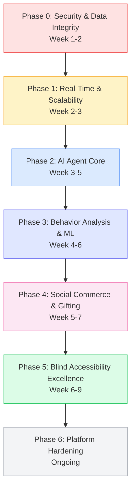

# ShopSphere: Complete Project Vision & Architectural Scope

> **Core Development Philosophy:**  
> *"Build the structure with bricks, cement, stones, and metal first; paint, tiles, and decorative finishes come later."*  
> Engineering focus is strictly prioritized on deep functional foundations, bulletproof database schemas, robust transactional workflows, deterministic state machines, and intelligent backend services. UI aesthetics and high-polish styling are deliberately built on top of this rock-solid core.

---

## 1. Project Overview & Amazon-Scale Vision

**ShopSphere** is a next-generation, hyper-intelligent multi-vendor e-commerce marketplace. It combines:
1. **Amazon-Grade Marketplace Depth:** Rich hierarchical catalog taxonomy, deep faceted search, product variants, detailed specifications, multi-seller competition, verified customer reviews & Q&A, multi-address checkout, granular order fulfillment tracking, and returns.
2. **A Personal AI Shopping Companion:** A continuous learning AI that builds a living contextual model of the user, acts as an active shopping guide, answers complex product queries, and **dynamically re-ranks and mutates the customer's home feed and carousels in real-time** based on conversations and behavioral signals.
3. **Accessibility-First (Saksham) Architecture:** Built-in multi-modal accessibility systems empowering users with disabilities (visual, auditory, motor, speech, and cognitive impairments) to navigate, search, inspect, and purchase with equal speed and dignity.
4. **Hyperlocal Logistics & Social Commerce:** 0–30 km radius local store discovery, BOPIS (Buy Online, Pick Up in Store) / hub pickup, Buy for Friend, and Gift for Friend with delayed tracking release mechanics.
5. **Enterprise Multi-Seller Hub:** Multi-inventory segregation, AI-assisted catalog onboarding with 10+ attribute extraction, and tiered analytics.
6. **Centralized Platform Governance:** Strict RBAC, passwordless OTP admin entry, compliance moderation queues, and immutable audit logs.

---

## 2. Customer Platform Features (Amazon-Grade Depth)

### 2.1 Catalog Discovery, Search & Browsing
* **Multi-Modal Navigation:** Browse by global search, hierarchical department taxonomy (e.g. *Electronics > Audio > Headphones > Over-Ear Noise Cancelling*), or individual local storefronts.
* **Deep Faceted Filtering & Sorting (Amazon-Scale):**
  * Price range slider with dynamic distribution histogram.
  * Customer review filter (4★ & up, 3★ & up).
  * Brand & seller multi-select checkboxes.
  * Fulfillment speed: Same-Day, Next-Day, Hyperlocal (under 1 hour), or Standard.
  * In-stock only, discount percentage, condition (New, Renewed, Used).
  * Sort by: *Featured, Price: Low to High, Price: High to Low, Avg. Customer Review, Newest Arrivals*.
* **Visual Search (Camera / Image Scanning):**
  * Snap or upload a photo of a physical product or storefront to search inventory.
  * Free tier: 5 scans/day; PRO tier: Unlimited scans.

### 2.2 Product Detail Page (PDP) Depth
* **Multi-Variant Matrix:** Select options dynamically by Color, Size, Storage, Capacity, and Condition with live price and stock updates.
* **Dynamic Specifications Table:** 10+ structured technical attributes (Brand, Model, Dimensions, Weight, Connectivity, Battery Life, In the Box, Warranty).
* **Buy Box & Multi-Seller Sourcing:** Clear stock indicator, fulfillment SLA ("Arrives Tomorrow by 11 AM if ordered in 2 hrs"), seller profile rating, "Add to Cart", "Buy Now", and gift toggle.
* **AI-Synthesized Review Summaries:** Automatically generated bullet-point breakdown of top positive and critical feedback from verified buyers.
* **Customer Q&A Community Hub:** Searchable questions & answers with answers from verified sellers and previous purchasers.
* **Side-by-Side Product Comparison:** Compare 2 products side-by-side (PRO tier: Compare up to 5 products simultaneously).

### 2.3 The Personal AI Companion (Contextual Guide & Feed Mutation)
* **Living User Context Model:** The AI continuously monitors browsing history, search queries, cart additions, price sensitivity, brand affinities, and explicit chat statements to build a structured JSON user interest graph.
* **Proactive Shopping Concierge:**
  * Context-aware conversational interface accessible via slide-over, dedicated route, or floating HUD.
  * Handles nuanced queries: *"Find a compact espresso maker under ₹5,000 for a small apartment that arrives before Friday."*
  * Troubleshoots compatibility: *"Will this soundbar connect to an optical audio port on my 2021 TV?"*
* **Dynamic Feed Personalization ("Change His Feed Accordingly"):**
  * **Real-time feed mutation:** When a user discusses a topic with the AI (e.g., training for a marathon), the AI issues a real-time weight update signal to the feed engine.
  * The customer's homepage immediately restructures its carousels:
    * *"Picked for Your Running Journey"*
    * *"Electrolyte & Nutrition Deals Near You"*
    * *"Lightweight Running Shoes in Your Size"*
* **Domain Specialist Personas (PRO Feature):** Specialized AI expert modes:
  * *Tech & Electronics Advisor* (benchmarks, compatibility, specs).
  * *Fashion & Style Stylist* (outfit coordination, sizing guide).
  * *Pantry & Gourmet Sommelier* (recipes, dietary filters, organic sourcing).
  * *Beauty & Wellness Consultant* (skin type matching, ingredient analysis).

### 2.4 Social Purchasing & Hyperlocal Logistics
* **Hyperlocal Logistics (0–30 km Radius):** Items located within 30 km can be picked up immediately at the merchant's physical shop or local sorting hub, bypassing courier transit.
* **Virtual Map Exploration (PRO Feature):** Interactive map showing local verified shops within 30 km. Shoppers can virtually enter a shop to browse its real-time inventory.
* **Buy for Friend:** Order on behalf of another registered user. Both sender and recipient track delivery; cancellations and refunds route strictly back to the purchaser.
* **Gift for Friend (Delayed Tracking Release):**
  * Order is purchased as a surprise gift.
  * Tracking details and recipient notifications are withheld until the sender's configured `gift_reveal_date` (or default 24 hours prior to delivery).
  * Recipient cannot see the price or item contents before the reveal date.

### 2.5 Cart, Multi-Address Checkout & Orders
* **Multi-Seller Split Cart:** Displays itemized sub-totals per merchant with separate fulfillment estimates.
* **Saved for Later:** Move items between active cart and saved wishlist.
* **Address Book Management:** Multiple saved addresses (Home, Work, Other) with GPS auto-detection and delivery instructions.
* **Comprehensive Order Lifecycle State Machine:**
  `pending` → `confirmed` → `processing` → `packed` → `shipped` → `out_for_delivery` → `delivered` (or `cancelled`, `return_requested`, `returned`, `refunded`).
* **Easy Return / Exchange Window:** Standard 7-day return request flow for eligible goods with pickup scheduling.

---

## 3. Accessibility-First Architecture (Saksham Framework)

ShopSphere is engineered with an unwavering commitment to disability inclusion:

### 3.1 Adaptive Onboarding & Disability Profile
* During signup, customers are invited to configure accessibility preferences:
  * **Visual Impairment:** High contrast, enlarged typography, screen-reader optimized layout, audio-described product images.
  * **Auditory Impairment:** Soundless visual alerts, text captions, visual order status notifications.
  * **Motor / Physical Impairment:** Voice-activated navigation, sticky keys mode, large touch targets (minimum 48×48px), keyboard-only focus navigation.
  * **Cognitive / Neurodivergent:** Simplified low-distraction reading mode, plain-language summaries, step-by-step checkout confirmation.
* Returning users have a **"Special Sign-In"** gateway that automatically adapts the login form to their registered accessibility needs.

### 3.2 Voice-Driven Shopping (STT / TTS)
* **Speech-to-Text (STT):** Full voice search and voice commands (*"Show me wireless headphones under three thousand rupees"*, *"Add the first item to cart"*, *"Go to checkout"*).
* **Text-to-Speech (TTS):** Screen-reader announcements and audible status alerts informing the user of price, stock, cart updates, and tracking milestones without requiring sight.

### 3.3 Strict Web Standards Compliance
* WCAG 2.1 Level AA & Section 508 adherence.
* Semantic HTML5 landmarks (`<nav>`, `<main>`, `<aside>`, `<section>`, `<article>`).
* ARIA live regions (`aria-live="polite"` and `aria-live="assertive"`) for dynamic state changes.
* Complete keyboard trap management and visible focus indicators.

---

## 4. Seller Platform Features (Merchant Operations)

### 4.1 Storefront & Inventory Management
* **Centralized Seller Hub:** Real-time visibility into sales, revenue, pending orders, and inventory health.
* **Multi-Inventory Segregation:** Segregate a single store into isolated inventories (e.g., *Physical Apparel* vs. *Digital Goods* vs. *Fresh Produce*). Each inventory has its own metrics, order pipeline, and catalog views.
* **Multi-Step Onboarding Wizard:** Choose between standard manual listing entry or AI-accelerated listing creation.

### 4.2 AI Listing Auto-Enrichment & Categorization (PRO)
* **AI Auto-Categorization:** Multimodal LLM analyzes product title, raw description, and image to automatically classify the item into the correct platform category and sub-category.
* **10+ Technical Specifications Synthesizer:** Automatically extracts and fills 10+ dynamic attributes (material, dimensions, weight, compatibility, suggested pricing).
* **Deterministic Validation:** All AI output is validated by strict runtime Zod schemas before being presented for seller verification.

### 4.3 Tiered Seller Analytics
* **Normal Mode (Free):** Category sales summaries, inventory health alerts, basic revenue reports.
* **Deep Mode (PRO):** Real-time customer search query demand graphs, conversion rate funnels, competitive price positioning, and automated reorder alerts.

---

## 5. Admin Governance & Platform Oversight

* **Platform Health Radar:** Live monitoring of platform GMV, order throughput, active user/seller concurrency, payment gateway status, and error logs.
* **Passwordless OTP Login:** Admin login route has no password field. Authentication requires an email address, triggering an OTP sent via secure channel, followed by CAPTCHA verification.
* **Product Compliance & Moderation Queue:** Review seller listings submitted in `pending` status. Admins can inspect AI-extracted attributes, approve listings for public customer view, or reject with feedback.
* **Global Order Governance:** Ability to inspect all system orders, investigate fraud flags, process manual interventions, and execute admin-level cancellations/refunds.
* **Immutable Audit Trail:** Chronological log of all administrative actions, catalog approvals, user suspensions, and role escalations.

---

## 6. Authentication & Security Architecture

* **Role Isolation:** Customers, Sellers, and Admins are segregated into dedicated routing groups (`(customer)`, `(seller)`, `(admin)`) with isolated layouts, sidebars, and middleware gates.
* **Row-Level Security (RLS):** 100% of Supabase PostgreSQL tables have RLS enabled with default-deny policies.
* **Session Management:** Secure HTTP-only cookies, JWT verification via Supabase Auth, and edge middleware role verification on every request.
* **Granular RBAC (Planned):** Permission-based access control matrix replacing coarse role checks. Supports Super Admin, Support Admin, Auditor, Seller Manager roles.
* **Security Hardening (Required):** Rate limiting on AI endpoints, prompt injection protection, CSRF tokens, security headers (CSP, Permissions-Policy), service role key isolation from customer APIs.

---

## 7. AI Guide Agent — Advanced Specification (Differentiator)

### 7.1 Core Agent Capabilities (Beyond Current Implementation)

#### 7.1.1 Multi-Modal Conversational Intelligence
* **Text + Voice + Vision Unified:** Single agent handles typed chat, voice commands (STT), and image uploads (visual search) in one conversation thread.
* **Context Window Management:** Automatic conversation summarization using sliding window + vector memory (pgvector) to maintain long-term context across sessions without token overflow.
* **Proactive Intervention Engine:** Background workers analyze user behavior patterns and trigger outbound notifications:
  - Price drop alerts for watched items
  - Back-in-stock notifications for wishlisted products
  - Delivery milestone updates via preferred channel (push/email/SMS)
  - Personalized deal discovery ("Your favorite brand just launched a sale")

#### 7.1.2 Specialist Persona Architecture (Production-Grade)
Each persona is a **dedicated sub-agent** with isolated system prompts, tool access, and knowledge bases:

| Persona | Domain | Exclusive Tools | Knowledge Base |
|---------|--------|-----------------|----------------|
| **Tech Guru** | Electronics, Computing, Smart Home | `check_compatibility`, `compare_specs`, `benchmark_lookup` | GSMArena, CPU/GPU benchmark DBs, connector pinout diagrams |
| **Fashion Stylist** | Apparel, Footwear, Accessories | `color_analysis`, `occasion_matcher`, `size_predictor` | Pantone color API, brand size charts, trend forecasts |
| **Gourmet Sommelier** | Groceries, Coffee, Pantry | `recipe_ingredient_match`, `dietary_filter`, `pairing_engine` | USDA nutrition DB, allergen database, wine/food pairing rules |
| **Beauty Consultant** | Skincare, Cosmetics | `ingredient_analyzer`, `skin_type_matcher`, `routine_builder` | INCI decoder, EWG safety ratings, dermatologist guidelines |
| **Accessibility Guide** | Universal | `screen_reader_nav`, `voice_command_router`, `audio_describer` | WCAG patterns, ARIA live region management, TTS optimization |

**Persona Switching:** Seamless handoff with shared memory — user says "Talk to the tech expert" → context transfers, specialist takes over.

#### 7.1.3 Visual Search & Camera Commerce
* **Snap-to-Shop:** Camera capture → CLIP embedding → vector similarity search against product catalog → ranked results with confidence scores.
* **Barcode/QR Scanner:** Native mobile camera integration for instant product lookup, price comparison, review access.
* **Storefront Recognition:** Photo of physical shop → OCR + landmark matching → pull up that seller's digital inventory.
* **Free Tier:** 5 scans/day; **PRO Tier:** Unlimited + history + cross-device sync.

#### 7.1.4 Autonomous Purchase Execution (Opt-In)
* **"Buy It For Me" Flow:** User delegates purchase within guardrails (max price, preferred seller, delivery deadline).
* **Stored Payment + Address Vault:** Encrypted, tokenized, requires biometric/OTP confirmation per transaction.
* **Human-in-the-Loop:** Agent presents final cart for explicit confirmation before order placement.

---

## 8. AI Behavior Analysis — Predictive Personalization Engine

### 8.1 Behavioral Event Stream (The Data Foundation)
Every user interaction emits structured events to an immutable event store:

```typescript
interface BehaviorEvent {
  userId: string;
  sessionId: string;
  eventType: 'view' | 'click' | 'add_to_cart' | 'remove_from_cart' | 'search' | 'filter' | 'ai_chat' | 'voice_command' | 'scroll' | 'carousel_impression' | 'carousel_click' | 'product_compare' | 'review_read' | 'qa_view' | 'checkout_start' | 'checkout_complete' | 'gift_sent' | 'gift_revealed';
  entityType: 'product' | 'category' | 'carousel' | 'ai_recommendation' | 'search_result' | 'seller' | 'brand';
  entityId: string;
  metadata: {
    dwellTimeMs?: number;
    scrollDepth?: number;
    viewport?: { width: number; height: number };
    device?: 'mobile' | 'desktop' | 'tablet';
    source?: 'organic' | 'ai_recommendation' | 'search' | 'direct' | 'social' | 'email';
    position?: number; // position in carousel/grid
  };
  timestamp: Date;
}
```

### 8.2 Real-Time Feature Computation
**Streaming Layer (Supabase Realtime / Kafka):** Events flow into feature store updated in near real-time:

| Feature | Computation | Refresh |
|---------|-------------|---------|
| `category_affinity` | Weighted category interaction scores (view=1, click=2, cart=5, purchase=10) | Per event |
| `price_elasticity` | Regression of purchase probability vs. price percentile | Daily batch |
| `brand_loyalty` | Repeat purchase rate per brand | Weekly |
| `size_preference` | Mode of purchased sizes per category | Per purchase |
| `delivery_urgency` | Avg. time from cart to checkout; preference for speed tiers | Per session |
| `gifting_propensity` | Ratio of gift orders to total orders | Monthly |
| `accessibility_mode_usage` | Feature adoption rates (voice, high-contrast, etc.) | Per session |

### 8.3 ML Model Suite (Production Pipeline)

| Model | Purpose | Input Features | Output | Serving |
|-------|---------|----------------|--------|---------|
| **Next Purchase Predictor** | What will user buy in next 7 days? | Behavioral sequence (last 30 events) + user features | Top-10 product IDs with probabilities | Batch nightly → cached |
| **Churn Risk Scorer** | Probability of 30-day inactivity | RFMC + engagement depth + support tickets | Risk tier (Low/Med/High) + retention actions | Batch weekly |
| **Category Affinity Ranker** | Personalized category ordering | `category_affinity` + seasonal trends + inventory | Ordered category list | Real-time (lightweight) |
| **Price Sensitivity Estimator** | Optimal discount depth per user | `price_elasticity` + historical discount response | Recommended discount % | Real-time |
| **Gift Recommender** | Gift suggestions for specific recipient | Sender history + recipient profile (if user) + occasion | Ranked gift ideas | On-demand |
| **Accessibility Needs Predictor** | Optimal UI configuration for new users | Early session signals (zoom, voice, contrast toggles) | Recommended preset | First session |

### 8.4 Feed Personalization Algorithm (Advanced)
Replaces current heuristic scoring with **Learning-to-Rank (LTR)** model:

```
Score(p, u) = LTR_Model([
  base_popularity(p),
  category_affinity(u, p.category),
  semantic_similarity(u.recent_intents, p.embedding),
  price_fit(u.price_sensitivity, p.price),
  recency_boost(p.created_at),
  inventory_urgency(p.stock, p.sales_velocity),
  social_proof(p.review_count, p.average_rating),
  gifting_signal(u.gifting_propensity, p.giftability_score)
])
```

**Carousel Generation:** MMR (Maximal Marginal Relevance) for diversity → themed carousels with explainable labels.

---

## 9. Social Commerce: Send a Friend & Gift a Friend (Complete)

### 9.1 Friend Graph & Social Layer
* **Friend Requests:** Search by email/phone/username → send request → accept/block.
* **Contact Import:** Optional phone/email contact sync (privacy-first, local matching only).
* **Social Proof:** "3 friends bought this", "Priya reviewed this 4★".
* **Shared Wishlists:** Collaborative lists for birthdays, weddings, housewarming.

### 9.2 "Send a Friend" (Non-Gift Sharing)
* **Deep Link Sharing:** `shopsphere.app/p/<product_id>?ref=<user_id>&ctx=friend_share`
* **Attribution Tracking:** `shared_products` table tracks viral coefficient, conversion from shares.
* **Contextual Message:** Sender adds note: *"Saw this and thought of your new apartment!"*
* **Recipient Experience:** Opens to personalized PDP with "Sent by [Name]" banner, pre-filled sender context for AI agent.

### 9.3 "Gift a Friend" — Complete Workflow

#### Phase 1: Gift Creation
1. **Product Selection:** Any purchasable item (digital/physical).
2. **Recipient:** Friend from graph (auto-complete) OR email/phone (creates pending invite).
3. **Reveal Trigger:** 
   - `date`: Specific date/time (birthday, anniversary)
   - `delivery`: When courier marks "out_for_delivery"
   - `manual`: Sender taps "Reveal Now" in gift management
4. **Wrapping & Card:** Digital unboxing animation + personalized message (text/voice/video).
5. **Payment:** Sender pays; recipient never sees price.

#### Phase 2: Pre-Reveal (Stealth Mode)
* **Recipient View:** Sees "You have a surprise gift! 🎁" — no product, price, seller, tracking.
* **Sender View:** Full tracking, delivery updates, can modify reveal date until triggered.
* **Notifications:** Sender gets all updates; recipient gets only "Gift arriving soon" (if delivery trigger).

#### Phase 3: Reveal & Post-Reveal
* **Unboxing Experience:** Animated reveal → product details → "Thank Sender" button.
* **Thank You Loop:** Recipient sends thank-you note (text/voice/photo) → sender notified.
* **Exchange/Return:** Recipient can initiate exchange (size/color) or return → refund to sender.
* **Gift History:** Both parties see gift timeline in dedicated "Gifts" section.

#### Phase 4: Group Gifting (Advanced)
* **Pool Creation:** Organizer creates "Group Gift for Anjali's Birthday" with target amount.
* **Contributions:** Friends join via link → pay share via UPI → real-time progress bar.
* **Auto-Purchase:** When target met → system places order → all contributors get receipt.
* **Fallback:** If target not met by deadline → auto-refund or organizer tops up.

---

## 10. Blind & Low-Vision Accessibility — Saksham Excellence (WCAG 2.2 AAA+)

### 10.1 Screen Reader Architecture (Beyond Compliance)
* **Semantic HTML5 Landmarks:** Every page has `<nav>`, `<main>`, `<aside>`, `<header>`, `<footer>`, `<section>`, `<article>` with unique `aria-label`s.
* **ARIA Live Region Strategy:**
  - `aria-live="polite"`: Cart updates, filter changes, AI responses, toast notifications
  - `aria-live="assertive"`: Errors, payment failures, session expiry, critical alerts
  - **Priority Queue:** `ScreenReaderAnnouncer` service manages announcement queue with deduplication and priority.
* **Heading Hierarchy Enforcement:** Automated linting (axe-core) ensures h1→h6 structure; no skipped levels.
* **Landmark Navigation:** `g` key jumps between landmarks; `r` key reads current region.

### 10.2 Voice-First Navigation System
* **Voice Command Router:** Natural language → structured intent → keyboard action simulation.
  - *"Go to cart"* → Focus cart link, announce contents
  - *"Search wireless headphones under 5000"* → Focus search, input query, submit
  - *"Read product details"* → Announce title, price, specs, reviews, stock
  - *"Checkout with home address"* → Navigate checkout, select default address, focus payment
* **Barge-In Support:** User can interrupt TTS mid-sentence with new command.
* **Wake Word:** "Hey ShopSphere" or hardware button (mobile) for hands-free.

### 10.3 Audio Product Descriptions (AI-Generated)
* **Source:** Product images + structured attributes + reviews
* **Pipeline:** `/api/ai/generate-audio-description` → GPT-4V/Gemini Vision → structured script → TTS (ElevenLabs/Google Cloud) → cached MP3
* **Content:** "Drift ANC Headphones in Space Black. Price ₹3,499. Rated 4.8 stars by 142 verified buyers. Key specs: 30-hour battery, multipoint Bluetooth 5.3, wear detection, USB-C charging. In the box: headphones, carrying case, USB-C cable, 3.5mm cable. Top review highlights: exceptional noise cancellation, comfortable for long sessions. Critical note: microphone average in wind. Sold by Sound & Co, delivers in 42 minutes."
* **Delivery:** `product.audio_description_url` field; play button on PDP; auto-play option in accessibility settings.

### 10.4 Special Accessible Sign-In Flow (`/login/accessible`)
* **Audio CAPTCHA:** Spoken challenge (math, word repeat) instead of visual puzzle.
* **Voice OTP Entry:** "Speak the 6-digit code" → STT verification.
* **Simplified Form:** Single-field progressive disclosure (email → OTP → done).
* **High Contrast + Large Touch Defaults:** Pre-enabled for this route.
* **Screen Reader Optimized:** Explicit labels, error announcements, success confirmation.

### 10.5 Multi-Sensory Feedback
* **Haptic Patterns (Mobile Web Vibration API):**
  - `add_to_cart`: Short double pulse
  - `out_of_stock`: Long single buzz
  - `navigation_landmark`: Light tap on region change
  - `error`: Triple rapid pulse
  - `success`: Rising triple tone
* **Earcons (Audio Icons):** Distinct sounds for cart add, page load, AI response, notification.

### 10.6 Braille Display Optimization
* **No Visual-Only State:** All status conveyed via ARIA live regions.
* **Dynamic Content Announcements:** Filter results count, price changes, stock updates auto-announced.
* **Focus Management:** Modal traps, skip links, logical tab order verified by automated tests.

---

## 11. Technical Architecture Requirements (Implementation Prerequisites)

### 11.1 Database Extensions & Infrastructure
```sql
-- Vector similarity search for AI
CREATE EXTENSION IF NOT EXISTS vector;
-- PostGIS for hyperlocal
CREATE EXTENSION IF NOT EXISTS postgis;
-- UUID generation
CREATE EXTENSION IF NOT EXISTS "uuid-ossp";
```

### 11.2 New Tables Required (See ARCHITECTURAL_ANALYSIS.md for full DDL)
- `user_behavior_events` — Immutable event stream
- `user_features` — Computed ML features
- `ml_models` — Model registry
- `friend_relationships` — Social graph
- `gifts` + `gift_notifications` + `gift_wrapping_options` — Gift workflow
- `shared_products` — Viral sharing tracking
- `ai_user_memory` — Long-term agent memory
- `ai_proactive_notifications` — Outbound notification queue
- `products.embedding` (vector), `audio_description_url`, `high_contrast_image_urls`
- `accessibility_usage_metrics` — Inclusion analytics

### 11.3 Infrastructure Additions
| Component | Technology | Purpose |
|-----------|------------|---------|
| **Redis Cache** | Upstash / Vercel KV | Feed cache (5min), rate limiting, session store |
| **Vector DB** | pgvector (Supabase) | Product embeddings, semantic search, agent memory |
| **Realtime** | Supabase Realtime | Order updates, feed mutations, gift reveals, cart sync |
| **Image CDN** | Supabase Storage + Transform / Cloudflare Images | Responsive images, WebP/AVIF, audio description hosting |
| **ML Pipeline** | Vertex AI / SageMaker / Modal.com | Nightly model training, feature store, batch inference |
| **STT/TTS** | Web Speech API + ElevenLabs / Google Cloud | Voice-first navigation, audio descriptions |
| **Event Bus** | Supabase Realtime / Kafka | Behavioral event ingestion, cross-service communication |

### 11.4 API Endpoints to Add
```
POST   /api/ai/visual-search              # Image → product matches
POST   /api/ai/generate-audio-description # Product ID → audio URL
POST   /api/ai/proactive-notifications    # Trigger check (cron)
GET    /api/ai/memory                     # User long-term memory
POST   /api/ai/memory                     # Update preferences/sizes
POST   /api/gifts                         # Create gift
POST   /api/gifts/:id/reveal              # Manual reveal
POST   /api/gifts/:id/thank               # Recipient thank you
POST   /api/friends                       # Friend request
GET    /api/friends                       # Friend list
POST   /api/behavior/events               # Batch event ingestion
GET    /api/feed/personalized/v2          # LTR-powered feed
POST   /api/accessibility/voice-command   # Voice router endpoint
GET    /api/accessibility/audio-description/:productId
```

### 11.5 Frontend Architecture Additions
* **Service Layer:** `src/services/` — OrderService, FeedService, AIAgentService, NotificationService, GiftService, SocialService
* **AI Components:** `src/components/ai/` — ChatWindow, VoiceInterface, PersonaSelector, ProductRecommendation
* **Gifting Components:** `src/components/gifting/` — GiftFlow, FriendSelector, GiftReveal, GroupGift
* **Accessibility Components:** `src/components/accessibility/` — ScreenReaderAnnouncer, VoiceCommandBar, AccessibleSignIn, AudioDescriptionPlayer
* **State Management:** Zustand stores for `behaviorEvents`, `voiceSession`, `giftFlow`, `accessibilitySession`

---

## 12. Phased Implementation Roadmap (Updated)



**Phase 0 (Critical — Do First):**
- Remove service role key from customer APIs
- Rate limiting on AI endpoints
- Prompt injection fix
- Stock decrement race condition fix
- Security headers + CSRF

**Phase 1 (Foundation):**
- Supabase Realtime enablement
- Redis caching layer
- PostGIS + pgvector setup
- Missing FKs + gift/social tables
- Pagination on feed API

**Phase 2 (AI Agent Core):**
- Visual search endpoint
- Conversation summarization
- Specialist persona architecture
- Proactive notification engine
- Audio description generation

**Phase 3 (Behavior Analysis):**
- Event ingestion pipeline
- Feature store + nightly compute
- LTR feed ranking model
- Offer personalization upgrade

**Phase 4 (Social Commerce):**
- Friend graph UI + API
- Complete gift workflow (stealth → reveal → thank you)
- Group gifting MVP
- Send-to-friend sharing + attribution

**Phase 5 (Blind Accessibility):**
- Full ARIA audit + remediation
- Voice command router + STT/TTS
- Accessible sign-in flow
- Haptic/earcon patterns
- Braille display optimization
- Audio description player

**Phase 6 (Hardening):**
- Granular RBAC
- GDPR compliance
- Multi-region deployment
- Chaos engineering
- Load testing (10k concurrent users)

---

## Appendix: Architectural Analysis Summary (2025-01-22)

> **Reference:** See [`ARCHITECTURAL_ANALYSIS.md`](file:///home/batman/Pictures/shopsphere/ARCHITECTURAL_ANALYSIS.md) for complete analysis.

### Critical Security Issues (Fix First)
1. **Service role key in customer APIs** — All `/api/ai/*`, `/api/feed/*`, `/api/offers/*` use `createAdminClient()` bypassing RLS
2. **No rate limiting** on AI endpoints (cost exposure, DoS risk)
3. **Prompt injection vulnerability** — User input directly interpolated in system prompt
4. **No CSRF protection** on mutating endpoints
5. **Missing security headers** (CSP, Permissions-Policy, etc.)

### Architectural Gaps
1. **No service layer** — Business logic in API routes (untestable, duplicated)
2. **No unified auth utility** — Three inconsistent patterns across codebase
3. **No API versioning/contracts** — Breaking changes will break frontend
4. **Client state fragmentation** — Cart, Accessibility, AI chat all independent

### Missing Data Relationships (Vision Features)
| Feature | Missing Tables |
|---------|----------------|
| AI Guide Agent | `ai_agent_memory`, `ai_agent_sessions`, `audio_descriptions` |
| AI Behavior Analysis | `user_behavior_events`, `user_features`, `ml_models` |
| Send a Friend | `friend_relationships`, `shared_products` |
| Gift a Friend | `gifts`, `gift_notifications`, `gift_wrapping_options`, `group_gifts` |
| Blind Accessibility | `accessibility_usage_metrics`, `audio_descriptions` |

### Scalability Bottlenecks
- `/api/feed/personalized` loads entire catalog (no pagination)
- Synchronous AI calls block event loop (1-3s latency)
- No Redis caching for personalized feed
- No async job queue for AI operations
- JSONB columns queried in-memory without GIN indexes

### Duplicated Business Logic
- Price calculation in 3+ places
- Stock decrement race condition (non-atomic, no SELECT FOR UPDATE)
- Address validation in 3+ places
- Feed weight mutation logic split across chat/feed APIs
- User profile fetching repeated in 8+ API routes

### Role-Permission Issues
- Only 3 coarse roles (customer/seller/admin) — no granular permissions
- No permission-based access control
- No session invalidation on role change
- Admin can access seller routes without audit trail

### Remediation Priority
**Phase 0 (Week 1-2):** Security fixes, service layer extraction, unified auth
**Phase 1 (Week 2-4):** Data integrity, missing FKs, indexes, migrations
**Phase 2 (Week 4-8):** Core vision features (tables + APIs + UI)
**Phase 3 (Week 6-10):** AI Agent enhancement, Behavior Analysis ML
**Phase 4 (Week 8-12):** Scalability, testing, granular RBAC, API versioning