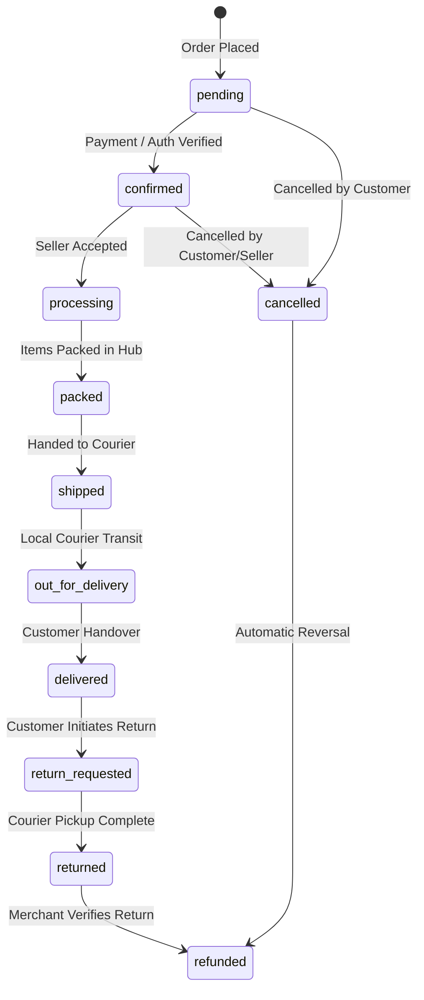
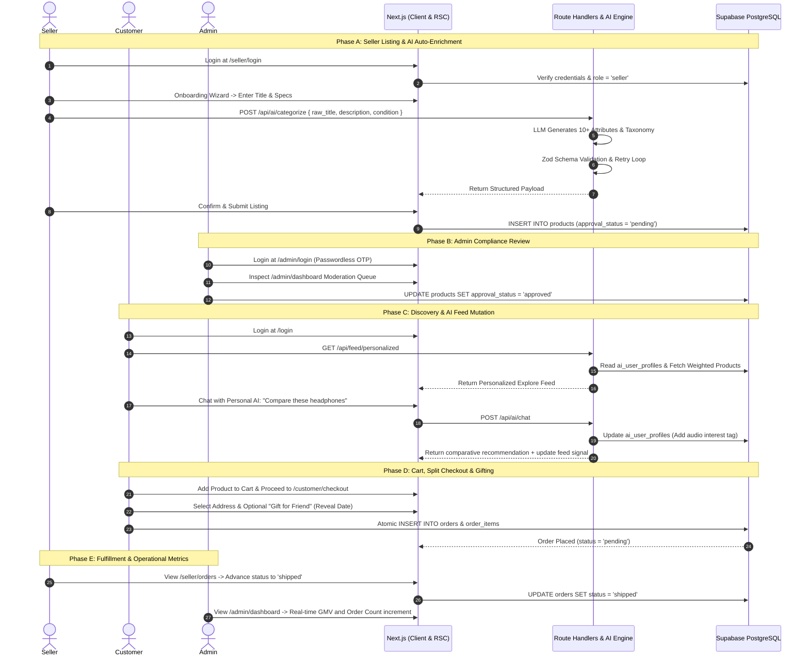

# ShopSphere — Master Product Requirements Document (PRD)

**Document Version:** 2.0.0  
**Status:** Approved for Implementation  
**Platform:** ShopSphere Multi-Vendor Hyperlocal & Global Marketplace  
**Core Motto:** *"Build the structure with bricks, cement, stones, and metal first; paints, tiles, and decorative finishes come later."*

---

## 1. Executive Summary & Architectural Philosophy

### 1.1 Scope Overview
ShopSphere is an enterprise-grade multi-vendor e-commerce platform that combines the structural depth of **Amazon** with **hyperlocal neighborhood logistics**, an **autonomous Personal AI Shopping Companion**, and a **first-class accessibility framework (Saksham)** for users with disabilities.

### 1.2 "Plumbing-First, Bricks & Mortar Before Paints & Tiles"
* **Data Integrity & Determinism First:** Engineering priority is strictly focused on bulletproof database schemas, PostgreSQL constraints, Row-Level Security (RLS), Role-Based Access Control (RBAC), and deterministic state machines.
* **Functional Headless Architecture:** The UI primitive layer is built cleanly using **Vanilla Extract (The TypeScript Purist's Choice)** for compile-time type-safe styling paired with accessible headless primitives (**Radix UI**). High-polish visual flourishes and cinematic animations are deferred until all underlying transactional, AI, and accessibility pipelines are verified.

---

## 2. Technology Stack & Contracts

| Layer | Technology | Rationale & Responsibility |
| :--- | :--- | :--- |
| **Framework** | Next.js 14+ (App Router) | Server Components (RSC), Route Handlers, Server Actions, edge middleware. |
| **Language** | TypeScript (Strict Mode) | Full-stack end-to-end type safety and deterministic schema contracts. |
| **UI & Styling** | Vanilla Extract (The TypeScript Purist's Choice) | Zero-runtime, build-time extracted, type-safe CSS-in-TypeScript (`.css.ts`) with contract-driven themes. |
| **Component Primitives** | Radix UI (Headless Primitives) | Unstyled, fully accessible UI foundations (Dialog, Tabs, Slider, Popover, Select, Accordion). |
| **Icons** | Lucide React | Uniform, accessible icon set. |
| **Database & Auth** | Supabase (PostgreSQL 15+) | PostgreSQL, Supabase Auth (Email + Google OAuth), Row-Level Security (RLS), Storage. |
| **Data Validation** | Zod | Runtime contract validation for API payloads, forms, and LLM JSON output. |
| **State Management** | Zustand / React Context | Client state for cart, active session flags, live order tracking, and accessibility settings. |

---

## 3. Strict Role-Based Access Control (RBAC) & Layout Architecture

### 3.1 Role Hierarchy & Isolation
The platform enforces three strictly separated roles:
1. **`customer`**: Discovers items, interacts with the Personal AI, manages cart, executes purchases, tracks orders, manages address book.
2. **`seller`**: Manages merchant catalog, triggers AI auto-categorization & 10+ attribute extraction, manages segregated inventories, fulfills orders.
3. **`admin`**: Inspects platform health, reviews the product moderation queue, audits global orders, manages participants, inspects audit logs.

### 3.2 Database Role Binding
Roles are persisted in `public.users` (linked directly to Supabase's `auth.users`):
```sql
CREATE TYPE user_role AS ENUM ('customer', 'seller', 'admin');
```

### 3.3 Next.js Edge Middleware Gatekeeper (`middleware.ts`)
The middleware interrogates the Supabase session token, verifies the authenticated user's role from `public.users`, and strictly prevents cross-role route traversal:
* `/customer/*` requires authenticated user with `role = 'customer'` (or admin override).
* `/seller/*` requires authenticated user with `role = 'seller'`.
* `/admin/*` requires authenticated user with `role = 'admin'`.
* Unauthenticated or unauthorized attempts trigger immediate redirects to `/login` or `/admin/login`.

### 3.4 Isolated Route Groups & Dashboards
* **Customer Portal (`app/(customer)/*`):** Top navigation, category drawer, persistent AI companion launcher, accessible status indicators.
* **Seller Hub (`app/(seller)/*`):** Persistent left sidebar (`/seller/dashboard`, `/seller/add-product`, `/seller/orders`, `/seller/settings`), multi-inventory tabs.
* **Admin Operations Desk (`app/(admin)/*`):** Differentiated operational sidebar (`/admin/dashboard`, `/admin/moderation`, `/admin/orders`, `/admin/health`, `/admin/audit`).

---

## 4. Feature Specifications: Amazon-Grade Depth & Living AI

### 4.1 Module 1: Authentication & Accessibility-First Onboarding
1. **Multi-Role Entrypoints:** Distinct portals for Customers (`/login`, `/signup`), Sellers (`/seller/login`, `/seller/signup`), and Admins (`/admin/login`).
2. **Passwordless Admin Access:** The Admin route has no password field. It requires an email address, which triggers an OTP (One-Time Password) via Supabase Auth, followed by CAPTCHA verification.
3. **Accessibility-First Onboarding:**
   * During signup, customers are prompted to indicate any accessibility accommodations:
     * *Visual Impairment:* High-contrast color palette, font magnification, screen-reader optimizations, audio descriptions.
     * *Auditory Impairment:* Visual flashing alerts, complete text transcripts.
     * *Motor Impairment:* Voice command activation, sticky keys, enlarged touch targets (min 48×48px).
     * *Cognitive Impairment:* Low-distraction plain language mode, step-by-step confirmation prompts.
   * **Special Sign-In:** Returning users can access a dedicated gateway that renders their specific assistive UI before authentication.

### 4.2 Module 2: Amazon-Grade Catalog & Product Detail (PDP)
1. **Hierarchical Taxonomy:** Multi-level tree (*Department > Category > Sub-Category > Product*).
2. **Product Variants:** SKUs supporting combinations of Color, Size, Storage, Capacity, and Condition ('New', 'Renewed', 'Used').
3. **Dynamic 10+ Specifications Table:** Structured attributes stored in `attributes JSONB` (e.g., Brand, Model, Material, Connectivity, Dimensions, Weight, Battery Life, Warranty, In the Box).
4. **Buy Box & Multi-Seller Sourcing:**
   * Primary seller winning the Buy Box based on price, rating, and delivery SLA.
   * Alternative seller offers listed under "Other Sellers on ShopSphere".
5. **Verified Customer Reviews & Breakdown:**
   * Star rating breakdown histogram (5★ down to 1★).
   * Verified Purchase badges on reviews.
   * Helpful vote counter (`review_helpful_votes`).
   * AI-generated summary distilling top positive and critical feedback.
6. **Customer Q&A Community Hub:** Searchable questions with answers from verified sellers and previous purchasers.

### 4.3 Module 3: Faceted Search & Discovery Engine
1. **Multi-Parameter Search:** Real-time query matching on product title, description, category, tags, and dynamic attributes.
2. **Faceted Filter Panel:**
   * Price Range slider with min/max inputs.
   * Customer Review filter (4★ & up, 3★ & up).
   * Brand multi-select checkboxes.
   * Delivery Speed: Hyperlocal (< 1 hour), Same-Day, Next-Day, Standard.
   * Item Condition: New, Renewed, Used.
   * In-Stock Only filter.
3. **Deterministic Sorting:** *Featured, Price: Low to High, Price: High to Low, Avg. Customer Review, Newest Arrivals*.

### 4.4 Module 4: The Personal AI Shopping Companion & Dynamic Feed Personalization
1. **Living User Context Engine:**
   * The system maintains an `ai_user_profiles` record for each customer, tracking:
     * Top categories browsed and purchased.
     * Price sensitivity profile (budget, mid-tier, luxury).
     * Dietary, material, or style preferences (e.g., vegan, organic, minimalist).
     * Conversational memory of recent requests and intent statements.
2. **Conversational Shopping Concierge (`/api/ai/chat`):**
   * Accessible via slide-over, dedicated route, or floating HUD.
   * Handles multi-turn natural language queries (*"I need a birthday gift for my sister who loves baking under ₹2,000 that can be delivered by Friday"*).
   * Executes structured tool calls: `search_catalog`, `compare_products`, `check_availability`, `update_user_preference`.
3. **Dynamic Feed Mutation ("Change His Feed Accordingly"):**
   * Whenever a user chats with the AI, the AI updates the user's `feed_weights` in `ai_user_profiles`.
   * The customer's explore feed (`/customer/explore`) queries `/api/feed/personalized` to dynamically re-rank and assemble custom carousels:
     * *"Recommended from Your Recent AI Conversation"*
     * *"Top Rated in [Your Active Interest]"*
     * *"Trending Near You"*

### 4.5 Module 5: Cart, Multi-Address Book & Checkout Pipeline
1. **Multi-Seller Split Cart:** Items from different merchants are grouped by store, itemizing individual shipping costs, delivery dates, and sub-totals.
2. **Saved for Later:** Seamless one-click transfer between active cart and saved items list.
3. **Customer Address Book:** Multiple physical addresses with labels (Home, Work, Other), recipient phone, and delivery instructions.
4. **Atomic Checkout Transaction:** Order placement writes atomically to `orders` and `order_items`, reserving stock and locking item purchase prices.

### 4.6 Module 6: Social Commerce & "Gift for Friend"
1. **"Buy for Friend":** User A purchases an item for User B (identified by email or phone). Both can monitor shipment progress; cancellations and refunds route strictly back to User A.
2. **"Gift for Friend" (Delayed Tracking Release):**
   * Sender marks order as a surprise gift.
   * Sender specifies a `gift_reveal_date` (or defaults to 24 hours prior to delivery).
   * **Enforced Privacy:** The recipient's order lookup view completely conceals product contents, prices, and tracking milestones until `NOW() >= gift_reveal_date`.
   * Sender retains 100% full real-time tracking visibility at all times.

### 4.7 Module 7: Comprehensive Order Lifecycle State Machine
Orders transition strictly through verified states:

* **State Transition Safeguards:**
  * Customers may only cancel orders in `pending` or `confirmed` status.
  * Once `shipped`, cancellations are locked; customers must use the standard 7-day return request workflow.

### 4.8 Module 8: Multi-Modal Accessibility Framework (Saksham)
1. **Speech-to-Text (STT) Voice Search:** Microphone input parses voice queries and executes catalog searches and navigation commands.
2. **Text-to-Speech (TTS) Audible Guidance:** Screen-reader announcements and audible status alerts describing product prices, specifications, and cart operations.
3. **Universal Keyboard Navigation:** Complete tab-order index, visible focus rings, bypass skip-links, and accessible dialog focus traps.
4. **Large Touch Target Mode:** Minimum 48×48px interactive bounding boxes across buttons, inputs, and tab triggers.
5. **Cognitive Distraction Reducer:** Toggleable plain-text layout stripping decorative elements and presenting essential product specs in bullet format.

### 4.9 Module 9: Seller Operations Hub & AI Auto-Categorizer
1. **Multi-Inventory Segregation:** Allows sellers to partition catalog into independent silos (e.g. *Physical Electronics*, *Digital Assets*, *Perishables*) with dedicated KPIs.
2. **Enterprise Listing Onboarding Wizard:**
   * **Step 1:** Select Manual Creation or AI-Assisted Creation.
   * **Step 2 (AI Ingestion):** Input raw title, brief description, condition, and optional image URL.
   * **Step 3 (AI Processing & Attribute Extraction):** Calls `/api/ai/categorize`. Multimodal AI classifies category, sub-category, 3–7 search tags, suggested retail price, and synthesizes 10+ dynamic specifications into `attributes JSONB`.
   * **Step 4 (Validation & Verification):** Seller verifies and refines generated attributes before submitting into `pending` admin review status.

### 4.10 Module 10: Centralized Admin Governance & Platform Health
1. **Real-Time Operational Radar:** Live cards for Total GMV, Order Volume, Active User/Seller Concurrency, Gateway Health, and AI Error Rates.
2. **Product Compliance & Moderation Queue:**
   * Real-time ledger of products in `pending` approval status.
   * Admin inspects title, image, AI-extracted specifications, and merchant details.
   * Instant "Approve" (sets `approval_status = 'approved'`, making it immediately live in catalog) or "Reject" (with mandatory rejection feedback notes).
3. **Global Order Ledger & Intervention:** View all customer orders across all sellers with ability to intervene on disputes or execute administrative cancellations.
4. **Immutable Audit Trail:** Append-only log capturing administrative approvals, suspensions, and manual overrides.

---

### 4.11 Module 11: AI Guide Agent — Advanced Capabilities (Differentiator)

#### 4.11.1 Multi-Modal Conversational Intelligence
1. **Unified Text + Voice + Vision Interface:** Single agent handles typed chat, voice commands (STT), and image uploads (visual search) in one conversation thread.
2. **Context Window Management:** Automatic conversation summarization using sliding window + vector memory (pgvector) to maintain long-term context across sessions without token overflow.
3. **Proactive Intervention Engine:** Background workers analyze user behavior patterns and trigger outbound notifications:
    - Price drop alerts for watched items
    - Back-in-stock notifications for wishlisted products
    - Delivery milestone updates via preferred channel (push/email/SMS)
    - Personalized deal discovery ("Your favorite brand just launched a sale")
4. **Tool-Calling Architecture (Extended):**
    - `search_catalog(query, category?, max_price?, in_stock?, condition?)`
    - `compare_products(product_ids)` — Side-by-side spec comparison
    - `check_local_availability(product_id, pincode)` — 30km hyperlocal check
    - `update_user_preference(category, weight_delta, intent_tag)` — Feed mutation
    - `visual_search(image_base64)` — CLIP embedding → vector similarity
    - `check_compatibility(product_id, user_context)` — Tech specs validation
    - `generate_audio_description(product_id)` — TTS-ready script for blind users
    - `predict_size(category, user_history)` — Fashion size recommendation

#### 4.11.2 Specialist Persona Architecture (Production-Grade)
Each persona is a **dedicated sub-agent** with isolated system prompts, tool access, and knowledge bases:

| Persona | Domain | Exclusive Tools | Knowledge Base |
|---------|--------|-----------------|----------------|
| **Tech Guru** | Electronics, Computing, Smart Home | `check_compatibility`, `compare_specs`, `benchmark_lookup` | GSMArena, CPU/GPU benchmark DBs, connector pinout diagrams |
| **Fashion Stylist** | Apparel, Footwear, Accessories | `color_analysis`, `occasion_matcher`, `size_predictor` | Pantone color API, brand size charts, trend forecasts |
| **Gourmet Sommelier** | Groceries, Coffee, Pantry | `recipe_ingredient_match`, `dietary_filter`, `pairing_engine` | USDA nutrition DB, allergen database, wine/food pairing rules |
| **Beauty Consultant** | Skincare, Cosmetics | `ingredient_analyzer`, `skin_type_matcher`, `routine_builder` | INCI decoder, EWG safety ratings, dermatologist guidelines |
| **Accessibility Guide** | Universal | `screen_reader_nav`, `voice_command_router`, `audio_describer` | WCAG patterns, ARIA live region management, TTS optimization |

**Persona Switching:** Seamless handoff with shared memory — user says "Talk to the tech expert" → context transfers, specialist takes over.

#### 4.11.3 Visual Search & Camera Commerce
1. **Snap-to-Shop:** Camera capture → CLIP embedding → vector similarity search against product catalog → ranked results with confidence scores.
2. **Barcode/QR Scanner:** Native mobile camera integration for instant product lookup, price comparison, review access.
3. **Storefront Recognition:** Photo of physical shop → OCR + landmark matching → pull up that seller's digital inventory.
4. **Free Tier:** 5 scans/day; **PRO Tier:** Unlimited + history + cross-device sync.

#### 4.11.4 Autonomous Purchase Execution (Opt-In)
1. **"Buy It For Me" Flow:** User delegates purchase within guardrails (max price, preferred seller, delivery deadline).
2. **Stored Payment + Address Vault:** Encrypted, tokenized, requires biometric/OTP confirmation per transaction.
3. **Human-in-the-Loop:** Agent presents final cart for explicit confirmation before order placement.

---

### 4.12 Module 12: AI Behavior Analysis — Predictive Personalization Engine

#### 4.12.1 Behavioral Event Stream (The Data Foundation)
Every user interaction emits structured events to an immutable event store (`user_behavior_events` table):

```typescript
interface BehaviorEvent {
  userId: string;
  sessionId: string;
  eventType: 'view' | 'click' | 'add_to_cart' | 'remove_from_cart' | 'search' | 'filter' | 'ai_chat' | 'voice_command' | 'scroll' | 'carousel_impression' | 'carousel_click' | 'product_compare' | 'review_read' | 'qa_view' | 'checkout_start' | 'checkout_complete' | 'gift_sent' | 'gift_revealed';
  entityType: 'product' | 'category' | 'carousel' | 'ai_recommendation' | 'search_result' | 'seller' | 'brand';
  entityId: string;
  metadata: {
    dwellTimeMs?: number;
    scrollDepth?: number;
    viewport?: { width: number; height: number };
    device?: 'mobile' | 'desktop' | 'tablet';
    source?: 'organic' | 'ai_recommendation' | 'search' | 'direct' | 'social' | 'email';
    position?: number;
  };
  timestamp: Date;
}
```

#### 4.12.2 Real-Time Feature Computation
**Streaming Layer (Supabase Realtime / Kafka):** Events flow into feature store updated in near real-time:

| Feature | Computation | Refresh |
|---------|-------------|---------|
| `category_affinity` | Weighted category interaction scores (view=1, click=2, cart=5, purchase=10) | Per event |
| `price_elasticity` | Regression of purchase probability vs. price percentile | Daily batch |
| `brand_loyalty` | Repeat purchase rate per brand | Weekly |
| `size_preference` | Mode of purchased sizes per category | Per purchase |
| `delivery_urgency` | Avg. time from cart to checkout; preference for speed tiers | Per session |
| `gifting_propensity` | Ratio of gift orders to total orders | Monthly |
| `accessibility_mode_usage` | Feature adoption rates (voice, high-contrast, etc.) | Per session |

#### 4.12.3 ML Model Suite (Production Pipeline)

| Model | Purpose | Input Features | Output | Serving |
|-------|---------|----------------|--------|---------|
| **Next Purchase Predictor** | What will user buy in next 7 days? | Behavioral sequence (last 30 events) + user features | Top-10 product IDs with probabilities | Batch nightly → cached |
| **Churn Risk Scorer** | Probability of 30-day inactivity | RFMC + engagement depth + support tickets | Risk tier (Low/Med/High) + retention actions | Batch weekly |
| **Category Affinity Ranker** | Personalized category ordering | `category_affinity` + seasonal trends + inventory | Ordered category list | Real-time (lightweight) |
| **Price Sensitivity Estimator** | Optimal discount depth per user | `price_elasticity` + historical discount response | Recommended discount % | Real-time |
| **Gift Recommender** | Gift suggestions for specific recipient | Sender history + recipient profile + occasion | Ranked gift ideas | On-demand |
| **Accessibility Needs Predictor** | Optimal UI config for new users | Early session signals (zoom, voice, contrast) | Recommended preset | First session |

#### 4.12.4 Feed Personalization Algorithm (Advanced)
Replaces current heuristic scoring with **Learning-to-Rank (LTR)** model:

```
Score(p, u) = LTR_Model([
  base_popularity(p),
  category_affinity(u, p.category),
  semantic_similarity(u.recent_intents, p.embedding),
  price_fit(u.price_sensitivity, p.price),
  recency_boost(p.created_at),
  inventory_urgency(p.stock, p.sales_velocity),
  social_proof(p.review_count, p.average_rating),
  gifting_signal(u.gifting_propensity, p.giftability_score)
])
```

**Carousel Generation:** MMR (Maximal Marginal Relevance) for diversity → themed carousels with explainable labels.

---

### 4.13 Module 13: Social Commerce — Send a Friend & Gift a Friend (Complete)

#### 4.13.1 Friend Graph & Social Layer
1. **Friend Requests:** Search by email/phone/username → send request → accept/block.
2. **Contact Import:** Optional phone/email contact sync (privacy-first, local matching only).
3. **Social Proof:** "3 friends bought this", "Priya reviewed this 4★".
4. **Shared Wishlists:** Collaborative lists for birthdays, weddings, housewarming.

#### 4.13.2 "Send a Friend" (Non-Gift Sharing)
1. **Deep Link Sharing:** `shopsphere.app/p/<product_id>?ref=<user_id>&ctx=friend_share`
2. **Attribution Tracking:** `shared_products` table tracks viral coefficient, conversion from shares.
3. **Contextual Message:** Sender adds note: *"Saw this and thought of your new apartment!"*
4. **Recipient Experience:** Opens to personalized PDP with "Sent by [Name]" banner, pre-filled sender context for AI agent.

#### 4.13.3 "Gift a Friend" — Complete Workflow

**Phase 1: Gift Creation**
1. **Product Selection:** Any purchasable item (digital/physical).
2. **Recipient:** Friend from graph (auto-complete) OR email/phone (creates pending invite).
3. **Reveal Trigger:**
    - `date`: Specific date/time (birthday, anniversary)
    - `delivery`: When courier marks "out_for_delivery"
    - `manual`: Sender taps "Reveal Now" in gift management
4. **Wrapping & Card:** Digital unboxing animation + personalized message (text/voice/video).
5. **Payment:** Sender pays; recipient never sees price.

**Phase 2: Pre-Reveal (Stealth Mode)**
* **Recipient View:** Sees "You have a surprise gift! 🎁" — no product, price, seller, tracking.
* **Sender View:** Full tracking, delivery updates, can modify reveal date until triggered.
* **Notifications:** Sender gets all updates; recipient gets only "Gift arriving soon" (if delivery trigger).

**Phase 3: Reveal & Post-Reveal**
* **Unboxing Experience:** Animated reveal → product details → "Thank Sender" button.
* **Thank You Loop:** Recipient sends thank-you note (text/voice/photo) → sender notified.
* **Exchange/Return:** Recipient can initiate exchange (size/color) or return → refund to sender.
* **Gift History:** Both parties see gift timeline in dedicated "Gifts" section.

**Phase 4: Group Gifting (Advanced)**
* **Pool Creation:** Organizer creates "Group Gift for Anjali's Birthday" with target amount.
* **Contributions:** Friends join via link → pay share via UPI → real-time progress bar.
* **Auto-Purchase:** When target met → system places order → all contributors get receipt.
* **Fallback:** If target not met by deadline → auto-refund or organizer tops up.

---

### 4.14 Module 14: Blind & Low-Vision Accessibility — Saksham Excellence (WCAG 2.2 AAA+)

#### 4.14.1 Screen Reader Architecture (Beyond Compliance)
1. **Semantic HTML5 Landmarks:** Every page has `<nav>`, `<main>`, `<aside>`, `<header>`, `<footer>`, `<section>`, `<article>` with unique `aria-label`s.
2. **ARIA Live Region Strategy:**
    - `aria-live="polite"`: Cart updates, filter changes, AI responses, toast notifications
    - `aria-live="assertive"`: Errors, payment failures, session expiry, critical alerts
    - **Priority Queue:** `ScreenReaderAnnouncer` service manages announcement queue with deduplication and priority.
3. **Heading Hierarchy Enforcement:** Automated linting (axe-core) ensures h1→h6 structure; no skipped levels.
4. **Landmark Navigation:** `g` key jumps between landmarks; `r` key reads current region.

#### 4.14.2 Voice-First Navigation System
1. **Voice Command Router:** Natural language → structured intent → keyboard action simulation.
    - *"Go to cart"* → Focus cart link, announce contents
    - *"Search wireless headphones under 5000"* → Focus search, input query, submit
    - *"Read product details"* → Announce title, price, specs, reviews, stock
    - *"Checkout with home address"* → Navigate checkout, select default address, focus payment
2. **Barge-In Support:** User can interrupt TTS mid-sentence with new command.
3. **Wake Word:** "Hey ShopSphere" or hardware button (mobile) for hands-free.

#### 4.14.3 Audio Product Descriptions (AI-Generated)
1. **Source:** Product images + structured attributes + reviews
2. **Pipeline:** `/api/ai/generate-audio-description` → GPT-4V/Gemini Vision → structured script → TTS (ElevenLabs/Google Cloud) → cached MP3
3. **Content:** "Drift ANC Headphones in Space Black. Price ₹3,499. Rated 4.8 stars by 142 verified buyers. Key specs: 30-hour battery, multipoint Bluetooth 5.3, wear detection, USB-C charging. In the box: headphones, carrying case, USB-C cable, 3.5mm cable. Top review highlights: exceptional noise cancellation, comfortable for long sessions. Critical note: microphone average in wind. Sold by Sound & Co, delivers in 42 minutes."
4. **Delivery:** `product.audio_description_url` field; play button on PDP; auto-play option in accessibility settings.

#### 4.14.4 Special Accessible Sign-In Flow (`/login/accessible`)
1. **Audio CAPTCHA:** Spoken challenge (math, word repeat) instead of visual puzzle.
2. **Voice OTP Entry:** "Speak the 6-digit code" → STT verification.
3. **Simplified Form:** Single-field progressive disclosure (email → OTP → done).
4. **High Contrast + Large Touch Defaults:** Pre-enabled for this route.
5. **Screen Reader Optimized:** Explicit labels, error announcements, success confirmation.

#### 4.14.5 Multi-Sensory Feedback
1. **Haptic Patterns (Mobile Web Vibration API):**
    - `add_to_cart`: Short double pulse
    - `out_of_stock`: Long single buzz
    - `navigation_landmark`: Light tap on region change
    - `error`: Triple rapid pulse
    - `success`: Rising triple tone
2. **Earcons (Audio Icons):** Distinct sounds for cart add, page load, AI response, notification.

#### 4.14.6 Braille Display Optimization
1. **No Visual-Only State:** All status conveyed via ARIA live regions.
2. **Dynamic Content Announcements:** Filter results count, price changes, stock updates auto-announced.
3. **Focus Management:** Modal traps, skip links, logical tab order verified by automated tests.

---

### 4.15 Module 15: Security Hardening & Platform Governance

#### 4.15.1 Security Requirements
1. **Service Role Isolation:** No `createAdminClient()` in customer-facing APIs. Use anon key + user JWT for RLS enforcement.
2. **Rate Limiting:** Upstash Redis / Vercel KV on all AI endpoints (10 req/min chat, 5 req/min categorize).
3. **Prompt Injection Protection:** Structured prompt templates with parameter binding — never string interpolation.
4. **CSRF Protection:** Double-submit cookie pattern on all mutating endpoints.
5. **Security Headers:** CSP, Permissions-Policy, X-Frame-Options, Referrer-Policy via Next.js middleware.
6. **Admin OTP Hardening:** Rate limiting on OTP requests, exponential backoff, CAPTCHA on submit.

#### 4.15.2 Granular RBAC (Planned)
1. **Permission Matrix:** Resource-action permissions replacing coarse role checks.
2. **Roles:** Super Admin, Support Admin, Auditor, Seller Manager, Seller Staff, Seller Analyst.
3. **Impersonation Audit:** All admin access to seller/customer routes logged with justification.

---

## 5. End-to-End Operational Workflows

### 5.1 The Complete Marketplace Pipeline



---

## 6. Verification & Acceptance Criteria

* [ ] **RBAC & Gatekeeping:** Traversal between `/customer/*`, `/seller/*`, and `/admin/*` is strictly governed by edge middleware with zero privilege leakage.
* [ ] **Amazon-Scale PDP:** Product details render multi-image galleries, 10+ specifications table, stock status, ratings breakdown, and Buy Box.
* [ ] **Faceted Search Reliability:** Search accurately filters by price slider, minimum star rating, brand, fulfillment speed, and condition.
* [ ] **Personal AI Feed Personalization:** Conversational inputs update `ai_user_profiles.feed_weights` and dynamically alter the carousels served by `/api/feed/personalized`.
* [ ] **Accessibility Compliance:** Platform supports full keyboard navigation, screen reader ARIA live announcements, STT voice input, and large touch target scaling.
* [ ] **Social Gifting Privacy:** Recipient tracking is strictly withheld until `gift_reveal_date` has elapsed, while sender retains full live tracking.
* [ ] **Order State Machine Integrity:** Status transitions follow strict sequential validation with automated stock management.
* [ ] **Admin Moderation & Health:** Products remain hidden from the customer catalog until approved by an admin; platform metrics update immediately upon transaction completion.
