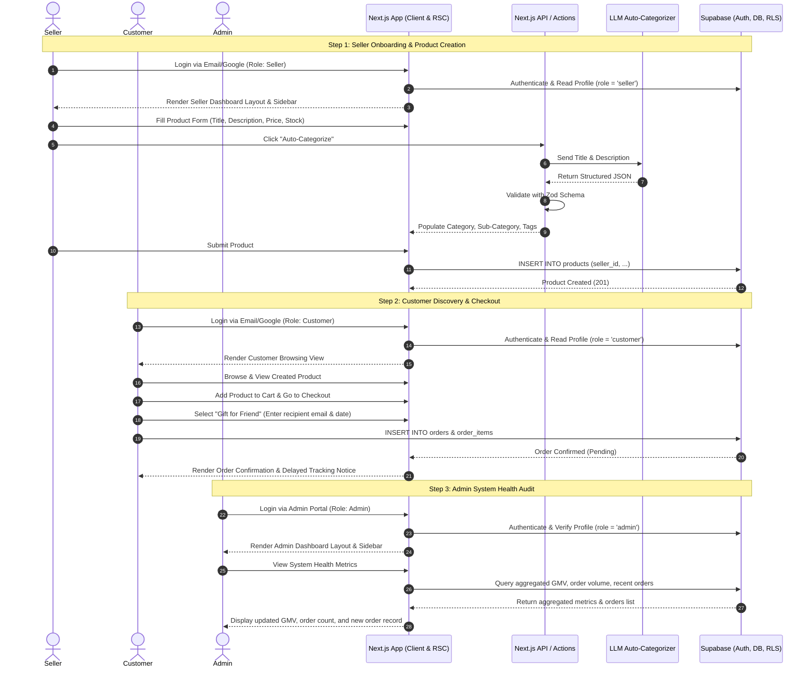

# ShopSphere Phase 1 — Product Requirements Document (PRD)

**Document Version:** 1.0.0  
**Author:** Technical Architect  
**Project:** ShopSphere (Phase 1 MVP)  
**Status:** Ready for Engineering  

---

## 1. Executive Summary & Architectural Philosophy

### 1.1 Scope Overview
ShopSphere Phase 1 delivers the foundational, end-to-end transactional marketplace. The system establishes reliable authentication, merchant inventory creation with structured AI assistance, customer discovery and order placement (including social gifting), and a centralized operational dashboard.

### 1.2 Core Philosophy: "Plumbing-First, Minimal UI"
* **Functional Integrity First:** Engineering focus is strictly concentrated on bulletproof data plumbing, deterministic state transitions, database constraints, Row-Level Security (RLS), and Role-Based Access Control (RBAC).
* **Lightweight UI Primitive Layer:** User interfaces must remain lean, minimal, and unbloated using Vanilla Extract (The TypeScript Purist's Choice) paired with accessible headless UI primitives (Radix UI). High-polish styling, cinematic animations, and complex micro-interactions are explicitly deferred until all transactional pipelines are verified.

---

## 2. Technology Stack

| Layer | Technology | Rationale & Responsibility |
| :--- | :--- | :--- |
| **Framework** | Next.js 14+ (App Router) | Server Components (RSC), Route Handlers, Server Actions, middleware routing. |
| **Language** | TypeScript (Strict Mode) | Full-stack end-to-end type safety and deterministic schema contracts. |
| **UI & Styling** | Vanilla Extract (The TypeScript Purist's Choice) | Zero-runtime, fully type-safe CSS-in-TypeScript (`.css.ts`) with contract-driven themes and static build-time extraction. Replaces utility-class frameworks like Tailwind CSS. |
| **Component Primitives** | Radix UI (Headless Primitives) | Unstyled, fully accessible UI foundation styled directly via Vanilla Extract `style()` and `recipe()` variants. |
| **Icons** | Lucide React | Lightweight, uniform icon kit. |
| **Database & Auth** | Supabase (PostgreSQL) | Managed PostgreSQL, Supabase Auth (Email + Google OAuth), Row-Level Security (RLS), Storage. |
| **Data Validation** | Zod | Runtime validation for API payloads, forms, and LLM structured JSON output. |
| **Client State** | Zustand / React Context | Lightweight client state for cart and session flags. |

---

## 3. Strict Role-Based Access Control (RBAC) & Layout Architecture

### 3.1 Role Hierarchy & Isolation
The platform enforces three strictly separated roles:
1. **`customer`**: Browses products, manages cart, executes purchases, tracks orders.
2. **`seller`**: Manages merchant catalog, triggers AI auto-categorization, fulfills orders.
3. **`admin`**: Inspects platform health, monitors transactions, audits users and listings.

### 3.2 Database Role Binding
Roles are persisted in a dedicated `public.profiles` table tied directly to Supabase's `auth.users` via a PostgreSQL trigger:
```sql
CREATE TYPE user_role AS ENUM ('customer', 'seller', 'admin');

CREATE TABLE public.profiles (
  id UUID REFERENCES auth.users(id) ON DELETE CASCADE PRIMARY KEY,
  email TEXT NOT NULL,
  full_name TEXT,
  role user_role NOT NULL DEFAULT 'customer',
  created_at TIMESTAMPTZ NOT NULL DEFAULT NOW(),
  updated_at TIMESTAMPTZ NOT NULL DEFAULT NOW()
);
```

### 3.3 Next.js Middleware Gatekeeper (`middleware.ts`)
The edge middleware interrogates the Supabase session token, fetches the user's role, and restricts cross-role route traversal:
* `/customer/*` requires authenticated user with `role = 'customer'` (or admin override).
* `/seller/*` requires authenticated user with `role = 'seller'`.
* `/admin/*` requires authenticated user with `role = 'admin'`.
* Unauthorized attempts trigger an immediate redirect to `/auth/login` or an access-denied page.

### 3.4 Isolated Sidebar & Dashboard Layouts
Using Next.js Route Groups, each role renders its own independent layout with a role-specific sidebar:
* **Customer Layout (`app/(customer)/layout.tsx`):**
  * Minimal Top Navigation + Category Drawer.
  * Links: *Explore Products, My Orders, Saved Items, Profile*.
* **Seller Layout (`app/(seller)/layout.tsx`):**
  * Persistent Left Sidebar.
  * Links: *Overview, Products (Add/Edit), Orders, Settings*.
* **Admin Layout (`app/(admin)/layout.tsx`):**
  * Persistent Left Sidebar (Dark themed / differentiated).
  * Links: *Platform Health, Orders Audit, Sellers, Users, System Logs*.

---

## 4. Supabase Database Schema & RLS Policies (Phase 1)

### 4.1 Schema Definition

```sql
-- 1. Profiles Table
CREATE TABLE public.profiles (
  id UUID PRIMARY KEY REFERENCES auth.users(id) ON DELETE CASCADE,
  email TEXT NOT NULL,
  full_name TEXT,
  role user_role NOT NULL DEFAULT 'customer',
  created_at TIMESTAMPTZ DEFAULT NOW(),
  updated_at TIMESTAMPTZ DEFAULT NOW()
);

-- 2. Products Table
CREATE TABLE public.products (
  id UUID PRIMARY KEY DEFAULT gen_random_uuid(),
  seller_id UUID NOT NULL REFERENCES public.profiles(id) ON DELETE CASCADE,
  title TEXT NOT NULL,
  description TEXT NOT NULL,
  price NUMERIC(10, 2) NOT NULL CHECK (price >= 0),
  stock INTEGER NOT NULL DEFAULT 0 CHECK (stock >= 0),
  category TEXT NOT NULL,
  sub_category TEXT,
  tags TEXT[] DEFAULT '{}',
  image_urls TEXT[] DEFAULT '{}',
  created_at TIMESTAMPTZ DEFAULT NOW(),
  updated_at TIMESTAMPTZ DEFAULT NOW()
);

-- 3. Orders Table
CREATE TYPE order_status AS ENUM ('pending', 'processing', 'shipped', 'delivered', 'cancelled');

CREATE TABLE public.orders (
  id UUID PRIMARY KEY DEFAULT gen_random_uuid(),
  customer_id UUID NOT NULL REFERENCES public.profiles(id) ON DELETE RESTRICT,
  total_amount NUMERIC(10, 2) NOT NULL CHECK (total_amount >= 0),
  status order_status NOT NULL DEFAULT 'pending',
  is_gift BOOLEAN NOT NULL DEFAULT FALSE,
  recipient_email TEXT,
  recipient_phone TEXT,
  gift_reveal_date TIMESTAMPTZ,
  shipping_address JSONB NOT NULL,
  created_at TIMESTAMPTZ DEFAULT NOW(),
  updated_at TIMESTAMPTZ DEFAULT NOW()
);

-- 4. Order Items Table
CREATE TABLE public.order_items (
  id UUID PRIMARY KEY DEFAULT gen_random_uuid(),
  order_id UUID NOT NULL REFERENCES public.orders(id) ON DELETE CASCADE,
  product_id UUID NOT NULL REFERENCES public.products(id) ON DELETE RESTRICT,
  seller_id UUID NOT NULL REFERENCES public.profiles(id) ON DELETE RESTRICT,
  quantity INTEGER NOT NULL CHECK (quantity > 0),
  unit_price NUMERIC(10, 2) NOT NULL CHECK (unit_price >= 0)
);
```

### 4.2 Row-Level Security (RLS) Rules
* **`profiles`:**
  * Read: Authenticated users can read their own profile; Admins can read all profiles.
  * Update: Users can update their own profile (except `role` column, which is locked to Admin/Database triggers).
* **`products`:**
  * Read: Public (anyone can view active products).
  * Insert/Update/Delete: Only users where `auth.uid() = seller_id` and `role = 'seller'`.
* **`orders`:**
  * Insert: Authenticated `customer`.
  * Read:
    * `customer_id = auth.uid()` can view their orders.
    * In Gift orders (`is_gift = true`), recipient matching `recipient_email` can view tracking **only if** `NOW() >= gift_reveal_date`.
    * Admin can view all orders.
* **`order_items`:**
  * Read: Customer who owns parent order, Seller where `seller_id = auth.uid()`, and Admins.

---

## 5. Detailed Feature Specifications (Phase 1)

### 5.1 Standard Authentication (Email & Google OAuth)
* Dedicated login and signup forms with role selection during merchant registration.
* Supabase Auth integration supporting password and Google OAuth redirects.
* Automatic insertion of profile record upon initial authentication via Postgres trigger.

### 5.2 Functional Seller Dashboard
* **Product Catalog View:** Minimalist table displaying inventory items, prices, and stock counts.
* **Add Product Form:** Inputs for Title, Description, Price, Stock, and Image URL/Upload.
* Action button: *"Auto-Categorize with AI"* adjacent to the category inputs.

### 5.3 Seller-Side AI Auto-Categorizer (Strict JSON Validation)
* **Pipeline:** Next.js Route Handler (`/api/ai/categorize`) receives product `title` and `description`.
* **LLM Prompting:** System prompt enforces output conforming strictly to JSON schema.
* **Zod Schema Enforcement:**
```typescript
import { z } from "zod";

export const CategoryResponseSchema = z.object({
  category: z.string().min(1),
  sub_category: z.string().min(1),
  tags: z.array(z.string()).max(5),
  confidence: z.number().min(0).max(1)
});

export type CategoryResponse = z.infer<typeof CategoryResponseSchema>;
```
* If LLM returns malformed JSON or schema validation fails, the API returns a deterministic error status prompting manual category selection.

### 5.4 Customer Browsing & Checkout Flow
* **Discovery:** Grid listing of active products with basic search and category filter.
* **Product Details:** Lightweight modal or page with description, stock indicator, and "Add to Cart" button.
* **Cart & Checkout:**
  * Cart drawer calculating itemized subtotal.
  * One-page checkout: Shipping address entry, order summary, and gift option toggle.
  * Order submission writing atomically to `orders` and `order_items`.

### 5.5 'Gift for Friend' Feature (Delayed Tracking Logic)
* At checkout, customer can toggle *"Send as Gift"*.
* Requires Recipient Email and optional Reveal Date (default: 24 hours before estimated delivery).
* **Delayed Tracking Enforcement:** Recipient order lookup or notification hides delivery status until `gift_reveal_date` has elapsed. Sender retains full real-time visibility.

### 5.6 Centralized Admin Dashboard (Platform Health)
* **Metrics Cards (Lightweight UI):**
  * Total Platform Gross Merchandise Value (GMV).
  * Total Orders Count & Active Users Count.
  * System Success Rate & AI Auto-Categorizer error count.
* **Recent System Orders Table:** Real-time stream of all orders across the platform with customer email, seller ID, total price, and status.

---

## 6. End-to-End Workflow Pipeline

The diagram and steps below illustrate the verified lifecycle of a transaction through all three roles.

### 6.1 Workflow Architecture Sequence



### 6.2 Step-by-Step Execution Walkthrough

1. **Step 1: Seller Login & Product Creation with AI**
   * Seller logs in at `/auth/login`. System validates credentials and routes to `/seller/dashboard`.
   * Seller views dedicated Seller Sidebar and navigates to `/seller/products/new`.
   * Seller inputs product details (e.g. *"Noise-Cancelling Wireless Headphones"*).
   * Seller clicks *"Auto-Categorize"*. The server handler invokes the AI categorizer, validates the JSON against `CategoryResponseSchema`, and returns `{ category: "Electronics", sub_category: "Audio", tags: ["wireless", "headphones"] }`.
   * Seller confirms and saves the listing to Supabase `products`.

2. **Step 2: Customer Discovery & Purchase**
   * Customer logs in at `/auth/login` and lands on `/customer/explore`.
   * Customer views the newly listed headphones in the product grid and clicks into the details.
   * Customer adds the item to the cart and proceeds to `/customer/checkout`.
   * Customer fills shipping details, selects *"Gift for Friend"*, and supplies recipient details.
   * Customer completes checkout. The transaction writes to `orders` and `order_items` under the customer's ID and seller's ID.

3. **Step 3: Admin Verification & Health Inspection**
   * Admin logs in at `/admin/login` and is redirected to `/admin/dashboard`.
   * Admin layout renders the dedicated Admin Sidebar.
   * Admin observes the updated metrics:
     * GMV reflects the new purchase amount.
     * Total Order count increments by 1.
     * The Recent Orders table displays the order ID, linked customer, seller ID, and status (`pending`).

---

## 7. Verification & Acceptance Criteria

* [ ] **RBAC Enforcement:** Direct URL traversal to `/admin/dashboard` by a `customer` or `seller` account is hard-rejected and redirected.
* [ ] **Sidebar Separation:** Each user role displays only its designated navigation links with zero route leakage.
* [ ] **AI Categorization Reliability:** AI categorizer passes 100% of validated mock payloads; any malformed JSON is caught by Zod before reaching state.
* [ ] **Database RLS Integrity:** Sellers cannot mutate products belonging to other sellers; Customers cannot access unrevealed gift details.
* [ ] **End-to-End Transactionality:** Placing an order synchronously updates Admin aggregate metrics and displays in the Admin recent orders table.
