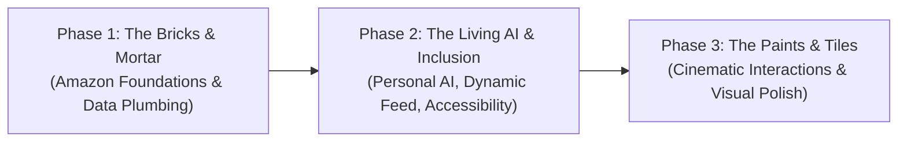

# ShopSphere — Product Concept, Strategic Roadmap & Architecture

**Document Type:** Strategic Product Architecture & Phasing Roadmap  
**Platform:** ShopSphere Multi-Vendor Hyperlocal & Global Ecosystem  
**Core Motto:** *"Build the structure with bricks, cement, stones, and metal first; paints, tiles, and decorative finishes come later."*  
**Status:** Architecture Approved & Prioritized

---

## 1. Executive Vision & Core Concept

**ShopSphere** is a next-generation intelligent e-commerce ecosystem designed to combine **Amazon-scale marketplace depth** with **neighborhood retail proximity** and an **autonomous Personal AI Shopping Companion**.

The platform is engineered around three pillars:
1. **The Commerce Engine (Bricks & Mortar):** Rock-solid multi-vendor catalog, variants, dynamic specifications, faceted search, multi-address split checkout, and an immutable order fulfillment state machine.
2. **The Living Personal AI:** A proactive concierge that continuously builds a contextual profile of the user, guides purchasing decisions, troubleshoots specifications, and **autonomously re-ranks and customizes the customer's home feed and carousels in real-time**.
3. **Inclusive by Design (Saksham Framework):** Built-in accessibility accommodations for users with visual, auditory, motor, and cognitive impairments, including voice-activated navigation and screen-reader telemetry.

---

## 2. User Roles & Access Architecture

* **Customer (Buyer):**
  * Browses and discovers items via global faceted search, category taxonomy, or neighborhood storefronts.
  * Interacts with the Personal AI Shopping Companion for advice, comparisons, and custom feed tuning.
  * Executes standard orders, BOPIS (Buy Online, Pick Up in Store) orders, or social "Gift for Friend" purchases.
  * Manages address books, payment methods, order tracking, and returns.

* **Seller (Merchant):**
  * Operates independent digital storefronts with multi-inventory segregation.
  * Lists products manually or through an AI-assisted wizard with automated 10+ attribute extraction.
  * Manages inventory levels, fulfills incoming orders through status transitions, and reviews sales analytics.

* **Admin (Platform Operator):**
  * Oversees platform health, transaction volume, gateway status, and catalog growth.
  * Moderates merchant listing submissions in the `pending` approval queue.
  * Enforces governance, processes disputes, executes administrative cancellations, and inspects audit logs.

---

## 3. Phased Implementation Roadmap

### Phase 1: The Bricks & Mortar (Foundational E-Commerce & Data Plumbing)
*Current Active Engineering Scope.* Focuses strictly on functional integrity, typed contracts, database constraints, RLS policies, and deterministic workflows.

#### 1.1 Strict Role-Based Authentication & Isolation
* Isolated signup and login gateways for Customers, Sellers, and Admins (`/signup`, `/login`, `/admin/login`).
* Passwordless OTP login for Admins (email + OTP + CAPTCHA).
* Supabase Auth integration supporting secure email/password and Google OAuth 2.0.
* Edge middleware gatekeeper preventing cross-role route traversal.

#### 1.2 Amazon-Grade Catalog, Product & Search Plumbing
* Multi-level category hierarchy (*Department > Category > Sub-Category > Item*).
* Rich product model with dynamic attributes (`JSONB`), stock limits, conditions ('New', 'Renewed', 'Used'), and image arrays.
* Faceted search engine: Price slider, rating filter (4★ & up), brand filter, fulfillment speed, condition, and in-stock toggles.
* Product Detail Page (PDP): Multi-image gallery, dynamic 10+ attribute specifications table, verified customer review breakdown, and Buy Box.

#### 1.3 End-to-End Shopping Cart, Multi-Address Book & Checkout
* Cart state supporting multi-seller itemization and shipping estimates.
* Customer Address Book: Multiple saved addresses with delivery notes.
* One-click checkout pipeline writing atomically to `orders` and `order_items`.
* Social "Gift for Friend" with delayed tracking release mechanics (`gift_reveal_date`).

#### 1.4 Seller Onboarding & AI Auto-Categorizer
* Seller Hub dashboard with dynamic category tabs and live status indicators (`pending`, `approved`, `rejected`).
* Multi-step product creation wizard with AI Auto-Categorizer Route Handler (`/api/ai/categorize`).
* Strict Zod schema enforcement and 3-attempt self-healing retry loop.

#### 1.5 Centralized Admin Operations & Moderation Queue
* Real-time platform health radar: GMV, order counts, active concurrency, catalog growth.
* Pending product approval queue with instant "Approve" (live publish) and "Reject" actions.
* Real-time global order ledger with state inspection and audit log records.

#### 1.6 Core Accessibility Foundation
* Semantic HTML5 landmarks and accessible form labelling.
* Complete keyboard focus traps and navigation compliance (WCAG 2.1 AA).
* ARIA live regions for cart and order state changes.

---

### Phase 2: The Living AI & Adaptive Experience (Intelligence & Inclusion)

#### 2.1 The Personal AI Shopping Companion & Memory Graph
* Background ingestion of user interactions (search terms, viewed products, category dwell times, price points) into an `ai_user_profiles` memory graph.
* Conversational shopping assistant capable of multi-turn product advisory, comparison, and tool-calling (`search_catalog`, `compare_products`, `check_availability`).

#### 2.2 Autonomous Dynamic Feed Personalization ("Change His Feed Accordingly")
* The home explore feed (`/customer/explore`) is continuously modulated by the user's AI interest graph and recent chat signals.
* Real-time feed mutation API (`/api/feed/personalized`) dynamically generates weighted carousels based on active user context:
  * *"Recommended Based on Your AI Consultation"*
  * *"Trending in [Your Preferred Category]"*
  * *"Budget-Friendly Alternatives Under [Your Average Price]"*

#### 2.3 Category-Specific Specialist Personas (PRO Feature)
* Dedicated domain expert modes tailored for specific buying decisions:
  * **Tech & Electronics Advisor:** Validates technical compatibility, hardware benchmarks, and port configurations.
  * **Fashion & Apparel Stylist:** Coordinates color palettes, occasions, and sizing guidelines.
  * **Gourmet & Pantry Sommelier:** Matches dietary preferences (organic, gluten-free, vegan) and recipe ingredients.
  * **Beauty & Skincare Consultant:** Matches dermal types and analyzes active ingredients.

#### 2.4 Multi-Modal Accessibility Framework (Saksham)
* **Voice-Activated Shopping:** Full Speech-to-Text (STT) for query entry and voice commands (*"Add the second item to cart"*, *"Go to checkout"*).
* **Text-to-Speech (TTS) Voice Engine:** Screen-free audio descriptions of listings, specs, and order tracking alerts.
* **Accessible Onboarding & Special Sign-In:** Dynamic configuration of high-contrast mode, large touch targets (min 48×48px), and low-distraction cognitive modes.

#### 2.5 Hyperlocal Spatial Commerce (0–30 km Radius)
* Geolocation filtering enabling customers to find products within a 30 km radius for immediate store pickup (BOPIS) or sub-hour delivery.
* Virtual Map Store Explorer (PRO): Interactive map interface to virtually enter neighborhood merchant shops.

#### 2.6 Multi-Inventory Segregation & Tiered Merchant Analytics
* Multi-inventory dashboard separating physical merchandise, digital goods, and fresh perishables.
* Tiered analytics: Normal Mode (basic sales) vs. Deep Mode PRO (predictive demand, search keyword frequency, competitive pricing).

---

### Phase 3: The Paints & Tiles (Visual Presentation & Polish)

* High-fidelity 3D GSAP ScrollTrigger scrollytelling animations (e.g. delivery van journey).
* Micro-interactions, fluid page transitions, and tactile hover physics.
* Themed brand palettes, custom typography accents, and decorative finishes applied over verified functional scaffolding.

---

## 4. Technology Stack & Architectural Standards

| Subsystem | Technology | Responsibility |
| :--- | :--- | :--- |
| **Framework** | Next.js 14+ (App Router) | React Server Components (RSC), Route Handlers, Server Actions, Edge Middleware. |
| **Language** | TypeScript (Strict Mode) | End-to-end type safety, deterministic database types, Zod contract schemas. |
| **Styling** | Vanilla Extract (The TypeScript Purist's Choice) | Zero-runtime, build-time extracted, type-safe CSS-in-TypeScript (`.css.ts`) ensuring contract-driven design without utility class drift. |
| **Primitives** | Radix UI (Headless Primitives) | Unstyled, fully accessible interactive foundation (Tabs, Dialogs, Menus, Sliders). |
| **Database & Auth** | Supabase (PostgreSQL 15+) | Managed PostgreSQL, Supabase Auth (Email + Google OAuth), Row-Level Security (RLS), Storage. |
| **AI Intelligence** | Multimodal LLMs + Zod | Schema-guided JSON generation, multimodal image inspection, vector embeddings. |
| **State Layer** | React Context & Zustand | Lightweight client state for cart, live session flags, and accessibility settings. |
