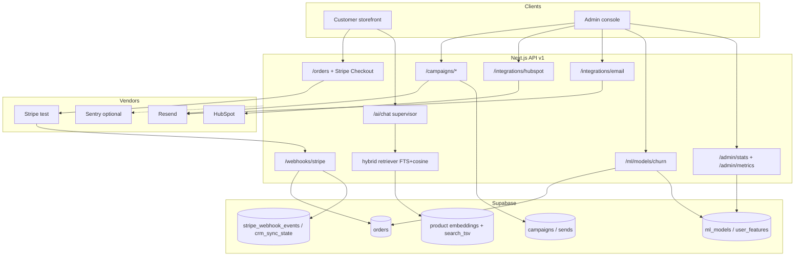

# ShopSphere Assessment 3 — demo report

**Live app:** https://shopsphere-lilac.vercel.app/  
**Repo:** https://github.com/nikhilkumarsjinnovation/shopspheres  
**Stack tip branch:** `feat/a3-demo` (depends on `feat/a3-churn` after platform merge)  
**Tag:** `assessment-3` (annotated, on this tip after merge)

This file is the Assessment 3 wrap-up. It does not modify `docs/`.

---

## Architecture

### Branch map (points)

| Branch | Focus | PR |
| --- | --- | --- |
| 1 integrations | HubSpot upsert, Resend promo, Stripe webhook | #20 |
| 2 campaigns | new/repeat/lapsed segments + promo codes | #21 / #24 |
| 3 agents | supervisor → customer vs marketing (15%–100% cap as shipped) | #22 |
| 4 eval-hybrid | cosine baseline + FTS∪cosine RRF report | #23 / #25 |
| 5 churn | RFM logistic next-purchase + churn F1 | #26 |
| 6 platform | `npm test`, CI workflow, Sentry, metrics, rate limits | #27 |
| 7 demo | this report + `assessment-3` tag | (this PR) |

---

## Eval summary

### Hybrid retrieval (gift / checkout)

Source: [`scripts/eval/hybrid-report.md`](hybrid-report.md) · baseline [`scripts/eval/baseline-a2.json`](baseline-a2.json)

Measured 2026-10-09 · 12 labelled scenarios · k=5 · FTS available: yes

| Metric | Baseline (cosine A2) | Hybrid + re-rank |
| --- | ---: | ---: |
| Task-success % | 75.0% | 75.0% |
| Hit-rate | 58.3% | 58.3% |
| Precision@5 | 36.7% | 36.7% |
| Faithfulness | 100.0% | 100.0% |
| Answer-relevance | 86.7% | 86.7% |

Hybrid matched cosine on this labelled set; baseline remains the frozen Assessment-2 cosine column.

### Churn / next-purchase

Source: offline `npm run test:a3-churn` on fixture `scripts/fixtures/a3-churn-orders.json`

| Model | Precision | Recall | F1 | Artifact |
| --- | ---: | ---: | ---: | --- |
| `next_purchase_predictor` | 1.0000 | 1.0000 | 1.0000 | `inline://rfm-logistic-next-purchase-v1` |
| `churn_scorer` | 1.0000 | 1.0000 | 1.0000 | `inline://rfm-logistic-churn-v1` |

F1 is the measured fixture holdout (not padded). Live DB registry write stays optional (`A3_CHURN_LIVE=1`).

### Platform smoke

`npm test` = `tsc --noEmit` + all `scripts/test_a3_*.ts` unit scripts (integrations, campaigns, agents, eval-hybrid, churn, platform).

---

## Click-path (demo)

Assume admin session + CSRF + `Accept: application/vnd.shopsphere.v1+json` where required. Live: https://shopsphere-lilac.vercel.app/

1. **Stripe test checkout** — Customer checkout → pay with Stripe test card → confirm webhook path (`checkout.session.completed`) moves order toward `confirmed` when `STRIPE_WEBHOOK_SECRET` is set.
2. **Campaign segments** — Admin → Email Campaigns → load segments (new / repeat / lapsed) → send one promo (code `SS{pct}-XXXX`, discount within cap).
3. **Marketing agent** — Admin assistant / campaigns AI → ask to draft a campaign; confirm over-limit discount is refused; under-cap schedules/sends via marketing specialist.
4. **Customer agent** — Storefront AI chat → gift or checkout phrasing still routes to the customer tool loop (carousel / cart help).
5. **Hybrid RAG** — Catalog search / agent `search_catalog` uses hybrid FTS+cosine when migration applied.
6. **Churn metrics** — Admin → Platform Metrics (`/admin/metrics`) → see committed F1; optional `POST /api/v1/ml/models/churn/score` with a `userId` that has paid orders.
7. **CI / tests** — Locally: `npm test`. On `main`: `.github/workflows/test.yml` runs typecheck + unit scripts (also paste onto stack tip if missing).

---

## Env names (values in `.env.local` / Vercel only)

`STRIPE_SECRET_KEY`, `STRIPE_WEBHOOK_SECRET`, `HUBSPOT_PRIVATE_APP_TOKEN`, `RESEND_API_KEY`, `RESEND_FROM_EMAIL`, `NEXT_PUBLIC_SUPABASE_URL`, `SUPABASE_SERVICE_ROLE_KEY`, optional `SENTRY_DSN` / `NEXT_PUBLIC_SENTRY_DSN`, optional `A3_CHURN_LIVE` / `CAMPAIGN_LIVE`.

---

## Apply checklist (reviewer)

1. Apply Assessment 3 migrations in branch order (`crm_sync` / stripe events → campaigns → FTS hybrid, etc.).
2. Confirm Stripe webhook endpoint + HubSpot + Resend on Vercel.
3. Ensure `.github/workflows/test.yml` exists on the branch you run CI from (`main` already has it).
4. Tag: `git tag -a assessment-3 -m "Assessment 3 complete"` on the merged demo tip, then `git push origin assessment-3`.

## NOT VERIFIED (pending your apply / secrets)

- Live HubSpot / Resend / Stripe against production-like data
- `A3_CHURN_LIVE` registry UPDATE
- Sentry events without a DSN
- Full stack merge into `main` if submission requires a single main tip
