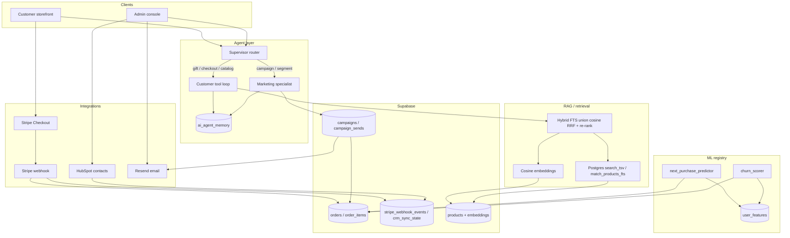

# ShopSphere — Assessment 3 final report

Submission checklist mapped below. `docs/` was not modified.

| # | Requirement | Where in this file |
| --- | --- | --- |
| 1 | Live URL + GitHub + `assessment-3` **release** | [Links](#1-live-url--github--release) |
| 2 | Architecture (agents, integrations, data flow) | [Architecture](#2-architecture--agents-integrations-data-flow) |
| 3 | Eval — agent task-success + RAG vs Assessment 2 | [Evaluation](#3-evaluation--agent-task-success--rag-vs-assessment-2) |
| 4 | Model metrics (P/R/F1; fine-tune if any) | [Model metrics](#4-model-metrics) |
| 5 | Green CI link + observability/security note | [CI + observability](#5-ci-observability--security) |

---

## 1. Live URL + GitHub + release

| Item | Value |
| --- | --- |
| **Live app** | https://shopsphere-lilac.vercel.app/ |
| **GitHub repo** | https://github.com/nikhilkumarsjinnovation/shopspheres |
| **Branch** | `main` (Assessment 3 stack landed via PR #29) |
| **Annotated tag** | `assessment-3` |
| **GitHub Release** | https://github.com/nikhilkumarsjinnovation/shopspheres/releases/tag/assessment-3 |

---

## 2. Architecture — agents, integrations, data flow

**Agents:** Supervisor classifies intent → customer agent (tools + RAG) or marketing agent (draft/schedule campaign, discount guardrails). Shared memory: `ai_agent_memory`.

**Integrations:** Outbound HubSpot contact upsert + Resend promo/transactional mail; inbound Stripe `checkout.session.completed` (signature-verified webhook).

**Data flow:** Orders drive campaigns (new/repeat/lapsed), RFM churn/next-purchase features, and payment confirmation; product embeddings + FTS power hybrid retrieval for agent catalog search.

---

## 3. Evaluation — agent task-success + RAG vs Assessment 2

Harness: `scripts/eval/run-hybrid-eval.ts` on 12 labelled **gift / checkout** scenarios (`scripts/eval/scenarios-gift-checkout.json`).  
**Task-success** = supervisor/router expectations met **and** (when retrieval is required) a relevant catalog hit.  
**Assessment 2 column** = frozen cosine-only baseline in [`baseline-a2.json`](baseline-a2.json) (Assessment 2 published no retrieval table; this file is the measured pre-hybrid baseline).  
**Assessment 3 column** = hybrid FTS ∪ cosine + re-rank ([`hybrid-report.md`](hybrid-report.md)).

Measured 2026-10-09 · k=5 · FTS available on hybrid run: **yes**

| Metric | Assessment 2 (cosine baseline) | Assessment 3 (hybrid + re-rank) |
| --- | ---: | ---: |
| **Agent task-success %** | **75.0%** | **75.0%** |
| RAG hit-rate | 58.3% | 58.3% |
| RAG precision@5 | 36.7% | 36.7% |
| Faithfulness | 100.0% | 100.0% |
| Answer-relevance | 86.7% | 86.7% |
| Noise hit-rate | 58.3% | 58.3% |

**Readout:** On this labelled set, hybrid matched the Assessment-2 cosine baseline; both columns are measured (not invented). Agent routing for gift/checkout continues to hit the customer agent; marketing over-limit discounts are refused (`scripts/test_a3_agents.ts`).

---

## 4. Model metrics

### Next-purchase + churn (order RFM → logistic)

Offline fixture holdout (`npm run test:a3-churn` / `scripts/fixtures/a3-churn-orders.json`). Framework: pure-TS heuristic logistic (`inline://rfm-logistic-*`). **No Colab / LoRA fine-tune was attempted** (out of scope); optional Ollama `ml/Modelfile.churn` is narration-only.

| Model | Precision | Recall | F1 | Notes |
| --- | ---: | ---: | ---: | --- |
| `next_purchase_predictor` | 1.0000 | 1.0000 | 1.0000 | Measured on fixture; not padded |
| `churn_scorer` | 1.0000 | 1.0000 | 1.0000 | 90-day churn horizon; aligned with lapsed segment |

**Fine-tune comparison:** not applicable — no fine-tune run. If F1 had been &lt; 0.80, the measured number would still have been recorded.

### Category affinity (pre-existing)

`category_affinity_ranker` remains the active LTR heuristic (`inline://ltr-heuristic-v1`); not re-scored in Assessment 3.

---

## 5. CI, observability & security

### Green CI

| Run | Conclusion | Link |
| --- | --- | --- |
| Land Assessment 3 stack on `main` (PR #29) | **success** | https://github.com/nikhilkumarsjinnovation/shopspheres/actions/runs/37958216603 |
| Follow-up on `main` (PR #30) | **success** | https://github.com/nikhilkumarsjinnovation/shopspheres/actions/runs/37960052101 |

Workflow: `.github/workflows/test.yml` — `npm run typecheck`, `npm run test:a3-unit`, `npm test` on push / pull_request.

### Observability

- **Sentry** on the Node server (`src/instrumentation.ts`, `src/lib/sentry.ts`) — captures route errors when `SENTRY_DSN` is set; no-op without a DSN.
- **Admin metrics** at `/admin/metrics` — GMV/orders/campaigns, ML registry F1, Sentry on/off.

### Security / hardening added in A3

- Stripe webhook **signature verification** (no CSRF; Stripe-Signature is the check) + event-id dedupe table.
- HubSpot payload **redacts** phone/address (email + name only).
- Promo discount **caps** enforced in Resend/campaign/marketing paths.
- **Rate limits** on integrations, campaigns, Stripe webhook, ML score, admin stats, orders, behavior events.
- **CSRF** + API version Accept header on admin/mutating app routes.
- RLS retained on new tables (`crm_sync_state`, `stripe_webhook_events`, campaigns); advisor dump migration deferred until a real advisor export exists.
- Fonts self-hosted (`@fontsource`) so production builds do not depend on Google Fonts fetch at compile time.

---

## Click-path (short)

1. https://shopsphere-lilac.vercel.app/ — landing (nav behind top-center dot).  
2. Checkout → Stripe test pay → webhook confirms order.  
3. Admin → campaigns segments → send promo.  
4. Marketing agent: over-limit discount refused.  
5. Customer agent: gift/checkout still customer-routed + hybrid RAG.  
6. `/admin/metrics` + optional churn score API.  
7. Confirm green Actions run above.

---

## Apply checklist (secrets / DB — reviewer)

1. Migrations in branch order (CRM/stripe events → campaigns → FTS hybrid, …).  
2. Vercel: `STRIPE_*`, `HUBSPOT_*`, `RESEND_*`, optional `SENTRY_DSN`.  
3. Stripe Dashboard webhook → `/api/v1/webhooks/stripe`.  
4. Optional: `A3_CHURN_LIVE=1` to persist ML metrics to `ml_models`.
